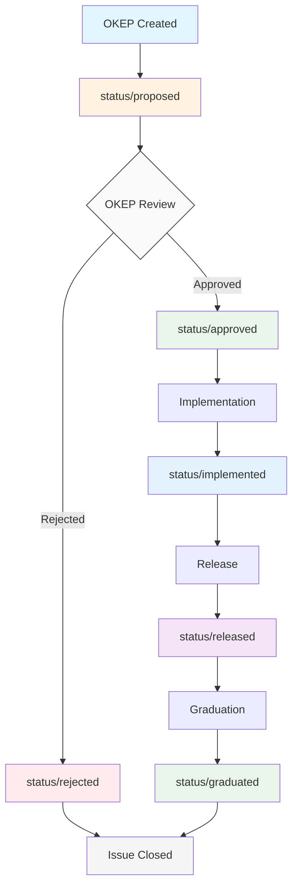

# Release Process

## Introduction

The process for managing enhancements (OKEPs), issues, and pull requests through an OVN-Kubernetes release is complex. This document describes the process in detail.

## How often are releases?

We release approximately once every 3 calendar months.

## How do we decide on the release date?

The release date is decided during the [community meeting] at the beginning of the release cycle.
It will be approximately 3 calendar months from the previous release. The release date will not land on a Friday, holiday, or weekend.

## Who is responsible for the release?

The release coordinator is elected at the [community meeting] at the beginning of the release cycle.
The release coordinator may be any volunteer from the community - a call for volunteers will be issued one week before the next community meeting via the community Slack and mailing list.

### Release Coordinator Responsibilities

- The release coordinator is the person who is ultimately responsible for ensuring that the release is completed on time, and with the desired payload.
- The release coordinator follows the release process outlined in [#what-is-the-release-process].
- The release coordinator ensures that all community members are following the correct process.
- While not a maintainer, the release coordinator is an important role in the community and should be afforded the respect and trust of the maintainers.
- The release coordinator is empowered to make decisions about the release that are in the best interest of the community.
  - For example, the release coordinator may choose to delay the release if the payload is not ready or if the quality of the release is not high enough.
- The release coordinator is responsible for ensuring that progress is being made on the release and regularly updates the community on the progress of the release during the [community meeting].
- If decisions are required that are outside the scope of the release coordinator's responsibilities, the release coordinator will seek the advice of the maintainers.
- If the release coordinator is unable to fulfill their responsibilities, they must step down and a new release coordinator will be elected.
- The release coordinator may be replaced by majority vote of the maintainers if they are unable to fulfill their responsibilities.

## What goes into a release?

A release is a collection of changes that are considered stable and ready for production use.
These changes can be broken down into the following categories:

- **New features** - new features require an approved OKEP.
- **Minor changes** - small changes to improve the project.
- **Bug fixes** - fixes for bugs.
- **Documentation** - improvements to the documentation.
- **Testing** - improvements to the testing or CI workflows.
At the [community meeting], we will discuss all approved OKEPs and issues that are targeted for the release and select a maximum of **5** OKEPs for the release.
This is limited to ensure that:

- There is sufficient development time.
- Developer focus is not spread too thin.
- Community feedback is solicited and considered during the release cycle.
- The release is not too large with too many potential breaking changes.

> [!TIP]
> As a future enhancement to the process we may wish to consider using T-shirt sizes to the OKEPs instead (XS<->XL). Each size can be represented as a number: XS=1, S=2, M=3, L=4, XL=5. Given release capacity of 10, we could select OKEPs whose combined size is less than or equal to 10.

## How long are releases supported?

OVN-Kubernetes follows an N-2 support model, meaning we support the current release (N) plus the two previous releases (N-1 and N-2).

For example, if the current release is `v1.3`, we support:
- `v1.3` (current release)
- `v1.2` (N-1)
- `v1.1` (N-2)

When `v1.4` is released, support for `v1.1` will be dropped, and we will support:
- `v1.4` (current release)
- `v1.3` (N-1)
- `v1.2` (N-2)

Patch releases will only be created for critical issues that are discovered after the release. In the case a patch release has been created, that release will be supported according to the N-2 model.

For example, if an issue was found in `v1.1.0` it would be fixed in `v1.1.1` and `v1.1.1` would be supported according to the N-2 model. `v1.1.0` would not be supported after `v1.1.1` is released.

## How do we decide on the release number?

The release number is decided by the community in the [community meeting] during the release planning phase.

The release number is a semantic version number.

The release number is incremented by the following rules:

- Major version is incremented for any backwards incompatible changes.
- Minor version is incremented for new features, but not backwards incompatible changes.
- Patch version is incremented for bug fixes.

## What is the release process?

The release process is as follows:

### Step 1: Planning

- The release coordinator is elected following the process outlined in [#who-is-responsible-for-the-release].
- The release date and code freeze date are decided during the [community meeting] following the process outlined in [#how-do-we-decide-on-the-release-date].
- The payload of the release is decided during the [community meeting], following the process outlined in [#what-goes-into-a-release].
- The release coordinator will create a tracking issue and GitHub milestone for the release
- All issues and pull requests that are targeted for the release are added to the GitHub milestone
- The tracking issue is created using the [release-planning.md](.github/ISSUE_TEMPLATE/release-planning.md) template
- The tracking issue is assigned to the release coordinator
- The tracking issue is the source of truth for the current state of the release

### Step 2: Development

- The development phase is the first 2.5 months of the release cycle
- During this phase the `master` branch is open for new changes
- There are no restrictions on the type of changes that can be made to the codebase
  during this phase
- The normal review process is followed for all changes
- The release coordinator updates the community on the progress of the release during the [community meeting]

### Step 3: Code Freeze

- The code freeze date is the 2 weeks before the release date
- During this phase the `master` branch is closed for new changes
- Any bug fixes or documentation changes must follow the normal review process, but will also require the explicit approval of the release coordinator.
- OKEPs may be reviewed and merged into the `master` branch during this phase without explicit approval from the release coordinator since they do not affect the release itself.

### Step 4: (Optional) Release Candidate

At the discretion of the release coordinator and the maintainers, a release candidate may be created.
The decision to create a release candidate is made at the [community meeting] after the code freeze date.

- Once the master branch is closed, the release coordinator may tag a new pre-release
- The pre-release is named `v<release-number>-rc<rc-number>`
- The pre-release is created from the `master` branch

Pre-release versions may be subjected to additional testing and review by the community.

### Step 5: Release

- Once the release date is reached and all required changes have been merged into the `master` branch, the release coordinator will tag a new release with the version `v<release-number>`.
- The release is created from the `master` branch
- The release coordinator creates a GitHub release with release notes
- Release notes should include:
  - Summary of new features
  - List of bug fixes
  - Breaking changes (if any)
  - Known issues
  - Upgrade notes

### Step 6: Post-Release

- The release coordinator announces the release to the community via:
  - GitHub release notes
  - Community Slack channels
  - Mailing list
- The release coordinator updates the tracking issue to mark the release as complete
- The release coordinator creates a retrospective document to capture lessons learned

## Release Communication

Throughout the release process, the release coordinator should maintain clear communication with:

- **Maintainers**: For technical decisions and code review coordination
- **Community**: For progress updates and feedback solicitation
- **Stakeholders**: For timeline and feature delivery expectations

## Patch Release Procedures

In case of critical issues discovered after release:

- A patch release may be created to address the issue. This may be done by any maintainer.
- Critical security fixes may bypass the normal release cycle.
- The community will be notified immediately of any critical issues.

## OKEP Process

The following diagram shows the lifecycle of an OKEP.

### Proposed

- A tracking issue is created using the [enhacements](.github/ISSUE_TEMPLATE/enhancement.yaml) template.
- A pull request is created to document the enhancement using the [OKEP template](./docs/okeps/okep-4368-template.md).

### Proposed -> Approved | Rejected

- The OKEP is reviewed and approved by maintainers following the process outlined [here](./docs/developer-guide/documentation.md#enhancement-proposals).

- The OKEP is accepted:
  - The OKEP is merged into the `master` branch. NOTE: This should not automatically close the tracking issue.
  - The tracking issue label `status/proposed` is removed.
  - The tracking issue label `status/approved` is added.

- The OKEP is rejected:
  - The tracking issue label `status/proposed` is removed.
  - The tracking issue label `status/rejected` is added.
  - The tracking issue is closed.

Approved OKEPs are expected to add a feature flag to the project.
This allows for the OKEP to be implemented and released without the feature being enabled by default. This allows for:

- Features to be delivered across multiple releases.
- Features to be disabled in downstream projects.

### Approved -> Implemented

Once an approved OKEP has been implemented and all code has been merged into the `master` branch, the following steps should be followed:

- The tracking issue label `status/approved` is removed.
- The tracking issue label `status/implemented` is added.

### Implemented -> Released

Once the OKEP is available in a release, the following steps should be followed:

- The tracking issue label `status/implemented` is removed.
- The tracking issue label `status/released` is added.

### Released -> Graduated

After release, once the feature has been used for a minimum of 3 releases, a discussion should be held to determine if the feature should be graduated. All OKEPs are expected to be graduated eventually, although the time between release and graduation may vary.

- The tracking issue label `status/released` is removed.
- The tracking issue label `status/graduated` is added.
- A pull request is created to remove the feature flag.
- The tracking issue is closed.

The graduation process removes the feature flag from the codebase, preventing the number of feature flags from growing indefinitely.

## Release Retrospective

After the release, a retrospective should be held to capture lessons learned.

- The retrospective is created using the [retrospective.md](.github/ISSUE_TEMPLATE/retrospective.md) template
- The retrospective is assigned to the release coordinator
- An agenda item is added to the [community meeting] to discuss the retrospective
- Notes from the retrospective are added to the retrospective issue
- The retrospective issue is closed when all action items have been completed

[community meeting]: ./docs/governance/MEETINGS.md
