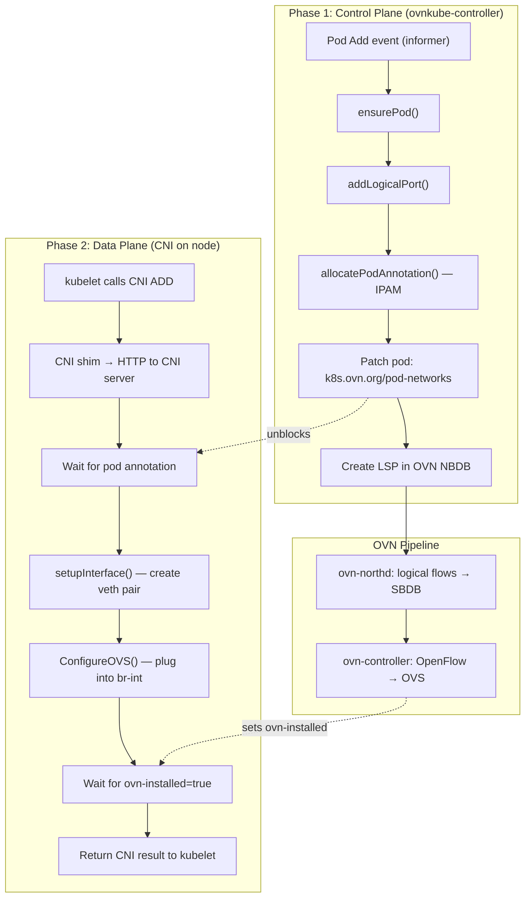
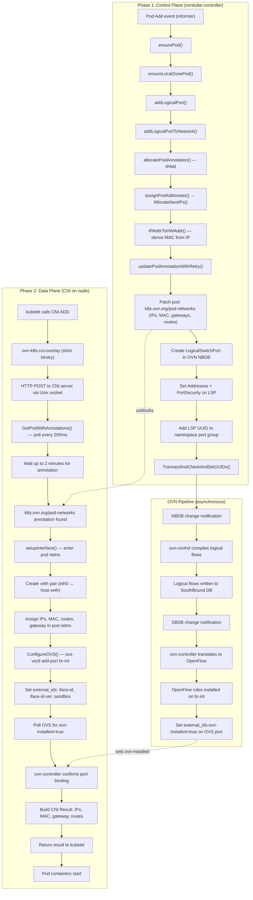

# Pod Creation Workflow

This document describes how a pod gets its network configured in
OVN-Kubernetes, from the moment it is scheduled to a node until it has
a working network interface with connectivity.

## Overview

Pod networking is a **two-phase, loosely coupled** process:

1. **Control plane (ovnkube-controller)** — watches the Pod API, allocates
   IPs, writes the pod annotation, and creates OVN NorthBound DB objects.
2. **Data plane (CNI on the node)** — kubelet invokes the CNI plugin, which
   waits for the annotation, plumbs the veth/OVS interface, and returns IPs
   to the container runtime.

The controller must write the annotation **before** CNI ADD can succeed.
The CNI server polls for the annotation every 200 ms for up to 2 minutes.



## Phase 1: Control Plane — Pod Reconciliation

### Event Handling

When a pod is scheduled, the Kubernetes informer fires an Add event.
The retry framework in `go-controller/pkg/retry/` ensures that transient
failures are retried with exponential backoff.

The call chain:

```go
func (oc *DefaultNetworkController) ensurePod(oldPod, pod *corev1.Pod, addPort bool) error

func (oc *DefaultNetworkController) addLogicalPort(pod *corev1.Pod) (err error)

func (bnc *BaseNetworkController) addLogicalPortToNetwork(pod *corev1.Pod, nadKey string,
    network *nadapi.NetworkSelectionElement, enable *bool) (ops []ovsdb.Operation,
    lsp *nbdb.LogicalSwitchPort, podAnnotation *util.PodAnnotation, newlyCreatedPort bool, err error)
```

Pods are only processed after nodes and services are synced. Host-network
pods are skipped (they do not need an OVN logical port).

### IP Allocation (IPAM)

```go
func (bnc *BaseNetworkController) allocatePodAnnotation(pod *corev1.Pod,
    existingLSP *nbdb.LogicalSwitchPort, podDesc, nadKey string,
    network *nadapi.NetworkSelectionElement, networkRole string) (*util.PodAnnotation, bool, error)
```

The allocation logic:

1. If the pod already has an annotation (e.g. after a restart), the
   existing IPs are reserved in IPAM to prevent duplicates.
2. If an existing LogicalSwitchPort is found in OVN NB, its addresses
   are recovered.
3. Otherwise, `assignPodAddresses()` allocates the next available IP(s)
   from the node's subnet via the LogicalSwitchManager:

```go
assignPodAddresses(switchName)
  → lsManager.AllocateNextIPs(switchName)
    → subnet.Allocator.AllocateNextIPs()
      → ip.Range.AllocateNext()
```

The MAC address is derived deterministically from the first allocated IP
using `util.IPAddrToHWAddr()`.

The allocated addresses are written to the pod as the
`k8s.ovn.org/pod-networks` annotation:

```go
type PodAnnotation struct {
    IPs            []*net.IPNet
    MAC            net.HardwareAddr
    Gateways       []net.IP
    GatewayIPv6LLA net.IP
    Routes         []PodRoute
    TunnelID       int
    Role           string
}
```

### OVN NorthBound DB Objects

`addLogicalPortToNetwork()` creates/updates the following in a single
OVSDB transaction:

* **LogicalSwitchPort** — Named `<namespace>_<pod-name>`, attached to the
  node's logical switch. Addresses set to `"<mac> <ip1> <ip2>"`. Port
  security enabled.
* **Namespace port group** — The LSP UUID is added to the namespace's port
  group (used by network policies).
* **External IDs** — `namespace`, `pod=true`, pod UID in `iface-id-ver`,
  and `requested-chassis` for binding.

```go
lsp := &nbdb.LogicalSwitchPort{
    Name:         "namespace_podname",
    Addresses:    []string{"0a:58:0a:f4:00:05 10.244.0.5"},
    PortSecurity: []string{"0a:58:0a:f4:00:05 10.244.0.5"},
    ExternalIDs: map[string]string{
        "namespace": namespace,
        "pod":       "true",
    },
    Options: map[string]string{
        "iface-id-ver":      string(pod.UID),
        "requested-chassis": nodeName,
    },
}
```

Additional OVN objects may be created depending on features:

* **SNAT rules** — if multi-gateway with no external gateway annotation
* **Gateway routes** — if namespace has external/pod gateway annotations
* **DHCP options** — for live-migratable pods

> [!NOTE]
> NetworkPolicy ACLs are **not** created during pod add. They are managed
> separately by the network policy controller when a pod matches a policy
> selector — the pod's LSP is added to the policy's port group, which
> already has ACLs attached.

## Phase 2: Data Plane — CNI ADD

### CNI Shim

The CNI binary is invoked by kubelet. It acts as a thin shim that forwards
the request over a Unix domain socket to the CNI server running inside
ovnkube-node.

```go
func (pr *Plugin) CmdAdd(args *skel.CmdArgs) error
```

### CNI Server

The CNI server listens on a root-only Unix socket and dispatches ADD/DEL
requests.

```go
func (pr *PodRequest) cmdAdd(kubeAuth *KubeAPIAuth, clientset *ClientSet,
    ovsClient client.Client) (*Response, error)
```

`cmdAdd()` performs the following steps:

1. Get pod from the Kubernetes API.
2. Wait for `k8s.ovn.org/pod-networks` annotation to appear (`isOvnReady`
   check). This is the synchronization point with the control plane.
3. Parse the annotation into IP/MAC/gateway configuration.
4. Call `ConfigureInterface()`.

### Interface Plumbing

```go
func (*defaultPodRequestInterfaceOps) ConfigureInterface(pr *PodRequest,
    getter PodInfoGetter, ifInfo *PodInterfaceInfo) ([]*current.Interface, error)

func ConfigureOVS(ctx context.Context, namespace, podName, podIfName, hostIfaceName string,
    ifInfo *PodInterfaceInfo, sandboxID, deviceID string, isVFIO bool, getter PodInfoGetter) error
```

The interface plumbing steps:

1. Create a veth pair — one end placed in the pod's network namespace
   (`eth0`), the other kept on the host.
2. Configure the pod namespace — assign IP addresses, set up default
   route via the gateway, configure any additional routes.
3. Add to OVS — `ConfigureOVS()` adds the host-side veth to `br-int`
   with external IDs:

```bash
ovs-vsctl add-port br-int abcd1234ef \
  -- set interface abcd1234ef \
       external_ids:iface-id="default_my-pod" \
       external_ids:iface-id-ver="pod-uid-here" \
       external_ids:sandbox="container-id" \
       external_ids:ip_addresses="10.244.0.5/24" \
       external_ids:attached_mac="0a:58:0a:f4:00:05"
```

4. Wait for OVN binding — poll OVS until `ovn-installed=true` is set
   on the interface by ovn-controller, confirming that OpenFlow rules are
   programmed and the port is active.
5. Return CNI result — IPs, MAC, gateway, and routes are returned to
   kubelet through the CNI shim.

## End-to-End Timeline



### How the phases connect

The critical handoff between the control plane and the data plane is the
**`k8s.ovn.org/pod-networks` pod annotation**:

* The **controller writes** it after IPAM allocation (during pod reconciliation), and CNI waits on this annotation before interface plumbing.
* The **CNI server blocks** on it before continuing with interface setup.

The OVN pipeline (**ovn-northd → ovn-controller**) runs asynchronously between
these two phases:

* **ovn-northd** compiles LogicalSwitchPort changes into logical flows in SBDB.
* **ovn-controller** translates those flows into OpenFlow rules on `br-int` and
  sets `external_ids:ovn-installed=true` on the OVS interface.
* The CNI server's **`ovn-installed` wait** cannot succeed until that step completes.

### What happens if things go wrong

* If the **controller is slow** (backlog, IPAM exhausted, node switch not ready),
  T1 is delayed and the CNI server times out at T5 after ~2 minutes waiting
  for the annotation.
* If **ovn-controller is slow** (SBDB unreachable, flow computation failure),
  T4 is delayed and the CNI server times out at T6 waiting for
  `ovn-installed=true`.
* In both cases, kubelet receives a CNI error and retries pod creation.

## Failure Modes

* **CNI ADD timeout** — if the controller has not written the annotation
  within ~2 minutes (e.g. IPAM exhausted, node switch not ready, controller
  backlog), CNI returns an error and kubelet retries.
* **ovn-installed timeout** — if ovn-controller cannot bind the port (e.g.
  SBDB unreachable, flow computation failure), the CNI server times out.
* **IPAM exhaustion** — `AllocateNextIPs` fails when the node subnet is
  full. The retry framework re-queues the pod.

## Key Source Files

* `go-controller/pkg/ovn/ovn.go`, `pods.go`, `base_network_controller_pods.go` — Pod handler and reconcile logic
* `go-controller/pkg/ovn/default_network_controller.go` — Event handlers and watch setup
* `go-controller/pkg/retry/obj_retry.go` — Retry framework
* `go-controller/pkg/ovn/logical_switch_manager/`, `go-controller/pkg/allocator/ip/` — IPAM
* `go-controller/pkg/util/pod_annotation.go` — Pod annotation marshalling
* `go-controller/pkg/cni/cnishim.go` — CNI shim binary
* `go-controller/pkg/cni/cniserver.go`, `cni.go` — CNI server
* `go-controller/pkg/cni/helper_linux.go`, `ovs.go` — Interface plumbing
* `go-controller/pkg/ovn/base_network_controller_user_defined.go` — User-Defined Networks
