# Traffic Flows

In interconnect mode each node is its own OVN zone (by default).
Zones are stitched together via a **transit switch** using GENEVE tunnels
over the physical underlay.

> **Scope:** Diagrams and path narratives on this page use **IPv4** addresses
> for readability. Dual-stack and IPv6-only clusters follow the same logical
> component paths (logical switches, `ovn_cluster_router`, gateway routers,
> transit switch, management port, and host masquerade); substitute the IPv6
> defaults from the subnet table below. IPv6-specific service VIP, EgressIP,
> and host-masquerade address details are out of scope for these diagrams.

## Topology Reference

The examples below use a two-node IPv4 cluster, each node in its own zone:

| Component | ovn-worker | ovn-worker2 |
|---|---|---|
| Node / Underlay IP | 172.19.0.2 | 172.19.0.3 |
| External Switch | ext_ovn-worker | ext_ovn-worker2 |
| Gateway Router | GR_ovn-worker | GR_ovn-worker2 |
| Join Switch IP | 100.64.0.2/16 | 100.64.0.3/16 |
| Transit Switch IP | 100.88.0.3/16 | 100.88.0.4/16 |
| Pod Subnet | 10.244.0.0/24 | 10.244.2.0/24 |
| Management Port (ovn-k8s-mp0) | 10.244.0.2 | 10.244.2.2 |

### Default Internal Subnets

| Subnet | IPv4 | IPv6 | Purpose |
|---|---|---|---|
| Join | `100.64.0.0/16` | `fd98::/64` | Connects ovn_cluster_router ↔ gateway routers |
| Transit | `100.88.0.0/16` | `fd97::/64` | Interconnects zones across the cluster |
| Masquerade | `169.254.169.0/29` | `fd69::/125` | Host ↔ OVN service traffic masquerading |

### Full Topology Diagram

The host datapath is abstracted as `eth0` → `breth0` → External Switch.
OVS integration details (`br-int`, patch ports) are omitted from all diagrams
on this page.

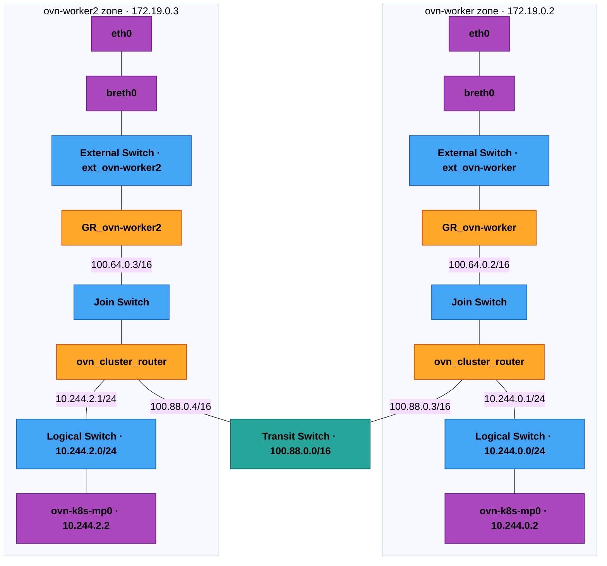

---

## East-West Traffic Flows

### Pod to Pod – Same Node

Both pods are on **ovn-worker** and attach to the same node-local logical
switch. Delivery uses an **L2 lookup** at the egress stage — traffic never
reaches `ovn_cluster_router` and no tunnel is used.

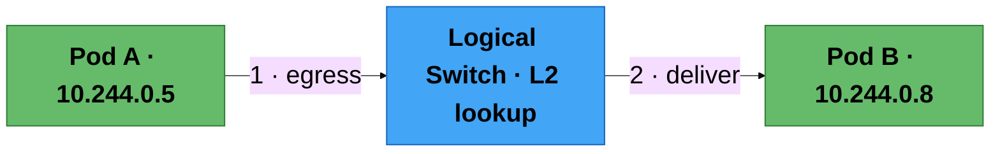

---

### Pod to Pod – Different Node

Pod A is on **ovn-worker**, Pod B is on **ovn-worker2**. Traffic crosses
zones via the **transit switch** over a GENEVE tunnel on the underlay.

```mermaid
%%{init: {'theme': 'base', 'flowchart': {'nodeSpacing': 60, 'rankSpacing': 50, 'padding': 35}, 'themeVariables': {'fontSize': '70px', 'primaryTextColor': '#000000', 'secondaryTextColor': '#000000', 'tertiaryTextColor': '#000000', 'textColor': '#000000', 'nodeTextColor': '#000000'}}}%%
graph LR
    classDef pod fill:#66bb6a,stroke:#2E7D32,stroke-width:1.5px,color:#000000,font-weight:bold
    classDef sw fill:#42a5f5,stroke:#1565C0,stroke-width:1.5px,color:#000000,font-weight:bold
    classDef rtr fill:#ffa726,stroke:#E65100,stroke-width:1.5px,color:#000000,font-weight:bold
    classDef ts fill:#26a69a,stroke:#00695C,stroke-width:1.5px,color:#000000,font-weight:bold

    A["Pod A · 10.244.0.5"]:::pod -->|"1"| LS1["Logical Switch"]:::sw
    LS1 -->|"2"| CR1["ovn_cluster_router"]:::rtr
    CR1 -->|"3 · GENEVE"| TS["Transit Switch"]:::ts
    TS -->|"4"| CR2["ovn_cluster_router"]:::rtr
    CR2 -->|"5"| LS2["Logical Switch"]:::sw
    LS2 -->|"6"| B["Pod B · 10.244.2.5"]:::pod
```

---

### Pod to ClusterIP (ovn pod backend)

The OVN load balancer on the **logical switch** DNATs the ClusterIP VIP
to a backend pod endpoint. After DNAT, normal pod-to-pod routing applies.

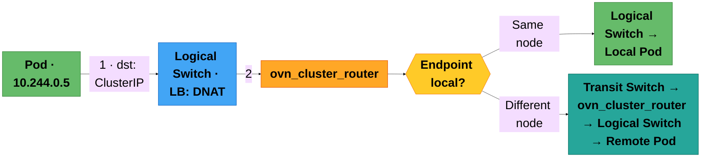

---

### Pod to LoadBalancerIP/ExternalIP (ovn pod backend)

From a pod's perspective LoadBalancerIP and ExternalIP VIPs are handled
the same way as ClusterIP — the load balancer on the logical switch
DNATs the VIP to a backend endpoint.

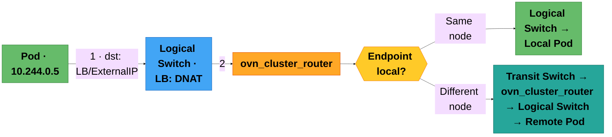

---

### Pod to NodePort (ovn pod backend) – Same Node NodePort Access

Pod accesses `<nodeIP>:<nodePort>` on the **same node** it runs on.

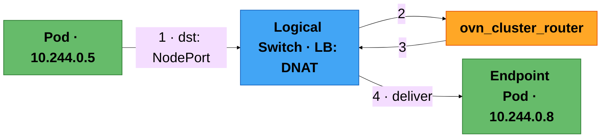

---

### Pod to NodePort (ovn pod backend) – Different Node NodePort Access

Pod accesses a NodePort on a **remote node**. After DNAT, the packet
crosses zones via the transit switch.

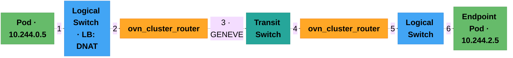

---

### Pod to ClusterIP/LoadBalancerIP/ExternalIP (host networked pod backend) – Same Node

The endpoint is a **host-networked pod on the same node**. After DNAT,
`ovn_cluster_router` delivers the packet back to the logical switch and out
the **management port** (`ovn-k8s-mp0`) to the host — it does not traverse the
join switch or gateway router.

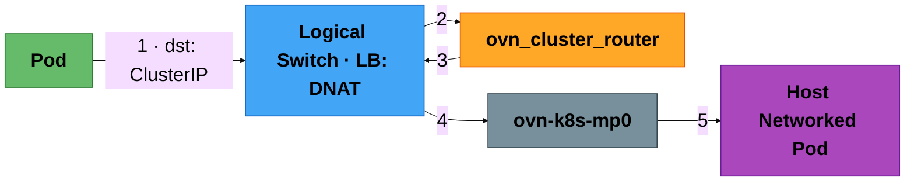

---

### Pod to ClusterIP/LoadBalancerIP/ExternalIP (host networked pod backend) – Different Node

The endpoint is a **host-networked pod on a different node**. Traffic
exits through the local GR (with SNAT), crosses the underlay, and
reaches the remote host.

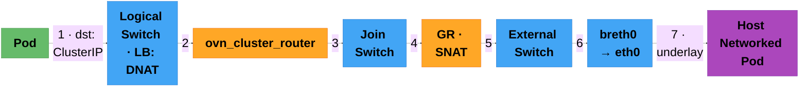

---

### Pod to NodePort (host networked pod backend) – Same Node NodePort Access

Similar to the ClusterIP → host-networked case above, but the entry
point is a NodePort VIP. Delivery is via the management port.

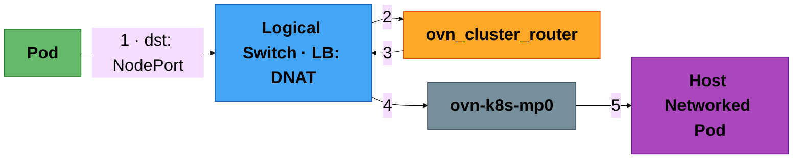

---

### Pod to NodePort (host networked pod backend) – Different Node NodePort Access

Pod accesses a NodePort backed by a host-networked pod on a **remote
node**.

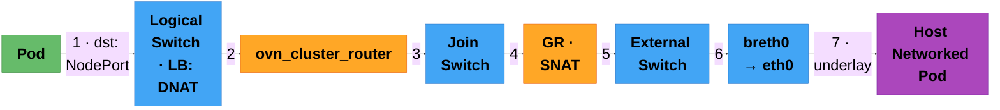

---

## Egress Traffic Flows

### Pod to External: routingViaHost=false

Default shared gateway mode. Egress goes entirely through the OVN
pipeline; the GR SNATs the pod IP to the node IP.

```mermaid
%%{init: {'theme': 'base', 'flowchart': {'nodeSpacing': 60, 'rankSpacing': 50, 'padding': 35}, 'themeVariables': {'fontSize': '70px', 'primaryTextColor': '#000000', 'secondaryTextColor': '#000000', 'tertiaryTextColor': '#000000', 'textColor': '#000000', 'nodeTextColor': '#000000'}}}%%
graph LR
    classDef pod fill:#66bb6a,stroke:#2E7D32,stroke-width:1.5px,color:#000000,font-weight:bold
    classDef sw fill:#42a5f5,stroke:#1565C0,stroke-width:1.5px,color:#000000,font-weight:bold
    classDef rtr fill:#ffa726,stroke:#E65100,stroke-width:1.5px,color:#000000,font-weight:bold
    classDef ext fill:#ef5350,stroke:#B71C1C,stroke-width:1.5px,color:#000000,font-weight:bold

    P["Pod"]:::pod -->|"1"| LS["Logical Switch"]:::sw
    LS -->|"2"| CR["ovn_cluster_router"]:::rtr
    CR -->|"3"| JS["Join Switch"]:::sw
    JS -->|"4"| GR["GR · SNAT"]:::rtr
    GR -->|"5"| ES["External Switch"]:::sw
    ES -->|"6"| BR["breth0"]:::sw
    BR -->|"7"| ETH["eth0"]:::sw
    ETH -->|"8"| EXT["External"]:::ext
```

---

### Pod to External: routingViaHost=true

Local gateway mode. Egress leaves OVN via the **management port**
(`ovn-k8s-mp0`) into the host networking stack. The host routing table
selects the egress interface and iptables/nftables masquerade SNATs to the
node IP. Traffic does **not** traverse the gateway router for SNAT.

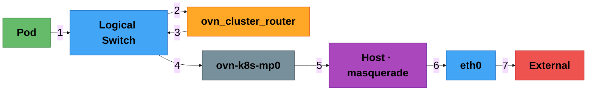

---

### Pod to External via EgressIPs – Same Node; EIP on primary br-ex shared network

The GR SNATs to the EgressIP instead of the node IP.

```mermaid
%%{init: {'theme': 'base', 'flowchart': {'nodeSpacing': 60, 'rankSpacing': 50, 'padding': 35}, 'themeVariables': {'fontSize': '70px', 'primaryTextColor': '#000000', 'secondaryTextColor': '#000000', 'tertiaryTextColor': '#000000', 'textColor': '#000000', 'nodeTextColor': '#000000'}}}%%
graph LR
    classDef pod fill:#66bb6a,stroke:#2E7D32,stroke-width:1.5px,color:#000000,font-weight:bold
    classDef sw fill:#42a5f5,stroke:#1565C0,stroke-width:1.5px,color:#000000,font-weight:bold
    classDef rtr fill:#ffa726,stroke:#E65100,stroke-width:1.5px,color:#000000,font-weight:bold
    classDef ext fill:#ef5350,stroke:#B71C1C,stroke-width:1.5px,color:#000000,font-weight:bold

    P["Pod"]:::pod -->|"1"| LS["Logical Switch"]:::sw
    LS -->|"2"| CR["ovn_cluster_router"]:::rtr
    CR -->|"3"| JS["Join Switch"]:::sw
    JS -->|"4"| GR["GR · SNAT → EgressIP"]:::rtr
    GR -->|"5"| ES["External Switch · breth0"]:::sw
    ES -->|"6"| ETH["eth0"]:::sw
    ETH -->|"7 · src: EgressIP"| EXT["External"]:::ext
```

---

### Pod to External via EgressIPs – Same Node; EIP on secondary network

When the EgressIP is on a **secondary host interface**, `ovn_cluster_router`
reroutes the packet to the local management port. The host then applies an
iptables SNAT (`OVN-KUBE-EGRESS-IP-MULTI-NIC`) to the EgressIP and an ip-rule
steers the packet out the secondary NIC. No NAT is performed on the gateway
router.

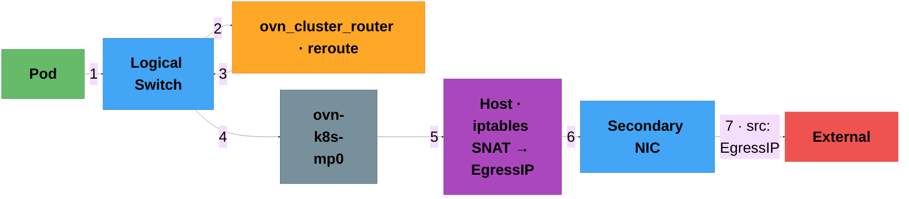

---

### Pod to External via EgressIPs – Destination towards other Nodes in cluster

When the egress destination is **another node in the cluster**.

```mermaid
%%{init: {'theme': 'base', 'flowchart': {'nodeSpacing': 60, 'rankSpacing': 50, 'padding': 35}, 'themeVariables': {'fontSize': '70px', 'primaryTextColor': '#000000', 'secondaryTextColor': '#000000', 'tertiaryTextColor': '#000000', 'textColor': '#000000', 'nodeTextColor': '#000000'}}}%%
graph LR
    classDef pod fill:#66bb6a,stroke:#2E7D32,stroke-width:1.5px,color:#000000,font-weight:bold
    classDef sw fill:#42a5f5,stroke:#1565C0,stroke-width:1.5px,color:#000000,font-weight:bold
    classDef rtr fill:#ffa726,stroke:#E65100,stroke-width:1.5px,color:#000000,font-weight:bold
    classDef mgmt fill:#78909c,stroke:#37474F,stroke-width:1.5px,color:#000000,font-weight:bold

    P["Pod"]:::pod -->|"1"| LS["Logical Switch"]:::sw
    LS -->|"2"| CR["ovn_cluster_router"]:::rtr
    CR -->|"3"| JS["Join Switch"]:::sw
    JS -->|"4"| GR["GR · SNAT → EgressIP"]:::rtr
    GR -->|"5"| ES["External Switch"]:::sw
    ES -->|"6"| BR["breth0 → eth0"]:::sw
    BR -->|"7 · src: EgressIP"| DST["ovn-worker2"]:::mgmt
```

---

### Pod to External via EgressIPs – Different Node; EIP on primary br-ex shared network

Traffic is **rerouted** to the EgressIP node via the transit switch,
then exits from that node's GR.

```mermaid
%%{init: {'theme': 'base', 'flowchart': {'nodeSpacing': 60, 'rankSpacing': 50, 'padding': 35}, 'themeVariables': {'fontSize': '70px', 'primaryTextColor': '#000000', 'secondaryTextColor': '#000000', 'tertiaryTextColor': '#000000', 'textColor': '#000000', 'nodeTextColor': '#000000'}}}%%
graph LR
    classDef pod fill:#66bb6a,stroke:#2E7D32,stroke-width:1.5px,color:#000000,font-weight:bold
    classDef sw fill:#42a5f5,stroke:#1565C0,stroke-width:1.5px,color:#000000,font-weight:bold
    classDef rtr fill:#ffa726,stroke:#E65100,stroke-width:1.5px,color:#000000,font-weight:bold
    classDef ts fill:#26a69a,stroke:#00695C,stroke-width:1.5px,color:#000000,font-weight:bold
    classDef ext fill:#ef5350,stroke:#B71C1C,stroke-width:1.5px,color:#000000,font-weight:bold

    P["Pod"]:::pod -->|"1"| LS1["Logical Switch"]:::sw
    LS1 -->|"2"| CR1["ovn_cluster_router"]:::rtr
    CR1 -->|"3 · reroute"| TS["Transit Switch"]:::ts
    TS -->|"4"| CR2["ovn_cluster_router"]:::rtr
    CR2 -->|"5"| JS2["Join Switch"]:::sw
    JS2 -->|"6"| GR2["GR · SNAT → EgressIP"]:::rtr
    GR2 -->|"7"| ES2["External Switch"]:::sw
    ES2 -->|"8 · src: EgressIP"| EXT["External"]:::ext
```

---

### Pod to External via EgressIPs – Different Node; EIP on secondary network

Traffic is **rerouted** to the EgressIP node via the transit switch. On that
node, `ovn_cluster_router` sends the packet out the management port; the host
performs iptables SNAT to the EgressIP and steers it onto the secondary NIC.

```mermaid
%%{init: {'theme': 'base', 'flowchart': {'nodeSpacing': 60, 'rankSpacing': 50, 'padding': 35}, 'themeVariables': {'fontSize': '70px', 'primaryTextColor': '#000000', 'secondaryTextColor': '#000000', 'tertiaryTextColor': '#000000', 'textColor': '#000000', 'nodeTextColor': '#000000'}}}%%
graph LR
    classDef pod fill:#66bb6a,stroke:#2E7D32,stroke-width:1.5px,color:#000000,font-weight:bold
    classDef sw fill:#42a5f5,stroke:#1565C0,stroke-width:1.5px,color:#000000,font-weight:bold
    classDef rtr fill:#ffa726,stroke:#E65100,stroke-width:1.5px,color:#000000,font-weight:bold
    classDef ts fill:#26a69a,stroke:#00695C,stroke-width:1.5px,color:#000000,font-weight:bold
    classDef host fill:#ab47bc,stroke:#6A1B9A,stroke-width:1.5px,color:#000000,font-weight:bold
    classDef mgmt fill:#78909c,stroke:#37474F,stroke-width:1.5px,color:#000000,font-weight:bold
    classDef ext fill:#ef5350,stroke:#B71C1C,stroke-width:1.5px,color:#000000,font-weight:bold

    P["Pod"]:::pod -->|"1"| LS1["Logical Switch"]:::sw
    LS1 -->|"2"| CR1["ovn_cluster_router"]:::rtr
    CR1 -->|"3 · reroute"| TS["Transit Switch"]:::ts
    TS -->|"4"| CR2["ovn_cluster_router · reroute"]:::rtr
    CR2 -->|"5"| LS2["Logical Switch"]:::sw
    LS2 -->|"6"| MP["ovn-k8s-mp0"]:::mgmt
    MP -->|"7"| HOST["Host · iptables SNAT → EgressIP"]:::host
    HOST -->|"8"| ETH2["Secondary NIC"]:::sw
    ETH2 -->|"9 · src: EgressIP"| EXT["External"]:::ext
```

---

## Ingress Traffic Flows

### External to NodePort/ExternalIP/LoadBalancerIP (ovn pod backend) – Same Node: routingViaHost=false

External traffic enters the node where the **backend pod is local**.


---

### External to NodePort/ExternalIP/LoadBalancerIP (ovn pod backend) – Different Node: routingViaHost=false

External traffic enters one node but the backend pod is on a
**different node**. After DNAT, traffic crosses zones via the transit switch.


---

### External to NodePort/ExternalIP/LoadBalancerIP (ovn pod backend) – Same Node: routingViaHost=true

Local gateway mode. External traffic enters the **host routing stack**,
then enters OVN via the management port.

```mermaid
%%{init: {'theme': 'base', 'flowchart': {'nodeSpacing': 60, 'rankSpacing': 50, 'padding': 35}, 'themeVariables': {'fontSize': '50px', 'primaryTextColor': '#000000', 'secondaryTextColor': '#000000', 'tertiaryTextColor': '#000000', 'textColor': '#000000', 'nodeTextColor': '#000000'}}}%%
graph LR
    classDef pod fill:#66bb6a,stroke:#2E7D32,stroke-width:1.5px,color:#000000,font-weight:bold
    classDef sw fill:#42a5f5,stroke:#1565C0,stroke-width:1.5px,color:#000000,font-weight:bold
    classDef host fill:#ab47bc,stroke:#6A1B9A,stroke-width:1.5px,color:#000000,font-weight:bold
    classDef mgmt fill:#78909c,stroke:#37474F,stroke-width:1.5px,color:#000000,font-weight:bold
    classDef ext fill:#ef5350,stroke:#B71C1C,stroke-width:1.5px,color:#000000,font-weight:bold

    EXT["External"]:::ext -->|"1"| ETH["eth0"]:::sw
    ETH -->|"2"| BR["breth0"]:::sw
    BR -->|"3"| HOST["Host · iptables DNAT"]:::host
    HOST -->|"4"| MP["ovn-k8s-mp0"]:::mgmt
    MP -->|"5"| LS["Logical Switch"]:::sw
    LS -->|"6"| P["Pod · 10.244.0.5"]:::pod
```

---

### External to NodePort/ExternalIP/LoadBalancerIP (ovn pod backend) – Different Node: routingViaHost=true

Local gateway mode, backend on a remote node. The host performs DNAT,
then OVN routes across zones via the transit switch.

```mermaid
%%{init: {'theme': 'base', 'flowchart': {'nodeSpacing': 60, 'rankSpacing': 50, 'padding': 35}, 'themeVariables': {'fontSize': '70px', 'primaryTextColor': '#000000', 'secondaryTextColor': '#000000', 'tertiaryTextColor': '#000000', 'textColor': '#000000', 'nodeTextColor': '#000000'}}}%%
graph LR
    classDef pod fill:#66bb6a,stroke:#2E7D32,stroke-width:1.5px,color:#000000,font-weight:bold
    classDef sw fill:#42a5f5,stroke:#1565C0,stroke-width:1.5px,color:#000000,font-weight:bold
    classDef rtr fill:#ffa726,stroke:#E65100,stroke-width:1.5px,color:#000000,font-weight:bold
    classDef ts fill:#26a69a,stroke:#00695C,stroke-width:1.5px,color:#000000,font-weight:bold
    classDef host fill:#ab47bc,stroke:#6A1B9A,stroke-width:1.5px,color:#000000,font-weight:bold
    classDef mgmt fill:#78909c,stroke:#37474F,stroke-width:1.5px,color:#000000,font-weight:bold
    classDef ext fill:#ef5350,stroke:#B71C1C,stroke-width:1.5px,color:#000000,font-weight:bold

    EXT["External"]:::ext -->|"1"| ETH["eth0"]:::sw
    ETH -->|"2"| BR["breth0"]:::sw
    BR -->|"3"| HOST["Host · DNAT"]:::host
    HOST -->|"4"| MP["ovn-k8s-mp0"]:::mgmt
    MP -->|"5"| LS1["Logical Switch"]:::sw
    LS1 -->|"6"| CR1["ovn_cluster_router"]:::rtr
    CR1 -->|"7 · GENEVE"| TS["Transit Switch"]:::ts
    TS -->|"8"| CR2["ovn_cluster_router"]:::rtr
    CR2 -->|"9"| LS2["Logical Switch"]:::sw
    LS2 -->|"10"| P["Pod"]:::pod
```

---

### External to NodePort/ExternalIP/LoadBalancer (ovn pod backend) ETP=local with EgressIPs

With `externalTrafficPolicy: Local`, only **local endpoints** receive
ingress traffic (preserving client source IP). A special `skip_snat`
load balancer is used on the GR to preserve the client IP.

**Ingress path:**

```mermaid
%%{init: {'theme': 'base', 'flowchart': {'nodeSpacing': 60, 'rankSpacing': 50, 'padding': 35}, 'themeVariables': {'fontSize': '60px', 'primaryTextColor': '#000000', 'secondaryTextColor': '#000000', 'tertiaryTextColor': '#000000', 'textColor': '#000000', 'nodeTextColor': '#000000'}}}%%
graph LR
    classDef pod fill:#66bb6a,stroke:#2E7D32,stroke-width:1.5px,color:#000000,font-weight:bold
    classDef sw fill:#42a5f5,stroke:#1565C0,stroke-width:1.5px,color:#000000,font-weight:bold
    classDef rtr fill:#ffa726,stroke:#E65100,stroke-width:1.5px,color:#000000,font-weight:bold
    classDef ext fill:#ef5350,stroke:#B71C1C,stroke-width:1.5px,color:#000000,font-weight:bold

    EXT["External"]:::ext -->|"1"| ETH["eth0"]:::sw
    ETH -->|"2"| BR["breth0"]:::sw
    BR -->|"3"| ES["Ext Switch"]:::sw
    ES -->|"4"| GR["GR · DNAT · skip_snat · ETP=local"]:::rtr
    GR -->|"5 · client IP preserved"| JS["Join Switch"]:::sw
    JS -->|"6"| CR["ovn_cluster_router"]:::rtr
    CR -->|"7"| LS["Logical Switch"]:::sw
    LS -->|"8"| P["Local Pod"]:::pod
```

**Reply path (EgressIP as source):**

```mermaid
%%{init: {'theme': 'base', 'flowchart': {'nodeSpacing': 60, 'rankSpacing': 50, 'padding': 35}, 'themeVariables': {'fontSize': '70px', 'primaryTextColor': '#000000', 'secondaryTextColor': '#000000', 'tertiaryTextColor': '#000000', 'textColor': '#000000', 'nodeTextColor': '#000000'}}}%%
graph LR
    classDef pod fill:#66bb6a,stroke:#2E7D32,stroke-width:1.5px,color:#000000,font-weight:bold
    classDef sw fill:#42a5f5,stroke:#1565C0,stroke-width:1.5px,color:#000000,font-weight:bold
    classDef rtr fill:#ffa726,stroke:#E65100,stroke-width:1.5px,color:#000000,font-weight:bold
    classDef ext fill:#ef5350,stroke:#B71C1C,stroke-width:1.5px,color:#000000,font-weight:bold

    P["Pod reply"]:::pod -->|"1"| LS["Logical Switch"]:::sw
    LS -->|"2"| CR["ovn_cluster_router"]:::rtr
    CR -->|"3"| JS["Join Switch"]:::sw
    JS -->|"4"| GR["GR · SNAT → EgressIP"]:::rtr
    GR -->|"5"| ES["External Switch"]:::sw
    ES -->|"6"| BR["breth0 → eth0"]:::sw
    BR -->|"7 · src: EgressIP"| EXT["External Client"]:::ext
```

---

## Summary — Component Roles

<div style="text-align: center;">

```mermaid
%%{init: {'theme': 'base', 'flowchart': {'nodeSpacing': 30, 'rankSpacing': 50, 'padding': 15}, 'themeVariables': {'fontSize': '16px', 'primaryTextColor': '#000000', 'secondaryTextColor': '#000000', 'tertiaryTextColor': '#000000', 'textColor': '#000000', 'nodeTextColor': '#000000'}}}%%
graph TD
    classDef sw fill:#42a5f5,stroke:#1565C0,stroke-width:1.5px,color:#000000,font-weight:bold
    classDef rtr fill:#ffa726,stroke:#E65100,stroke-width:1.5px,color:#000000,font-weight:bold
    classDef ts fill:#26a69a,stroke:#00695C,stroke-width:1.5px,color:#000000,font-weight:bold

    LS["Logical Switch · per node"]:::sw -->|"pod traffic + LB DNAT"| CR["ovn_cluster_router · per zone"]:::rtr
    CR -->|"intra-zone routing"| LS
    CR -->|"cross-zone routing"| TS["Transit Switch · cluster-wide"]:::ts
    CR -->|"north-south routing"| JS["Join Switch"]:::sw
    JS --> GR["Gateway Router · per node · SNAT / DNAT"]:::rtr
    GR --> ES["External Switch · per node"]:::sw
    ES --> BRINT["breth0 ↔ eth0"]:::sw
```

</div>

| Component | Scope | Role |
|---|---|---|
| **Logical Switch** | Node-local | Hosts pod ports; attaches load balancers for service DNAT |
| **ovn_cluster_router** | Per zone | Routes east-west traffic; connects to transit switch for cross-zone |
| **Join Switch** | Per zone | Connects ovn_cluster_router to gateway routers |
| **Gateway Router** | Per node | Handles north-south traffic; SNAT (egress) and DNAT (ingress) |
| **External Switch** | Per node | Bridges gateway router to the physical network via breth0 |
| **Transit Switch** | Cluster-wide | Carries cross-zone traffic over GENEVE tunnels on the underlay |
| **ovn-k8s-mp0** | Per node | Management port for host ↔ OVN pod connectivity |
