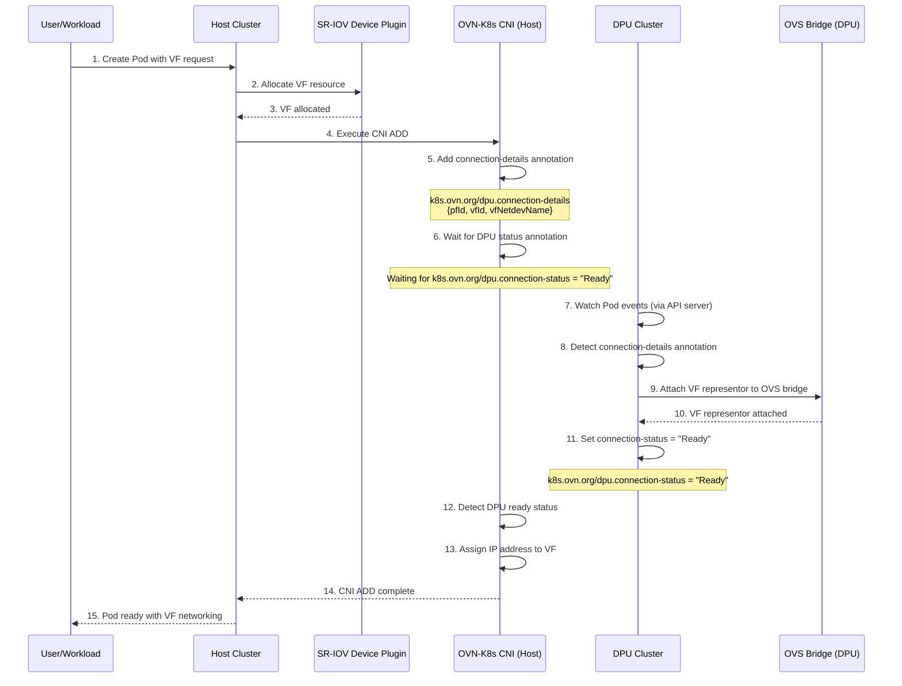

# DPU support

With the emergence of [Data Processing Units] (DPUs), NIC vendors can now offer
greater hardware acceleration capability, flexibility and security.

It is desirable to leverage DPU in OVN-Kubernetes to accelerate networking and
secure the network control plane.

A DPU consists of:

- An industry-standard, high-performance, software-programmable multi-core CPU
- A High-performance network interface
- Flexible and programmable acceleration engines

A DPU follows the kernel [switchdev] model, similar to Smart-NICs.
In this model, every VF/PF net-device on the host has a corresponding
representor net-device existing on the embedded CPU.

Any vendor that manufactures a DPU which supports the above model should work
with current design.

## Design

### Two Clusters

In order to support DPUs in OVN-Kubernetes, we need two Kubernetes clusters,
one on the host and another on the DPU.
We will refer to the host cluster as the "Host Cluster" and the DPU cluster as
the "DPU Cluster".

The Host Cluster run user workloads and the DPU management components.

The DPU Cluster contains only what is necessary to provide networking for the
Host Cluster's workloads.

The interaction between these two clusters will be described in the
[Pod Networking Workflow](#pod-networking-workflow) section.

In order to support this, we now have 3 modes in which to deploy the
`ovnkube-node` component, specified by the `--ovnkube-node-mode` flag.

### ovnkube-node Deployment Modes

- `full` (default)
- `dpu`
- `dpu-host`

#### `full` mode

This mode is the default mode and is the same as the traditional OVN-Kubernetes
deployment. It should NOT be used in a DPU-enabled environment.

#### `dpu` mode

This mode is used to deploy the `ovnkube-node` component on the DPU.
It contains all of the same components as the `full` mode althought the logic
may be slightly different to account for DPU-specific operations.

Note that in this mode, ovnkube-node is watching for Pod events in the Host
Cluster. It is not watching for Pod events in the DPU Cluster, hence it cannot
act as a CNI for the DPU Cluster.

#### `dpu-host` mode

This mode is used to deploy the `ovnkube-node` component on the DPU host.
In this mode, only the `ovnkube-node` component is deployed.

It is expected that this is the ONLY ovn-kubernetes component deployed on the
DPU host.

DPU-Host mode assumes all pods will be served by the DPU.

### SR-IOV VF Allocation

DPU support in OVN-Kubernetes requires that the SR-IOV VF is allocated before
the OVN-Kubernetes CNI is executed. The exact method of allocation is left as an
exercise for the vendor.

### Pod Networking Workflow

The following diagram shows the Pod Networking Workflow.

As shown in the diagram, annotations are used to convey the necessary
information to the DPU Cluster to setup the network plumbing.
Annotations are then used to signal the Host Cluster's OVN-Kubernetes that the
DPU network plumbing is complete.

While the diagram above shows the successful completion of the Pod Networking
Workflow, it is possible for the Pod Networking Workflow to fail if the DPU
network plumbing is not successfully completed. This is indicated by the
`k8s.ovn.org/dpu.connection-status` annotation being set to `Error`.

### Gateway Interface Configuration

For detailed configuration of gateway interfaces in DPU host mode, see
[DPU Gateway Interface Configuration].

[switchdev]:https://www.kernel.org/doc/html/latest/networking/switchdev.html
[Data Processing Units]:https://www.nvidia.com/en-us/networking-containers/products/data-processing-unit/
[DPU Gateway Interface Configuration]: dpu-gateway-interface.md
