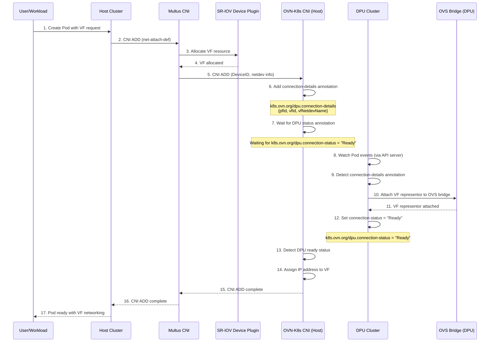

# DPU support

## Introduction

OVN-Kubernetes can run on [Data Processing Units](https://www.nvidia.com/en-us/networking-containers/products/data-processing-unit/) (DPUs) to accelerate pod networking and secure the network control plane. A DPU provides its own CPU, storage, memory, and OS, plus an embedded SmartNIC for hardware-offloaded packet processing. From the host, a DPU appears as a standard SR-IOV NIC with Physical Functions (PFs) and Virtual Functions (VFs). It follows the kernel [switchdev](https://www.kernel.org/doc/html/latest/networking/switchdev.html) model: each host VF has a corresponding representor net-device on the DPU, and PFs have uplink representors for the eSwitch.

This document describes how to enable and operate OVN-Kubernetes in DPU-enabled environments, including deployment modes, workflow, and troubleshooting.

## Motivation

- **Hardware acceleration**: Use DPU offload to improve pod networking performance and reduce host CPU usage.
- **Control-plane isolation**: Run OVN control-plane components on the DPU to improve security and isolation from the host.

### User stories / use cases

1. **As a** cluster operator running workloads that need high-throughput or low-latency networking, **I want** to use DPU hardware offload for pod traffic **so that** performance is improved and host resources are preserved.

2. **As a** security-conscious operator, **I want** the OVN control plane for my nodes to run on the DPU **so that** the host cluster sees a smaller attack surface and network policy enforcement is offloaded.

3. **As a** platform integrator, **I want** to deploy OVN-Kubernetes in a split “host + DPU” topology **so that** I can manage host and DPU clusters separately (e.g., via a DPU platform like DOCA) while OVN-Kubernetes wires pod networking end-to-end.

## How to enable this feature on an OVN-Kubernetes cluster?

Always check the dependencies on the [Requirements page](../requirements.md).

- **Deployment topology**: There are two possible deployment models:
  - **Off-host-cluster**: Running OVN-Kubernetes on the DPU as **off-host-cluster** is currently the only supported mode. The DPU is not a node in the host Kubernetes cluster; DPUs are typically managed as a separate “DPU cluster” (e.g., via DOCA Platform Framework).
  - **On-host-cluster**: In this mode, there is a single Kubernetes cluster that contains both the host and the DPU nodes. This mode is not currently supported.

- **OVN-Kubernetes installation**: OVN-Kubernetes can be installed using the project’s Helm charts (see the installation guide), however you must ensure to use the correct `ovnkube-node-mode` for each cluster.

- **ovnkube-node mode**: Use the `--ovnkube-node-mode` flag (or the Helm chart value `ovnkube-node.mode`) to select how `ovnkube-node` is deployed:
  - **`full`** (default): Traditional deployment; **do not use** in a DPU-enabled environment.
  - **`dpu`**: Run `ovnkube-node` in this mode on the DPU cluster. It watches the host cluster and performs DPU-specific operations; it does not act as the CNI for the DPU cluster.
  - **`dpu-host`**: Run `ovnkube-node` in this mode on the host cluster. This is the only OVN-Kubernetes component that should run on the host cluster.

- **Gateway interface (dpu-host only)**: You must specify the gateway interface using one of two options. Both methods are described with examples in [Gateway interface configuration (DPU host mode)](#gateway-interface-configuration-dpu-host-mode).
  - **Manual** — set `--gateway-interface=<interface-name>` (e.g. `--gateway-interface=eth0`);
  - **Automatic** — set `--gateway-interface=derive-from-mgmt-port` and the management port via `--ovnkube-node-mgmt-port-netdev` or `--ovnkube-node-mgmt-port-dp-resource-name` so the gateway is derived from the management VF’s PF.

- **SR-IOV and Multus**: DPU support relies on SR-IOV VFs. You need the [SR-IOV device plugin](https://github.com/k8snetworkplumbingwg/sriov-network-device-plugin) to reserve and configure SR-IOV resource pools per node, and [Multus](https://github.com/k8snetworkplumbingwg/multus-cni) to pass VF device information to OVN-Kubernetes so it can wire the VF correctly on the DPU.

## Workflow Description

### OVN-Kubernetes architecture with DPU

The DPU runs its own OS and can be treated like a separate node. In off-host-cluster mode, the host cluster runs the CNI and schedules pods; the DPU cluster runs `ovnkube-node` in `dpu` mode and performs the data-path setup on the DPU (e.g., attaching VF representors to OVS). Coordination is done via pod annotations. There is a health check mechanism in place to ensure that the DPU is ready to serve pods.

All pods (except those that are hostnetworked) must request a resource from the SRIOV-Device-Plugin.
This is typically injected into the pod spec via a webhook to ensure that all pods have this without the need for the user to manually request the resource.

[!NOTE]
The current design assumes that all pods (except those that are hostnetworked) are DPU accelerated.
This limitation may be lifted in the future.

### Pod networking workflow

The following sequence describes how a pod gets a VF and how the host and DPU coordinate.


```mermaid
sequenceDiagram
    participant User as User/Workload
    participant Host as Host Cluster
    participant Multus as Multus CNI
    participant SRIOV as SR-IOV Device Plugin
    participant CNI as OVN-K8s CNI (Host)
    participant DPU as DPU Cluster
    participant OVS as OVS Bridge (DPU)

    User->>Host: 1. Create Pod with VF request
    Host->>Multus: 2. CNI ADD (net-attach-def)
    Multus->>SRIOV: 3. Allocate VF resource
    SRIOV-->>Multus: 4. VF allocated
    Multus->>CNI: 5. CNI ADD (DeviceID, netdev info)
    CNI->>CNI: 6. Add connection-details annotation
    Note over CNI: k8s.ovn.org/dpu.connection-details<br/>{pfId, vfId, vfNetdevName}
    CNI->>CNI: 7. Wait for DPU status annotation
    Note over CNI: Waiting for k8s.ovn.org/dpu.connection-status = "Ready"

    DPU->>DPU: 8. Watch Pod events (via API server)
    DPU->>DPU: 9. Detect connection-details annotation
    DPU->>OVS: 10. Attach VF representor to OVS bridge
    OVS-->>DPU: 11. VF representor attached
    DPU->>DPU: 12. Set connection-status = "Ready"
    Note over DPU: k8s.ovn.org/dpu.connection-status = "Ready"

    CNI->>CNI: 13. Detect DPU ready status
    CNI->>CNI: 14. Assign IP address to VF
    CNI-->>Multus: 15. CNI ADD complete
    Multus-->>Host: 16. CNI ADD complete
    Host-->>User: 17. Pod ready with VF networking
```

- **Multus** is invoked for the pod’s VF network attachment; it obtains a VF from the SR-IOV device plugin and invokes the OVN-Kubernetes CNI with **DeviceID and netdev info** in the CNI ADD request.
- The host CNI adds a **connection-details** annotation so the DPU knows which PF/VF and netdev to use.
- The host CNI then waits for a **connection-status** annotation set by the DPU before assigning the pod IP to the VF.
- If the DPU cannot complete setup, it sets `k8s.ovn.org/dpu.connection-status` to `Error`; the workflow fails accordingly.

## Implementation Details

### User-facing API changes

None. Configuration is done entirely via the command-line flags and Helm chart values described in [How to enable this feature on an OVN-Kubernetes cluster?](#how-to-enable-this-feature-on-an-ovn-kubernetes-cluster).

### OVN-Kubernetes implementation details

- **Host (dpu-host mode)**: Only `ovnkube-node` runs. It performs CNI ADD/DEL and manages the connection-details annotation, then waits for connection-status from the DPU before completing ADD.
- **DPU (dpu mode)**: `ovnkube-node` watches the host cluster API for pods with `k8s.ovn.org/dpu.connection-details`. It programs the DPU (e.g., attaches the VF representor to the OVS bridge) and sets `k8s.ovn.org/dpu.connection-status`.

Host and DPU coordination uses internal pod annotations (not a CRD). These are written and consumed by the components; users do not set or read them:

- **`k8s.ovn.org/dpu.connection-details`**: Written by the host CNI. Contains the information the DPU needs to plumb the VF (e.g., `pfId`, `vfId`, `vfNetdevName`).
- **`k8s.ovn.org/dpu.connection-status`**: Written by the DPU-side component. Values: `Ready` (VF attached and ready) or `Error` (setup failed).

DPU health is reflected in a custom **Lease** in the `ovn-kubernetes` namespace. The DPU host creates the lease with an owner reference to the Node; the DPU renews it periodically. If the lease expires, the DPU host CNI server fails `ADD` requests immediately with `DPU Not Ready` and the `STATUS` command returns a CNI error with code `50` (The plugin is not available). This causes the container runtime to report `NetworkReady=false`, preventing new workloads from landing on the affected host until the DPU becomes healthy again. See [Troubleshooting](#troubleshooting) for how to investigate and resolve lease expiry.

#### Differences between full and dpu modes

Although `ovnkube-node` in **dpu** mode is conceptually similar to **full** mode, several aspects behave differently to support the split host/DPU topology:

- **CNI handling**: In **full** mode, the node is the CNI for that cluster: it handles CNI ADD/DEL, configures OVS, and assigns pod IPs. In **dpu** mode, the node does **not** act as the CNI for the DPU cluster; it watches the **host** cluster API for pods with `k8s.ovn.org/dpu.connection-details`, programs the DPU (e.g. attaches VF representors to the OVS bridge), and sets `k8s.ovn.org/dpu.connection-status`. The **dpu-host** node on the host runs the CNI and completes ADD only after the DPU sets connection-status to Ready.

- **Port types**: In **full** mode, pod interfaces are typically veth pairs or OVS-attached ports on the node. In the DPU path, the host pod gets a VF netdev; on the DPU, the corresponding entity is a **VF representor** attached to the node’s OVS bridge. Port creation and lifecycle are therefore different (annotation-driven on the DPU, CNI-driven on the host).

- **Gateway setup**: In **full** mode, the node sets up the gateway (e.g. bridge, external port, routing) on that node. In **dpu-host** mode, the host runs only the CNI and must have the gateway interface configured explicitly (manually or via derive-from-mgmt-port); the DPU does not run gateway logic for the host’s default network in the same way a full node does. On the DPU (**dpu** mode), OVS and OVN are used to switch traffic for the VF representors; gateway behavior for the host cluster’s pods is determined by the host’s dpu-host configuration and the DPU’s OVS/OVN data path.

- **Health and readiness**: In **full** mode, node readiness is the usual kubelet/CNI health. In the DPU setup, the **dpu-host** node relies on a **Lease** in the host cluster that the DPU renews; if the lease expires, the host CNI fails ADD with “DPU Not Ready” and CNI error code 50 until the DPU is healthy again.

#### Options for DPU health (lease)

- `--dpu-node-lease-renew-interval` (seconds, default 10). Set to `0` to disable the health check.
- `--dpu-node-lease-duration` (seconds, default 40).

#### OVN constructs and OVS flows

On the DPU, OVN-Kubernetes uses the same general OVN/OVS model as on a regular node (logical ports, OVS bridge attachment). The main difference is that the “node” is the DPU and the port is the VF representor. For concrete OVN NBDB/SBDB objects and OVS flows, the same debugging approaches as for non-DPU nodes apply (e.g., `ovn-nbctl` / `ovn-sbctl` on the DPU, `ovs-ofctl` on the DPU OVS bridge). Exact constructs depend on the topology (local vs shared gateway, etc.).

### Gateway interface configuration (DPU host mode)

The gateway can be set **manually** (e.g. `--gateway-interface=eth0`) or **automatically** with **derive-from-mgmt-port**. The automatic option is useful when the management port is a VF and the Physical Function (PF) is used for external connectivity: derive-from-mgmt-port discovers the PF from the management port VF and uses it as the gateway, avoiding manual VF-to-PF mapping.

#### How derive-from-mgmt-port works

When `--gateway-interface=derive-from-mgmt-port` is set, OVN-Kubernetes:

1. **Management port resolution**: Gets the management port network device name (from `--ovnkube-node-mgmt-port-netdev` or `--ovnkube-node-mgmt-port-dp-resource-name`; the resource name has priority and refers to an SR-IOV device plugin pool).
2. **VF PCI address**: Reads the PCI address of that management port device (the VF).
3. **PF PCI address**: Resolves the Physical Function PCI address from the VF PCI address.
4. **PF netdevs**: Finds all network devices associated with the PF PCI address.
5. **Selection**: Uses the first available PF network device as the gateway interface.

This feature is used together with the gateway accelerated interface: the management port identifies the VF, and derive-from-mgmt-port selects the corresponding PF as the gateway accelerated interface.

#### Gateway interface configuration options

**Manual gateway** — specify the interface name directly:

```bash
--ovnkube-node-mode=dpu-host
--gateway-interface=eth0
```

**Automatic (derive-from-mgmt-port)** — command line:

```bash
--ovnkube-node-mode=dpu-host
--ovnkube-node-mgmt-port-netdev=pf0vf0
--gateway-interface=derive-from-mgmt-port
```

**Config file (derive-from-mgmt-port):**

```ini
[OvnKubeNode]
mode=dpu-host
mgmt-port-netdev=pf0vf0

[Gateway]
interface=derive-from-mgmt-port
```

**Helm (derive-from-mgmt-port):**

```yaml
ovnkube-node:
  mode: dpu-host
  mgmtPortNetdev: pf0vf0

gateway:
  interface: derive-from-mgmt-port
```

#### Example scenario

- Management port device: `pf0vf0` (VF), PCI `0000:01:02.3`
- PF PCI address: `0000:01:00.0`
- PF interfaces: `eth0`, `eth1`

With `--gateway-interface=derive-from-mgmt-port`, OVN-Kubernetes starts from `pf0vf0`, gets VF PCI `0000:01:02.3`, resolves PF PCI `0000:01:00.0`, finds `eth0` and `eth1`, and selects `eth0` as the gateway interface.

#### Requirements and limitations (gateway)

- **Mode**: Only available in DPU host mode (`--ovnkube-node-mode=dpu-host`).
- **Management port**: Must be set via `--ovnkube-node-mgmt-port-netdev` or `--ovnkube-node-mgmt-port-dp-resource-name`.
- **Hardware**: SR-IOV capable NIC with VF (management) and PF (gateway); management port must be a VF.
- **Selection**: The implementation picks the first available PF netdev; there is no way to choose among multiple PF interfaces.
- **Compatibility**: Depends on proper VF/PF driver support and may not work with all SR-IOV implementations.

#### Multiple networks

Derive-from-mgmt-port works with multiple network support when pods have multiple interfaces on different networks.

## Troubleshooting

- **Gateway interface (derive-from-mgmt-port)**: If the gateway interface is not resolving correctly in DPU host mode, verify SR-IOV and the management port. Check PF/VF layout with `lspci | grep -i ethernet`, `ip link show`, and `ls /sys/bus/pci/devices/*/virtfn*`. For the management port device (e.g. `pf0vf0`), confirm it exists with `ip link show pf0vf0`, get PCI info with `ethtool -i pf0vf0 | grep bus-info`, and inspect VF/PF PCI with `cat /sys/class/net/pf0vf0/device/address` and `cat /sys/class/net/pf0vf0/device/physfn/address`. When migrating from a manual gateway (`--gateway-interface=eth0`), switch to `--gateway-interface=derive-from-mgmt-port` after setting the management port, then re-run these checks and monitor logs for successful resolution.

  Common errors when using derive-from-mgmt-port:

  | Error | Cause | What to check |
  |-------|--------|----------------|
  | `no netdevs found for pci address <pci>` | No network devices for the PF PCI | Verify PF has interfaces (e.g. `ip link`, driver bound). |
  | `failed to get PCI address` | Cannot get PCI from management port device | Ensure management port netdev exists and is configured. |
  | `failed to get PF PCI address` | Cannot resolve PF from VF PCI | Check SR-IOV config and driver (e.g. `virtfn*` under PCI in sysfs). |
  | `failed to get network devices` | Cannot list netdevs for PF PCI | Check SR-IOV utilities and PCI/netdev visibility. |

- **Connection never becomes Ready**: Check that the DPU cluster can reach the host API server and that `ovnkube-node` in `dpu` mode is running and watching the same namespace/pods. Verify the pod’s `k8s.ovn.org/dpu.connection-details` annotation and that the DPU has the corresponding PF/VF and representor. Check DPU logs for errors when attaching the representor to the OVS bridge.

- **DPU Not Ready / CNI error code 50**: The DPU-side lease has expired. The host CNI fails ADD immediately with “DPU Not Ready” and the STATUS command returns CNI error code 50 (plugin not available). The container runtime reports `NetworkReady=false`, and new workloads will not be scheduled until the DPU is healthy again. Verify that `ovnkube-node` on the DPU is running and that it can renew the lease (check `--dpu-node-lease-renew-interval` and `--dpu-node-lease-duration`). Inspect the Lease object in the `ovn-kubernetes` namespace and the DPU node’s owner reference.

- **Metrics and alerts**: Use any existing OVN-Kubernetes metrics and health checks for the node and CNI. Monitor the DPU lease and the `k8s.ovn.org/dpu.connection-status` annotation to detect stuck or failed DPU setup.

## Best Practices

- Use the SR-IOV device plugin and Multus in a way that matches your DPU’s PF/VF layout and resource pool configuration.
- Ensure the DPU cluster has stable connectivity to the host cluster API server so that pod events and annotations are visible and the DPU can update connection-status and renew the lease.
- In DPU host mode, when the management port is a VF, consider `--gateway-interface=derive-from-mgmt-port` with a defined management port so the gateway is derived from the PF automatically (see [Gateway interface configuration (DPU host mode)](#gateway-interface-configuration-dpu-host-mode)); otherwise specify the gateway interface manually.

## Future Items

- Support using OVN-Kubernetes as the CNI for the DPU cluster (today, ovnkube-node in `dpu` mode watches only the host cluster and does not act as CNI on the DPU cluster).
- Additional deployment topologies (e.g., on-host-cluster) may be considered.
- Gateway: support selecting a specific PF netdev when multiple are available, multiple gateway interfaces, and richer diagnostics.

## Known Limitations

- Only **off-host-cluster** DPU deployment is supported.
- OVN-Kubernetes does not act as the CNI for the DPU cluster; the DPU runs the data path and responds to host-cluster pod annotations only.
- DPU host mode assumes all pods on the host are served by the DPU (except those that are hostnetworked).
- Gateway derive-from-mgmt-port: only the first available PF netdev is used; requires SR-IOV and correct VF/PF driver support.

## References

- [Kernel switchdev documentation](https://www.kernel.org/doc/html/latest/networking/switchdev.html)
- [NVIDIA Data Processing Unit](https://www.nvidia.com/en-us/networking-containers/products/data-processing-unit/)
- [SR-IOV network device plugin](https://github.com/k8snetworkplumbingwg/sriov-network-device-plugin)
- [Multus CNI](https://github.com/k8snetworkplumbingwg/multus-cni)
- [Gateway accelerated interface configuration](../../design/gateway-accelerated-interface-configuration.md)
- [Configuration guide](../../getting-started/configuration.md)
