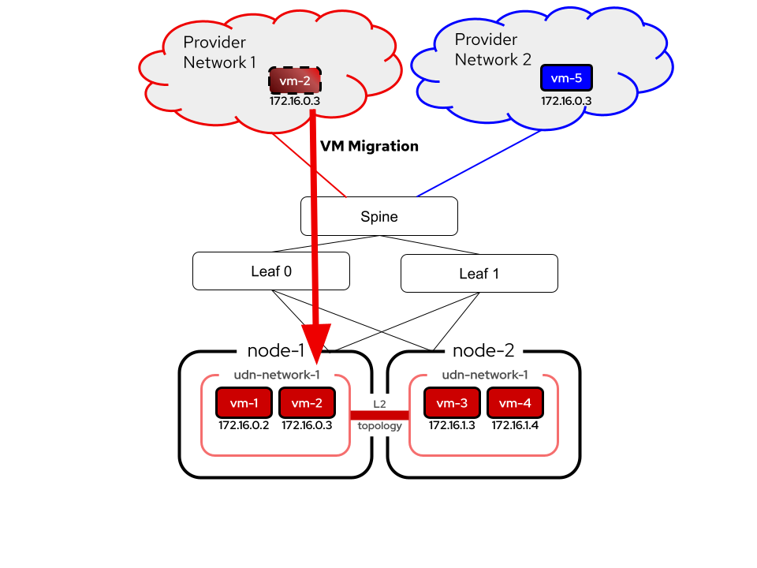
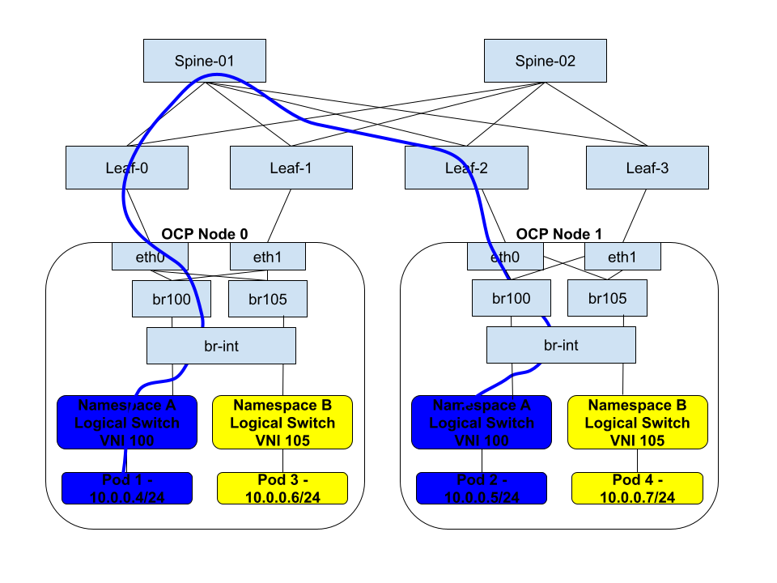
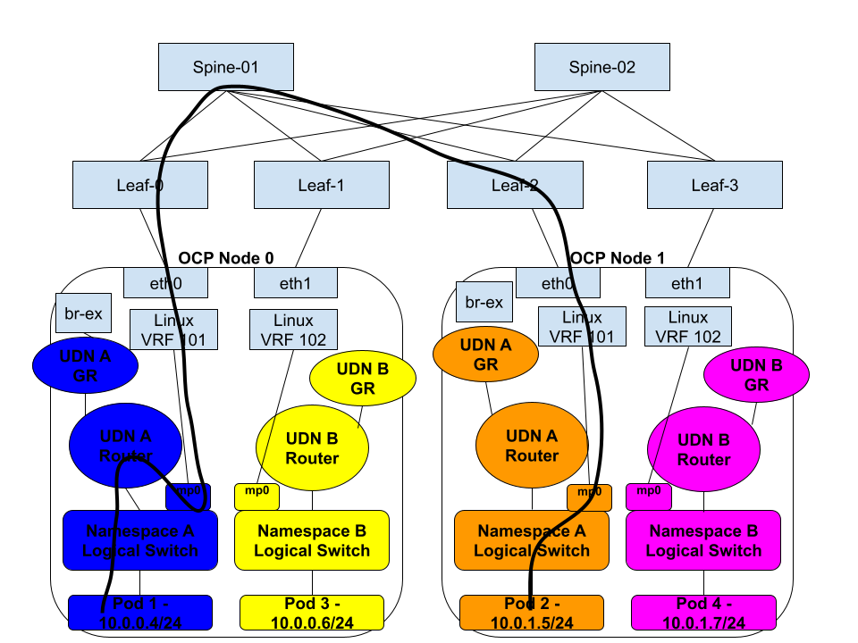

# OKEP-5088: EVPN Support

* Issue: [#5088](https://github.com/ovn-org/ovn-kubernetes/issues/5088)

## Problem Statement

The purpose of this enhancement is to add support for EVPN within the OVN-Kubernetes SDN, specifically with BGP. This
effort will allow exposing User Defined Networks (UDNs) externally via a VPN to other entities either
inside, or outside the cluster. BGP+EVPN is a common and native networking standard that will enable integration into
a user's networks without SDN specific network protocol integration, and provide an industry standardized way to achieve
network segmentation between sites.

## Goals

* To provide a user facing API to allow configuration of EVPN on Kubernetes worker nodes to integrate with a provider's
  EVPN fabric.
* EVPN support will be provided for Layer 2 (MAC-VRF) or Layer 3 (IP-VRF) OVN-Kubernetes Primary User Defined Network
  types.
* EVPN Multi-Homing + Mass Withdrawal support, including BFD support for link detection.
* FRR providing EVPN connectivity via BGP and acting as the Kubernetes worker node PE router.
* Support for EVPN in local gateway mode only.
* Support for EVPN in on-prem deployments only.

## Non-Goals

* Providing EVPN support for Secondary User Defined Network types. This may come in a later enhancement.
* Providing support for any other virtual router as a PE router.
* Asymmetric Integrated Routing and Bridging (IRB) with EVPN.

## Future-Goals

* Support for EVPN in shared gateway mode once there is OVN support.
* Potential cloud platform support.
* Potentially advertising service Cluster IPs.
* Cloud platform BGP/EVPN enablement.

## Introduction

The BGP feature has been implemented in OVN-Kubernetes, which allows a user expose pods and other internal Kubernetes
network entities outside the cluster with dynamic routing. The previous
[BGP enhancement](https://github.com/openshift/enhancements/blob/master/enhancements/network/bgp-ovn-kubernetes.md) was
tracked in OpenShift.

Additionally, the User Defined Network (UDN) feature has
brought the capability for a user to be able to create per tenant networks. Combining these features today allows a user
to either:
- BGP advertise the Cluster Default Network (CDN) as well as leak non-IP-overlapping UDNs into default VRF.
- Expose UDNs via BGP peering over different network interfaces on an OCP node, allowing a VPN to be terminated on the
  next hop PE router, and preserved into the OCP node. Also known in the networking industry as VRF-Lite.

While VRF-Lite allows for a UDN to be carried via a VPN to external networks, it is cumbersome to configure and requires
an interface per UDN to be available on the host. By leveraging EVPN, these limitations no longer exist and all UDNs can
traverse the same host interface, segregated by VXLAN. Furthermore, with exposing UDNs via BGP today there is a limitation
that these networks are advertised as an L3 segment. With EVPN, we can now stretch the L2 UDN segment across the external
network fabric. Finally, EVPN is a common datacenter networking fabric that many users with Kubernetes clusters already
rely on for their top of rack (TOR) network connectivity. It is a natural next step to enable the Kubernetes platform
to be able to directly integrate with this fabric directly.

## User-Stories/Use-Cases

The user stories will be broken down into more detail in the subsections below. The main use cases include:
* As a user, I want to connect my Kubernetes cluster to VMs or physical hosts on an external network. I want tenant
  pods/VMs inside my Kubernetes cluster to be able to only communicate with certain network segments on this external
  network.
* As a user, I want to be able to live migrate VMs from my external network onto the Kubernetes platform.
* As a user, my data center where I run Kubernetes is already using EVPN today. I want to eliminate the use of Geneve
  which causes double encapsulation (VXLAN and Geneve), and integrate natively with my networking fabric.
* As a user, I want to create overlapping IP address space UDNs, and then connect them to different external networks
  while preserving network isolation.

### Extending UDNs into the provider network via EVPN

This use case is about connecting a Kubernetes cluster to one or more external networks and preserving the network
isolation of the UDN and external virtual routing and forwarding instances (VRFs) segments. Consider the following
diagram:


In this example a user has traditional Finance and HR networks. These networks are in their own VRFs, meaning they are
isolated from one another and are unable to communicate or even know about the other. These networks may overlap in IP
addressing. Additionally, the user has a Kubernetes cluster where they are migrating some traditional servers/VMs
workloads over to the Kubernetes platform. In this case, the user wants to preserve the same network isolation they had
previously, while also giving the Kubernetes based Finance and HR tenants connectivity to the legacy external networks.

By combining EVPN and UDN this becomes possible. The blue Finance network UDN is created with the Kubernetes cluster, and
integrated into the user's EVPN fabric, extending it to the traditional Finance external network. The same is true for
the yellow HR network. The Finance and HR network isolation is preserved from the Kubernetes cluster outward to the
external networks.

### Extending Layer 2 UDNs into the provider network to allow VM migration

Building upon the previous example, the network connectivity between a UDN and an external network can be done using
either Layer 3 (IP-VRF) or Layer 2 (MAC-VRF). With the former, routing occurs between entities within the Kubernetes
UDN and the corresponding external network, while with the latter, the UDN and the external network are both part of the
same layer 2 broadcast domain. VM migration relies on being a part of the same L2 segment in order to preserve MAC
address reachability as well as IP address consistency. With MAC-VRFs and EVPN it becomes possible to extend the
layer 2 network between the kubernetes cluster and outside world:



The image above depicts a Layer 2 UDN which not only exists across the worker nodes node-1 and node-2 but is also stretched
into Provider Network 1. In this scenario, vm-2 is able to migrate into node-1 on the UDN network, preserving the same IP
address it had in the external provider network. Similarly, there is another Provider Network 2 which may or may not
correspond to another UDN within the Kubernetes cluster. However, notice that the red and blue networks are both using
the same IP addressing scheme and sharing the same hardware, however due to VRF isolation they are completely unaware and
unable to communicate with each other.

### Using EVPN as the Overlay for Tenant Networks

With integrating into a customer's already exising TOR spine and leaf architecture, Geneve can be disabled, and network
segmentation will still persist for east/west traffic due to VXLAN tunnels with EVPN. This is true for both IP-VRFs,
and  MAC-VRFs. This reduces packet overhead for customers, while also providing some other advantages that come with
EVPN, such as link redundancy and broadcast, unknown unicast, and multicast (BUM) traffic suppression.

## Proposed Solution

EVPN will continue to build upon the BGP support already implemented into OVN-Kubernetes using FRR. This support includes
integration with an OVN-Kubernetes API as well as an FRR-K8S API for configuring BGP peering and routing for UDNs. FRR
already supports EVPN and similar API resources will be leveraged to accomplish configuring FRR as the BGP/EVPN control
plane. A new EVPN CRD will be introduced as the API necessary to enable EVPN for a cluster and selected UDNs.

FRR's implementation relies on specific Linux constructs in order to use EVPN:

1. A VRF device
2. Linux Bridge enslaved to the VRF
3. An SVI attached to the bridge (in most cases)
4. A VXLAN device enslaved to the bridge
5. A VTEP IP configured locally (generally on a loopback interface)

These objects are required to be configured to interoperate with FRR EVPN, and therefore this enhancement proposes a new
controller functionality in OVN-Kubernetes that will be used to manage objects 2-5. The VRF itself is already managed by
OVN-Kubernetes as part of the UDN itself. Furthermore, due to the reliance of FRR on these Linux devices, there is no current
way to natively integrate the data path of EVPN into OVN/OVS. This may change in the future, but for now all traffic
needs to traverse the Linux Kernel Networking stack. Due to this constraint, this enhancement proposes EVPN support only
for local gateway mode.

### Workflow Description

Tenants as well as admins are able to create UDNs for their namespace, however it requires admin access to be able to
configure BGP and expose UDNs over BGP. This trend will continue with EVPN, where it will require admin access in order
to enable EVPN for one or more UDNs. A typical workflow will be:

1. Configure BGP peering via interacting with the FRR-K8S API for a given set of worker nodes.
2. Create a primary Layer 2 or Layer 3 UDN.
3. Configure EVPN CR to enable EVPN for this UDN.
4. Create a RouteAdvertisements CR to specify what routes should be advertised via EVPN for this UDN.

### API Details

FRR-K8S may need to be extended to allow for configuring specific EVPN FRR configuration. A new cluster-scoped CRD for
EVPN will be created within OVN-Kubernetes:

```yaml
apiVersion: k8s.ovn.org/v1
kind: EVPN
metadata:
  name: default
spec:
  networkSelector:
    matchLabels:
      k8s.ovn.org/metadata.name: blue
  vtep:
    cidr: 100.64.0.0/24
    mode: managed
  macVRF:
    vni: 100
  ipVRF:
    vni: 101
```

In the above example, an EVPN CR is created that is matching on a network "blue", which will be used to match on the
NAD network name. Additionally, the "vtep" configuration provides the subnet that will be used as VXLAN VTEP endpoints
for EVPN. The cidr field is mandatory. If the mode is "managed", then OVN-Kubernetes will handle allocating and assigning
VTEP IPs per node. If the mode is not provided, or is "unmanaged", then it is left to some other provider to handle
adding the IP address to each node from the subnet provided. OVN-Kubernetes will still create the VTEP for the unmanaged
mode, and will use the first found IP address within the provided "cidr" subnet. The macVRF and ipVRF fields are optional,
but at least one must be provided. The "vni" specified under each will be used to determine the VNID for each EVPN segment.
The VNI values may not overlap between any EVPN CR. Additionally for the time being, a layer 3 UDN may not be part of a MAC VRF.
However, a Layer 2 UDN may be part of a MAC-VRF, as well as an IP-VRF. The MAC-VRF would be used for east/west traffic,
while the IP-VRF may be used to route to other subnets external to the cluster.

### Implementation Details

When an EVPN CR is created (using the example above) with a VTEP in managed mode, ovnkube-cluster-manager will handle
assigning an VTEP IP to each node. If the cidr range overlaps with the Kubernetes node subnet, then the node IP will be
used for VTEP IP. Note, using the node IP should be avoided in most cases, as that IP will already be tied to a specific
interface on the node. With EVPN, it is advantageous to assign the VTEP IP to a loopback interface, so that multihoming
and failover handling can occur.

#### MAC-VRF + IP-VRF Combination with Layer 2 UDN

For the rest of the examples in this section, assume there is a layer 2 UDN called "blue", with subnet 10.0.10.0/24.

Once the VTEP IP is assigned, ovnkube-node will then handle configuring the following:
```bash
# VTEP IP assignment to loopback
ip addr add 100.64.0.1/32 dev lo

# Create the IP-VRF
ip link add br101 type bridge
ip link set br101 master blue addrgenmode none
ip link set br101 addr aa:bb:cc:00:00:64
ip link add vni101 type vxlan local 100.64.0.1 dstport 4789 id 101 nolearning
ip link set vni101 master br100 addrgenmode none
ip link set vni101 type bridge_slave neigh_suppress on learning off
ip link set vni101 up
ip link set br101 up

## Create the MAC-VRF
ip link add br100 type bridge
ip link set br100 master blue
ip link set br100 addr aa:bb:cc:00:00:6e
ip addr add 10.0.10.254/24 dev br100
ip link add vni100 type vxlan local 100.64.0.1 dstport 4789 id 100 nolearning
ip link set vni100 master br100 addrgenmode none
ip link set vni100 type bridge_slave neigh_suppress on learning off
ip link set vni100 up
ip link set br100 up

## Connect OVS to the linux bridge
ip link add blue-0 type veth peer name blue-1
ovs-vsctl add-port br-int blue-0
ip link set dev blue-1 master br100
ip link set dev br100 up
ip link set dev blue-1 up
```

The MAC addresses for the bridge are unique and will be automatically generated by OVN-Kubernetes. Furthermore, bridge and
VXLAN link names may also change and will be decided by OVN-Kubernetes. While the IP-VRF uses pure routing to transmit
traffic over the EVPN fabric, MAC-VRF relies on layer 2. For that reason, the layer 2 OVN network needs to be extended into
the EVPN fabric. To do that, we connect br-int to the linux bridge for the MAC-VRF. This will allow layer 2 traffic to
be travel through br100 and then eventually into the EVPN fabric via the VNID 100. This enables a user to disable the
Geneve overlay and allow L2 communication between UDNs on different nodes via the MAC-VRF:

<a id="l2evpn-anchor"></a>


Note, the Layer 2 domain for the MAC-VRF may be extended into the provider's physical network, and not just extended across
Kubernetes nodes. This allows for VM migration and other layer 2 connectivity between entities external to the cluster
and entities within.

The SVI interface (br100, br101) requires an IP address only when a MAC-VRF is being used as part of an IP-VRF. This IP
is used as the next hop for hosts on the layer 2 MAC-VRF to route via the IP-VRF. Since asymmetrical IRB is not supported,
there is no reason to advertise the SVI IP. Therefore, the SVI IP may be the same value across all Kubernetes nodes.
OVN-Kubernetes will handle either allocating this IP from the layer 2 subnet, and using the same IP across all nodes.

OVNKube-Controller will re responsible for configuring OVN, including the extra veth port attached to the worker logical
switch. Additionally, the normal route for local gateway mode that routes packets from pods via mpx, will be modified to
route to the SVI IP.

In addition to VTEP IP allocation, ovnkube-cluster-manager will be responsible for generating FRR-K8S config to enable
FRR with EVPN. The config for the above example would look something like this:

```aiignore
vrf blue
 vni 101
exit-vrf
!
router bgp 4200000000
 neighbor 192.168.122.12 remote-as internal
 !
 address-family ipv4 unicast
  network 100.64.0.1/32
 exit-address-family
 !
 address-family l2vpn evpn
  neighbor 192.168.122.12 activate
  advertise-all-vni
 exit-address-family
exit
!
router bgp 4200000000 vrf blue
 !
 address-family ipv4 unicast
  redistribute static
 exit-address-family
 !
 address-family ipv6 unicast
  redistribute static
 exit-address-family
 !
 address-family l2vpn evpn
  advertise ipv4 unicast
  advertise ipv6 unicast
 exit-address-family
exit
```

FRR automatically detects VNIs via netlink, and it is not required to specify the MAC-VRFs that shoudl use EVPN. In the
above configuration, the "vrf blue" stanza indicates to FRR that VNI 101 is an IP-VRF and it should advertise type 5 routes
for exported routes, in this case redistributed static routes. The RouteAdvertisements CRD will still work in conjunction
with the EVPN CRD to determine what IPs should be advertised.

#### IP-VRF + Layer 3 UDN

A Layer 3 UDN with an IP-VRF is really just a subset of the previous example, as far as configuration of the node:

```bash
# VTEP IP assignment to loopback
ip addr add 100.64.0.1/32 dev lo

# Create the IP-VRF
ip link add br101 type bridge
ip link set br101 master blue addrgenmode none
ip link set br101 addr aa:bb:cc:00:00:64
ip link add vni101 type vxlan local 100.64.0.1 dstport 4789 id 101 nolearning
ip link set vni101 master br100 addrgenmode none
ip link set vni101 type bridge_slave neigh_suppress on learning off
ip link set vni101 up
ip link set br101 up
```

Note, it is not required to wire the OVN logical switch to the linux bridge in this case. It is also not required to
modify routes in ovn_cluster_router. Pod egress traffic should be rerouted towards mpx as is done today with BGP.

The FRR configuration remains the same as the previous example.

An IP-VRF with a layer 3 UDN would look something like this:



In this case each node has its own layer 2 domain, and routing is used via the IP-VRF for inter-node UDN communication. 

#### MAC-VRF + Layer 2 UDN

With only a MAC-VRF the node configuration changes somewhat:

```bash
## Create the MAC-VRF
ip link add br100 type bridge
ip link set br100 addrgenmode none
ip link add vni100 type vxlan local 100.64.0.1 dstport 4789 id 100 nolearning
ip link set vni100 master br100 addrgenmode none
ip link set vni100 type bridge_slave neigh_suppress on learning off
sysctl -w net.ipv4.conf.br100.forwarding=0
sysctl -w net.ipv6.conf.br100.forwarding=0
ip link set vni100 up
ip link set br100 up

## Connect OVS to the linux bridge
ip link add blue-0 type veth peer name blue-1
ovs-vsctl add-port br-int blue-0
ip link set dev blue-1 master br100
ip link set dev br100 up
ip link set dev blue-1 up
```

In the above config, the bridge is no longer enslaved to an IP-VRF. Additionally, there is no address assigned to the bridge
SVI interface and IP forwarding has been disabled on the bridge.

The same OVS connection to linux bridge is still required, and ovnkube-controller will still need to create the OVN logical
switch port attached to the worker. However, ovnkube-controller will not be required to modify routes in ovn_cluster_router.

The FRR configuration will not need to specify the "vrf" stanza for this MAC-VRF to function.

Architecturally, the traffic pattern and topology will look the same as the diagram in the
[MAC-VRF + IP-VRF Combination with Layer 2 UDN](#l2evpn-anchor) section.

### Testing Details

The EVPN feature will require E2E tests to be written which will simulate a spine and leaf topology that the KIND Kubernetes
nodes are attached to. From there tests will be added that will create UDN+BGP+EVPN and test the following:

1. UDN pods are able to talk to external applications on the same VPN.
2. UDN pods are unable to talk to external applications on a different VPN.
3. UDN pods are able to talk to other UDN pods on the same network without a Geneve overlay via EVPN.
4. The above tests will apply for both IP-VRF and MAC-VRF EVPN types.
5. For MAC-VRF, a test will be added to ensure VM migration between two Kubernetes nodes with EVPN.
6. Testing with EgressIP.

### Documentation Details

BGP documentation (including a user guide) needs to be completed first with details around how to configure with UDN.
Following up on that EVPN documentation will be added to show users how configure EVPN and have it integrate with a
spine and leaf topology.

## Risks, Known Limitations and Mitigations

Interoperability with external provider networks EVPN infrastructure. Although BGP+EVPN is a standardized protocol, there
may be nuances where certain features are not available or do not work as expected in FRR. There is no current FRR
development expertise in our group, so we will have to rely on FRR community for help as we ramp up.

If the default network access to the node is also using EVPN, then it requires EVPN/FRR to be up and running at node
boot time. There will need to be requirements around having FRR up and configured before Kubelet starts in these types
of deployments.

Same drawbacks exist here that are highlighted in the BGP enhancement. Namely:

* Increased complexity of our SDN networking solution to support more complex networking.
* Increases support complexity due to integration with the user's provider network.

Other considerations include FRR deployment. If the default cluster network is relying on EVPN or BGP to provide network
connectivity, then FRR must be started and bootstrapped by the time the kubelet comes up. This includes considerations around
node reboot, as well as fresh cluster install. The means to manage, deploy and maintain FRR is outside the scope of
OVN-Kubernetes, but may be handled by another platform specific operator. For example, MetalLB may be used to install
FRR for day 2 operations.

Limitations include support for Local gateway mode only.

There are other aspects to consider around Kubernetes services. Today OVN-Kubernetes works with MetalLB, and MetalLB is
responsible for advertising externally exposed services across the BGP fabric. In OVN-Kubernetes we treat services as though
they belong to a specific UDN. This is due to the fact that a service is namespace scoped, and namespace belongs to either
the default cluster network or a UDN. However, when a user exposes a service externally via a nodeport, loadbalancer, or
external IP; that service is now reachable externally over the default VRF (advertised via MetalLB). MetalLB has no concept
of VRFs or UDNs, but it could be extended to allow advertising services in different VRFs. Until this support exists,
external services may not be advertised by MetalLB over non-default VRF EVPNs. However, it may be desirable for OVN-Kubernetes
to fill this void somewhat, by advertising the cluster IP of services on UDNs via BGP. This can be a future enhancement after
we figure out what can be done in MetalLB.

MEG will not be supported with EVPN as MEG is only supported in shared gateway mode, while EVPN is limited to local gateway mode.

## OVN Kubernetes Version Skew

TBD

## Alternatives

None

## References

 - [FRR EVPN Configuration Guide](https://docs.frrouting.org/en/latest/evpn.html)