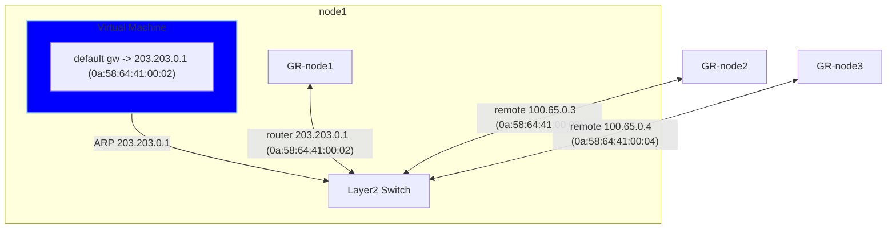
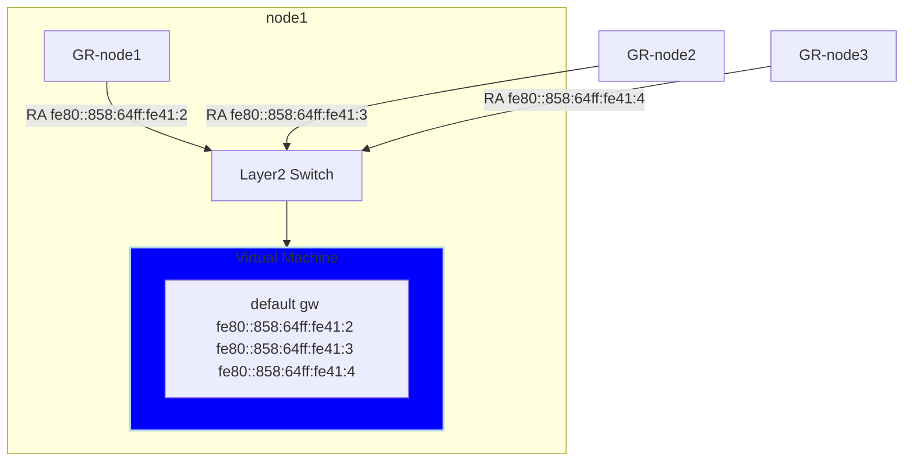
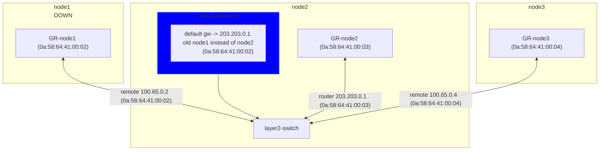
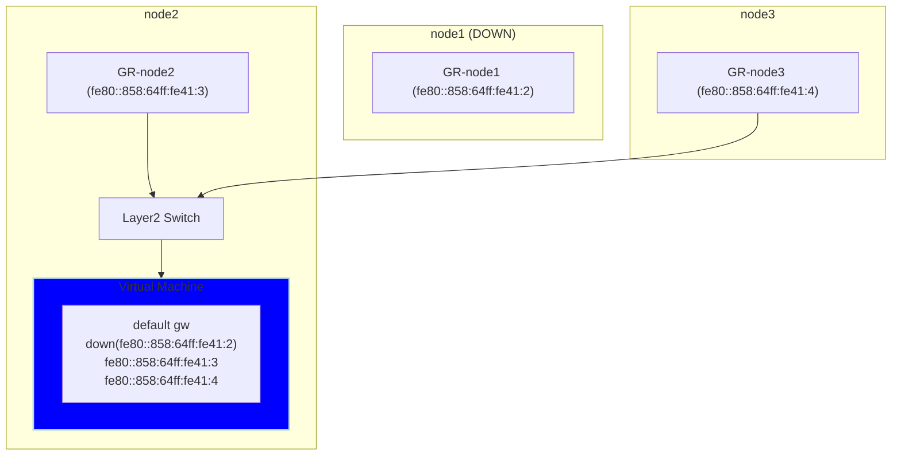

# OKEP-4368: Primary UDN Layer2 topology improvements

* Issue: [#5094](https://github.com/ovn-kubernetes/ovn-kubernetes/issues/5094)

## Problem Statement

The primary UDN layer2 topology present some problems related to VM's live migration that are being addressed by
ovn-kubernetes sending GARPs or unsolicited router advertisement and blocking some OVN router advertisement, although
this fix the issue is not the most robust way to address the problem and add complexity to ovn-kubernetes live migration mechanism,
also there are other layer2 egressip limitations introduced by this topology,
like GCP or disconnected environments without gateway.

We can make use of the new transit router OVN topology entity to fix these issue changing the topology for primary UDN layer2.

## Goals

1. For layer2 topology advertise default gw with same IP and MAC address independently of the node where
   the vm is running.
2. Keep all the layer2 topology features at current topology.
3. Cover the missing egressip features from current topology.
4. Make the new topology upgradable with minor disruption.

## Non-Goals

1. Extend the layer2 topology changes to other topologies.

## Introduction

### Layer2 default gw discovery at VMs

Currently at layer2 topology the virtual machine related to default gw
routing looks like the following for ipv4, where the .1 address is configured 
using DHCP and VM send and ARP that is only answered by the local gateway
router with the gateway router mac.



```bash
$ ip route
default via 203.203.0.1 dev eth0 proto dhcp metric 100

$ ip neigh
203.203.0.1 dev eth0 lladdr 0a:58:64:41:00:02 REACHABLE
```

And this is how it looks for IPv6 where the RFC dictates the default gw route 
advertise with the link local address, so every gateway router connected to the
switch will send a router advertisment after receiving the router solicitation from 
the virtual machine.


```bash
$ ip -6 route
default proto ra metric 100 pref low
	nexthop via fe80::858:64ff:fe41:2 dev eth0 weight 1
	nexthop via fe80::858:64ff:fe41:3 dev eth0 weight 1
	nexthop via fe80::858:64ff:fe41:4 dev eth0 weight 1

$ ip neigh
fe80::858:64ff:fe41:3 dev eth0 lladdr 0a:58:64:41:00:03 router STALE
fe80::858:64ff:fe41:4 dev eth0 lladdr 0a:58:64:41:00:04 router STALE
fe80::858:64ff:fe41:2 dev eth0 lladdr 0a:58:64:41:00:02 router STALE
```

This is a look of the logical router ports connected to the switch, take
into account that the 203.203.0.1 is only "propagated" on the node where the
vm is running:
```bash
$ ovnk ovn-control-plane ovn-nbctl show GR_test12_namespace.scoped_ovn-control-plane
router 2b9a5f29-ef44-4bda-8d39-45198353013b (GR_test12_namespace.scoped_ovn-control-plane)
    port rtos-test12_namespace.scoped_ovn_layer2_switch
        mac: "0a:58:64:41:00:03"
        ipv6-lla: "fe80::858:64ff:fe41:3"
        networks: ["100.65.0.3/16", "2010:100:200::1/60", "203.203.0.1/16", "fd99::3/64"]

$ ovnk ovn-worker ovn-nbctl show GR_test12_namespace.scoped_ovn-worker
router dbbb9301-2311-4d2f-bfec-64e1caf78b8e (GR_test12_namespace.scoped_ovn-worker)
    port rtos-test12_namespace.scoped_ovn_layer2_switch
        mac: "0a:58:64:41:00:02"
        ipv6-lla: "fe80::858:64ff:fe41:2"
        networks: ["100.65.0.2/16", "2010:100:200::1/60", "203.203.0.1/16", "fd99::2/64"]

$ ovnk ovn-worker2 ovn-nbctl show GR_test12_namespace.scoped_ovn-worker2
router 148b41ca-3641-449e-897e-0d63bf395233 (GR_test12_namespace.scoped_ovn-worker2)
    port rtos-test12_namespace.scoped_ovn_layer2_switch
        mac: "0a:58:64:41:00:04"
        ipv6-lla: "fe80::858:64ff:fe41:4"
        networks: ["100.65.0.4/16", "2010:100:200::1/60", "203.203.0.1/16", "fd99::4/64"]
```

So the gist of it is that the default gw ip4 and ipv6 is dependent of where
the VM is running, and that has important implications.

Also having ipv6 default gw multipath means that the egress traffic is
crossing between nodes flooding the inter node network.

### Virtual machine live migration and default gateway

When a virtual machine is live migrated it's transfered from the node where is
running to a different one, in this case it can be from node1 to node2.

After live migration has finish and the VM is running at different node,
the VM do *not* initiate any type of ARP or Router Solication to reconcile
routes since from its point of view nothing has happend, this means it's running
with the same network configuration, the consequence of that is that the 
VM will run ipv4 default gw mac address pointing to the node1 instead of node2 and
for ipv6 it will continue to be the multipath default gw.

One common scenario that triggers user live migrating VMs is related to
doing some kind of node maintenance where the node need to go down. The VM is
live migrated to a different node then the node where it was original running
is shutdown and some maintenance like changing memory is done before starting
it up again.

With that scenario in mind after VM has live migrated at ipv4 the default gw
will be pointing by its mac to a node that is down and at ipv6 one of the 
default gw path is down, that introduce huge traffic disruptions.

To fix that for ipv4 ovn-kubernetes send a GARP after live migration to 
reconcile the default gw mac to the new node where the VM is running [merged PR](https://github.com/ovn-kubernetes/ovn-kubernetes/pull/4964), for
ipv6 there is a work in progress PRs to do similar by blocking external gatewa
routers RAs [not merged PR](https://github.com/ovn-kubernetes/ovn-kubernetes/pull/4852) and reconciling gateways with unsolicited router advertisments
[not merged PR](https://github.com/ovn-kubernetes/ovn-kubernetes/pull/4847), 
although this fixes works, they are not very robust since messages can be lost
or block so be do not get reconciled.

This is how the topology will look after the virtual machine has being live migrated from node1 to node2
and shutting down node1 after it.

ipv4:


ipv6:


### Layer2 topology limitations for EIP

Also the layer2 current topology has some limitations, when there are multiple
IPs in an EIP, and if a pod is local to the egress node,
then we use the external default gateway as the next hop.
This is not good for GCP or disconnected envs.

## User-Stories/Use-Cases

### Story 1: seamless live migration

As a kubevirt user, I want to live migrate a virtual machine using layer2 primary UDN, 
so that tcp connections are not broken and downtime is minimun with network configuration 
not being changed within the virtual machine.

For example: User has a virtual machine serving a video conference using TCP connection and the node
where is running need to be shut down, so user do a live migration to move to other nodes, the video
should continue with minimun downtime without changing virtual machine network configuration.

### Story 2: EIP for layer2 limitations

**TODO**

## Proposed Solution

Ther OVN team did introduce a new network topology element [**transit router**](https://www.ovn.org/support/dist-docs/ovn-nb.5.html) that allow to have logical router share
between OVN zones, this make possible to use a cluster router similar to layer3 topology ovn_cluster_router for layer2
so the logical router port that is connected to the layer2 switch will have just the .1 address and mac and ipv6 lla generated 
with it.

This is a big picture of the topology with the transit subnet used to connect the ovn_cluster_router and gateway routers directly without a switch for ipv4:
```mermaid
%%{init: {"nodeSpacing": 20, "rankSpacing": 100}}%%
flowchart TD
    classDef nodeStyle fill:orange,stroke:none,rx:10px,ry:10px,font-size:25px;
    classDef vmStyle fill:blue,stroke:none,color:white,rx:10px,ry:10px,font-size:25px;
    classDef portStyle fill:#3CB371,color:black,stroke:none,rx:10px,ry:10px,font-size:25px;
    classDef routerStyle fill:brown,color:white,stroke:none,rx:10px,ry:10px,font-size:25px;
    classDef switchStyle fill:brown,color:white,stroke:none,rx:10px,ry:10px,font-size:25px;
    classDef termStyle font-family:monospace,fill:black,stroke:none,color:white;
    subgraph node1["node1"]
        subgraph GR-node1
            rtotr-GR-node1["trtor-GR-node1 
            100.65.0.2/16 100.88.0.6/30 (0a:58:64:41:00:02)"]
        end
        subgraph VM["Virtual Machine"]
            class VM vmStyle;
            term["default gw 
            203.203.0.1
            (0a:58:CB:CB:00:01)"]
        end
    end
    subgraph node2
        subgraph GR-node2
            rtotr-GR-node2["rtotr-GR-node2 100.65.0.3/16 100.88.0.14/30 (0a:58:64:41:00:03)"]
        end
    end
    subgraph node3
        subgraph GR-node3
            rtotr-GR-node3["rtotr-GR-node3 100.65.0.4/16 100.88.0.10/30 (0a:58:64:41:00:04)"]
        end
    end
    subgraph layer2-switch
        stor-ovn_cluster_router["stor-ovn_cluster_router 
        type: router"]
    end
    subgraph ovn_cluster_router["ovn_cluster_router "]
        trtor-GR-node1["trtor-GR-node1 100.88.0.5/30"]
        trtor-GR-node2["trtor-GR-node2 100.88.0.13/30"]
        trtor-GR-node3["trtor-GR-node3 100.88.0.9/30"]
        rtos-layer2-switch["rtos-layer2-switch 203.203.0.1 (0a:58:CB:CB:00:01)"]
    end
    rtotr-GR-node1 <--> trtor-GR-node1
    rtotr-GR-node2 <--> trtor-GR-node2
    rtotr-GR-node3 <--> trtor-GR-node3
    VM <-->layer2-switch
    rtos-layer2-switch <--> stor-ovn_cluster_router
    
    class VM vmStyle;
    class rtotr-GR-node1 portStyle;
    class rtotr-GR-node2 portStyle;
    class rtotr-GR-node3 portStyle;
    class trtor-GR-node1 portStyle;
    class trtor-GR-node2 portStyle;
    class trtor-GR-node3 portStyle;
    class stor-ovn_cluster_router portStyle;
    class rtos-layer2-switch portStyle;
    class GR-node1 routerStyle;
    class GR-node2 routerStyle;
    class GR-node3 routerStyle;
    class ovn_cluster_router routerStyle;
    class layer2-switch switchStyle
    class term termStyle;
    class node1,node2,node3 nodeStyle;
    
 ```


### API Details

(... details, can point to PR PoC with changes but this section has to be
explained in depth including details about each API field and validation
details)

* add details if ovnkube API is changing

### Implementation Details

(... details on what changes will be made to ovnkube to achieve the
proposal; go as deep as possible; use diagrams wherever it makes sense)

* add details for differences between default mode and interconnect mode if any
* add details for differences between lgw and sgw modes if any
* add config knob details if any

### Testing Details

* Unit Testing details
* E2E Testing details
* API Testing details
* Scale Testing details
* Cross Feature Testing details - coverage for interaction with other features

### Documentation Details

* New proposed additions to ovn-kubernetes.io for end users
to get started with this feature
* when you open an OKEP PR; you must also edit
https://github.com/ovn-org/ovn-kubernetes/blob/13c333afc21e89aec3cfcaa89260f72383497707/mkdocs.yml#L135
to include the path to your new OKEP (i.e Feature Title: okeps/<filename.md>)

## Risks, Known Limitations and Mitigations

## OVN Kubernetes Version Skew

which version is this feature planned to be introduced in?
check repo milestones/releases to get this information for
when the next release is planned for

## Alternatives

(List other design alternatives and why we did not go in that
direction)

## References

(Add any additional document links. Again, we should try to avoid
too much content not in version control to avoid broken links)
