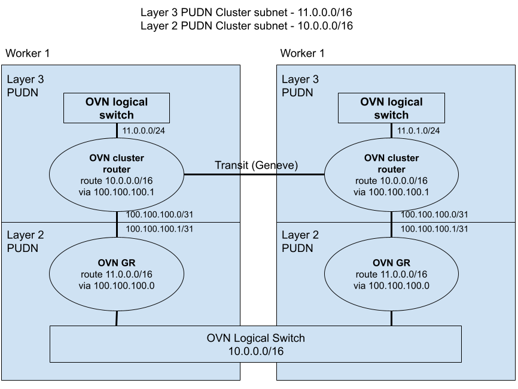
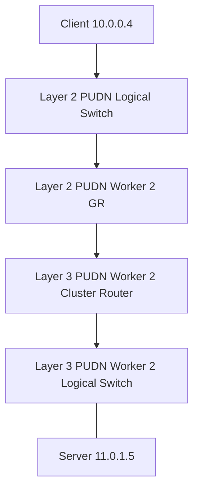
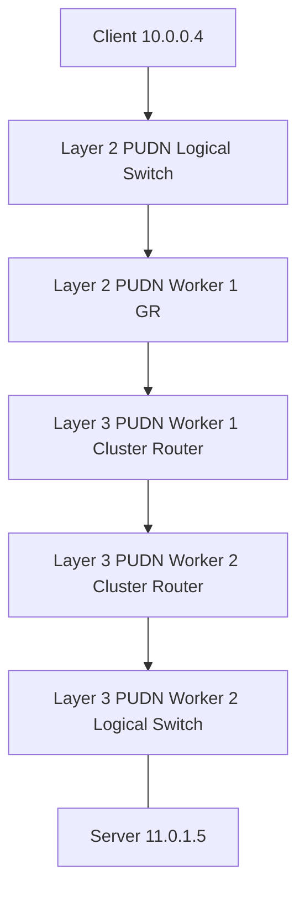

# OKEP-5252: Multiple Primary UDNs in a namespace

* Issue: [#5252](https://github.com/ovn-org/ovn-kubernetes/issues/5252)

## Problem Statement

When a primary UDN runs out of address space, the only option today is to delete the
UDN and create a new one. This means tearing down pods and recreating the entire network,
which is a very disruptive operation. When using BGP to expose UDN subnets directly onto
the provider network, the UDN is no longer an internal private subnet, and now subnet planning
coordination has to be done with the provider network to prevent conflicts and subnet
exhaustion. Therefore, it is feasible that an administrator may want a user to use the smallest
subnet possible, and then later add extra subnets as needed.

## Goals

* Allow a cluster administrator to create multiple primary networks for selected namespaces
* Allow a tenant without a CUDN, to create multiple primary networks for a namespace

## Non-Goals

* Preserve isolation between multiple overlapping primary networks
* Guarding a tenant from making multiple primary networks
* Allowing both a primary CUDN and a primary UDN to co-exist for a namespace

## Introduction

The goal here is to allow a cluster administrator or tenant to create multiple primary UDNs
for a namespace. These primary UDNs are interconnected via routing at the OVN level, and there
is no native isolation between these primary UDNs.

## User-Stories/Use-Cases

Story 1: Cluster Admin adding additional PUDNs for a tenant

As a cluster admin, I want to create extra primary UDNs for a tenant, as they
exhaust the address space I give them. This allows flexibility without having
to tear down the network and reprovision the tenant.

For Example: The admin is using BGP to advertise primary UDN across multiple tenants.
The admin initially scoped the subnet to be small, trying to consolidate IP address usage
within the provider network. However, one tenant has exhausted the IP address range of the subnet
and now the admin needs to provision an additional subnet, without disrupting current workloads.

Story 2: A trusted tenant wants to create additional PUDNs

A tenant has a primary UDN which has been allowed by the cluster admin to be advertised
via BGP. The tenant is trusted by the admin to create additional Primary UDNs out of
an agreed upon supernet. As a tenant, I initially scoped my primary UDN to a small subnet
and now have exhausted my IP space and want to now create additional PUDNs.

## Proposed Solution

In order to accomplish the previous stated goal of creating multiple primary UDNs, the
networks must be connected to avoid breaking the paradigm of namespace scoped networking
features within Kubernetes. Therefore, even if multiple primary UDNs exist, pods across
these primary UDNs will all be reachable between one another.

Furthermore, this solution proposes that there may be multiple primary CUDNs for a set of
namespaces or multiple primary UDNs for a namespace, but not an intermix of both. For a
primary UDN or CUDN to be valid, the namespace label "k8s.ovn.org/primary-user-defined-network"
is still required to exist on the namespace when it is created.

Primary (C)UDNs may also be destroyed at runtime, as long as no pods exist on that UDN. The
original primary (C)UDN may also be deleted.

### Multiple Primary CUDNs

For the case where an administrator creates an additional CUDN for a primary network, the
CUDN namespaceSelector must be the same as the original CUDN. If they are not the same, then
the new CUDN will report error state and will not be created. In addition, layer 2 and layer 3
topology types may be intermixed, but they may not overlap in subnets. If a new CUDN is created,
and it overlaps with a corresponding CUDN subnet, it will report error state and not be created.

### Multiple Primary UDNs

A tenant may choose to create additional primary UDNs. As with CUDNs, these additional primary
UDNs may be a mix of layer 2 or layer 3 topology types, but their subnet allocation may not overlap.

### Requesting Primary (C)UDNs From a Pod

When multiple primary UDNs exist, and a new pod is created, the OVN-Kubernetes will choose which
UDN to wire the pod to. OVN-Kubernetes will be intelligent enough to detect if one UDN is exhausted or
unfit to be the pod's UDN, and then select a different one. Additionally, a user may request a specific
UDN by creating the pod with the annotation "k8s.ovn.org/requested-primary-udn". If the value of this
annotation does not correspond to a legitimate primary UDN, the pod will not be wired and will error. If
a user applies this annotation to a pod, whose namespace is using the custer default network (CDN), it will
have no effect, and the pod will still come up and be wired to the CDN. If a user attempts to modify this
annotation after a pod has been created, it will have no effect.

### Kubernetes Features Implications

#### Network Policy

Network policy should continue to work between pods on multiple primary UDNs. The pods
are still selectable via the API, and should still create rules on the OVN logical
switches where the affected source pod lives. Note, this may result in O(n) additional
ACLs for n networks depending on the network policy selectors.

#### Services

Services are usually isolated to each UDN, unless exposed externally. However, with multiple
primary UDNs these services must be reachable via all pods within the namespace. Therefore,
when a service is created within a namespace with multiple primary UDNs, the OVN loadbalancer
will be placed on the logical switches for all primary UDNs affecting said namespace.

For externally exposed services, ingress via br-ex will be delivered only one of the OVN gateway
routers (GRs).

#### Egress IP

Egress IP is applied via routes in within OVN routers that force packets to cross the overlay
to the egress node. At that point the router then sends the packet out into br-ex or the host,
where SNAT rules modify the source IP to be the Egress IP and send the packet out.

The same behavior will continue to work for pods that exist across multiple primary UDNs. The
impact of multiple UDNs will be that the egress IP routes and policies must exist
on each router for multiple UDNs.

#### QoS

QoS is applied locally to the OVN switch, so as with other features, QoS rules may need to be applied
to multiple PUDN logical switches. QoS should continue to function as it does today, without limitations.

### API Details

There shall be no API changes, other than the new annotation "k8s.ovn.org/requested-primary-udn", which is applied
to a pod at create time to signal which primary UDN the pod would like to connect to.

### Implementation Details

The ovnkube cluster manager will need to be modified to validate multiple primary UDNs according to this spec. OVNKube-controller
will need to be modified to track multiple PUDNs per namespace, and ensure that each controller applies its feature
configuration across multiple networks.

For the OVN topology itself, a new point to point link will be created between multiple PUDNs under the same namespace(s):

Here there are two PUDNS, a Layer 3 and a Layer 2 that are part of the same namespace. A point to point link is created
between the ovn_cluster_router in the Layer 3 topology, and the OVN GR in the Layer 2 topology, per node. Routes are
added to each router in order to route the supernet into the appropriate PUDN. Note, for the OVN GR in the Layer 2 network
the supernet route is added for the Layer 3 network (11.0.0.0/16) via the OVN cluster router on the node. This is intentionally
done so that east/west inter-node traffic for the each UDN only flows over its Geneve overlay. Cross UDN traffic should not
flow across the wrong UDN's Geneve tunnel. For example, if a client pod in Worker 1/Layer 2 PUDN wants to reach a server pod on
Worker2/Layer 3 PUDN (11.0.1.5), it should not flow as:

Instead, traffic should flow as:

### Testing Details

* E2E upstream tests covering both multiple primary CUDNs and UDNs
* E2E tests should validate core features like network policy, services, etc continue to work across multiple primary networks
* Negative testing to ensure invalid configurations of multiple primary UDNs are properly handled

### Documentation Details

* UDN user guide will be updated to show how to use multiple primary UDNs
* Additional dev guides will be added to the repo to show how the internal design of how multiple primary UDNs are implemented.

## Risks, Known Limitations and Mitigations

* Major risk here is scale. As we have multiple primary UDNs we now have to replicate feature config to multiple networks.

## OVN Kubernetes Version Skew

TBD

## Alternatives

Allow expanding current subnet of a primary UDN to be larger, without having to delete the UDN and recreate it. This has
limitations with then reconfiguring existing pods to have the expanded subnet, etc. It would be more complex to implement.

## References

None
