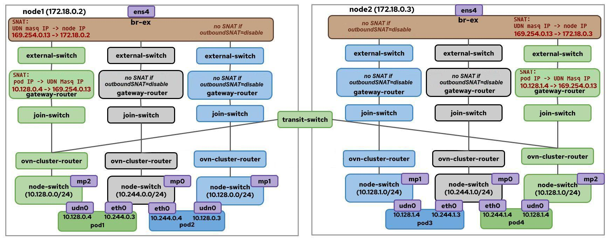

# OKEP-4368: No-overlay mode

* Issue: [#5259](https://github.com/ovn-kubernetes/ovn-kubernetes/issues/5259)
* Authors: Riccardo Ravaioli, Peng Liu

## Problem Statement

<!-- (1-2 sentence summary of the problem we are trying to solve here) -->

Currently OVN-Kubernetes uses Geneve as its encapsulation method on the overlay network for east/west traffic; this adds overhead and reduces throughput. By leveraging ovn-kubernetes support for BGP, we want to provide a way for users to enable a no-overlay mode, which would disable Geneve encapsulation and use direct routing between nodes for east/west traffic on selected networks.

## Goals

<!-- (Bullet list of Primary goals of this proposal.) -->

* Extend the CUDN API to enable no-overlay mode on the selected network.
* Toggle no-overlay mode on existing CUDNs as well as the default network after their creation, without having to delete them and recreate them.

## Future Goals
* When OVN-Kubernetes supports BGP for UDNs, extend the UDN API to enable no-overlay mode on the selected network

## Non-Goals

<!-- (Bullet list of What is explicitly out of scope for this proposal.) -->
* This enhancement does not aim to change the default behavior of OVN-Kubernetes, which will continue to use Geneve encapsulation for the default network and any user-defined networks unless no-overlay mode is explicitly enabled.
* This enhancement does not aim to minimize network disruption when toggling no-overlay mode on existing networks. The user should be aware that enabling no-overlay mode on a network may cause temporary disruption to traffic until the new routes are fully propagated and established. Similarly, disabling no-overlay mode may also cause temporary disruption as the network reverts to using Geneve encapsulation.
* This enhancement does not aim to change the existing CUDN/UDN isolation mechanism. CUDNs/UDNs will continue to be isolated from each other and from the default network by means of OVN ACLs on every node logical switch.
* This enhancement does not aim to change the existing BGP configuration or behavior. The user must ensure that the BGP configuration is correctly set up to support no-overlay mode.
* This enhancement does not aim to change the existing CUDN lifecycle management. The user must ensure that the CUDN CRs are correctly managed according to the existing lifecycle management practices.

## Introduction

<!-- (Can link to external doc -- but we should bias towards copying -->
<!-- the content into the OKEP as online documents are easier to lose -->
<!-- -- e.g. owner messes up the permissions, accidental deletion) -->
<!-- Give a good detailed introduction to the problem including the -->
<!-- ecosystem information -->

In the [BGP enhancement](https://github.com/openshift/enhancements/blob/master/enhancements/network/bgp-ovn-kubernetes.md#no-tunneloverlay-mode), the no-overlay mode was briefly discussed. In this enhancement we aim to describe the feature in detail, define the API changes we want to introduce for it and address a number of concerns with respect to the existing BGP and CUDN features.

Avoiding Geneve encapsulation and using directly the infrastructure network for east/west traffic spawns from the need of minimizing network overhead and maximizing throughput. Users who intend to enable BGP on their clusters can indeed leverage BGP-learned routes to achieve this. The goal is to provide users with an API to enable or disable no-overlay mode on selected networks (default or user-defined), allowing traffic to skip Geneve encapsulation (i.e. the overlay network) and simply make use of the learned routes in the underlay or provider network for inter-node communication.

## User-Stories/Use-Cases

### Story 1: enable no-overlay mode for the default network
As a cluster admin, I want to avoid all encapsulation for traffic in the default network.
### Story 2: enable no-overlay mode for a CUDN
As a cluster admin, I want to avoid all encapsulation for traffic in a CUDN.
### Story 3: disable no-overlay mode
As a cluster admin, for any existing network that enables no-overlay mode, I want to be able to disable no-overlay mode and revert to the default behavior of using Geneve encapsulation for traffic in the network.

# Proposed Solution

<!-- What is the proposed solution to solve the problem statement? -->

### API Details

We introduce a new `encapsulation` field to be added to the Spec of the ClusterUserDefinedNetwork (CUDN) CRD. This new field will enable control over the network encapsulation behavior with the following options:

1. **Encapsulation Mode Configuration**:
   - `mode`: specifies the encapsulation method (default: `Geneve`)
   - Supported values: `Geneve` (default) or `None` (no overlay)

2. **Target VRF Configuration**:
   - `targetVRF`: defines the VRF where pod routes should be advertised via BGP
   - Only applicable when `mode` is set to `None`
   - Supported values: `default` (default VRF) or `auto` (for the VRF-lite scenario described in the BGP enhancement)

No-overlay mode is only applicable to layer-3 CUDNs. As a consequence the `encapsulation` field cannot be added to layer-2 CUDNs.

#### Example of a layer-3 CUDN with no-overlay mode enabled
A layer-3 CUDN that enables no-overlay mode should look like this:

```yaml
apiVersion: k8s.ovn.org/v1
kind: ClusterUserDefinedNetwork
metadata:
  name: my-cudn
  namespace: my-namespace
spec:
    namespaceSelector:
      matchExpressions:
      - key: kubernetes.io/metadata.name
        operator: In
        values: ["red", "blue"]
    network:
      layer3:
        role: Primary
        subnets:
        - cidr: 10.10.0.0/16
          hostSubnet: 24
      topology: Layer3
    encapsulation:
      mode: None
      targetVRF: default
```
The `advertise: true` label in the metadata section is not necessary, since `Spec.encapsulation.mode` set to `None` already implies that the network will be advertised via BGP. We also do not want a spec field to depend on a label and vice-versa, as it would increase the number of possible configurations without any added value.

`Spec.encapsulation` can be modified after the CUDN is created, allowing users to toggle no-overlay mode on existing networks. The user can change the encapsulation mode from `Geneve` to `None` or vice versa, and ovn-kubernetes will handle the necessary changes in the OVN topology and BGP configuration. Changing the value `targetVRF` is also possible and would trigger a BGP reconfiguration.

#### Example of a default network with no-overlay mode enabled
For the default network, ovn-kubernetes cluster manager will create by default a UserDefinedNetwork CR with the name `default`. Users are only allowed to modify the `encapsulation` field to switch the no-overlay mode on and off. For this CR, OVN-K shall not create the corresponding NetworkAttachementDefinition CR.

```yaml
apiVersion: k8s.ovn.org/v1
kind: UserDefinedNetwork
Metadata:
  # 'default' is the reserved name to represent the cluster default network
  name: default
spec:
  network:
    topology: Layer3
    encapsulation:
      mode: None
      targetVRF: default
```

### Implementation Details

A network that is configured to use no-overlay mode needs a slightly modified OVN topology. It is useful to remember that in today's interconnect architecture a network is able to span all cluster nodes thanks to the cross-node logical links that OVN establishes between the transit switch and the ovn-cluster-router instances on each node. That is the logical representation of the OVN network and in practice these links are implemented through Geneve tunnels between every node in the cluster. For a network to skip the encapsulation step and route pod traffic directly over the underlay network, we need to change the logical network topology of this network: its ovn-cluster-router won't connect to the transit switch anymore and all traffic will be naturally routed directly to the gateway router. Once traffic arrives on the gateway router, it will hit the BGP-learned routes and be forwarded to destination node without getting SNATed to the node IP.

The following diagram shows the OVN topology of a cluster with three networks:
- a CUDN (in green) that uses Geneve encapsulation (default behavior)
- a default network (in gray) that enables no-overlay mode
- a CUDN (in blue) that enables no-overlay mode


When switching from `spec.encapsulation.mode: Geneve` to `spec.encapsulation.mode: None` or vice-versa, the corresponding OVN topology is created. One possible optimization to explore in order to reduce the toggling time is to always create the transit switch and remove only the cross-node logical links when no-overlay mode is enabled.

Finally, no-overlay mode is only available when OVNK interconnect is enabled, since it is built on top of BGP, which only works with interconnect mode.

#### Local gateway mode
TODO

#### Workflow for enabling no-overlay mode on the default network
1. A cluster is built with ovn-kubernetes, its default network uses Geneve encapsulation as expected by default;
2. The cluster admin enables no-overlay mode by adding a `Spec.encapsulation` section to the `default` UDN CR created by OVNK cluster manager: `Spec.encapsulation.mode` is set to `None` and `spec.encapsulation.targetVRF` to `default`:

```yaml
apiVersion: k8s.ovn.org/v1
kind: UserDefinedNetwork
metadata:
  name: default
spec:
    topology: Layer3
    encapsulation:
      mode: None
      targetVRF: default
```

OVN-kubernetes cluster manager watches the `default` UDN CR. If `spec.encapsulation.mode` equals `None`, cluster manager will create a `RouteAdvertisement` CR which will advertise pod subnets in the default network:

```yaml
apiVersion: k8s.ovn.org/v1
kind: RouteAdvertisements
metadata:
  name: default
spec:
  targetVRF: default
  advertisements:
    podNetwork: true
```

The cluster admin will have to create an `FRRConfiguration` CR that connects all the node FRR BGP speakers via either a route reflector or in full-mesh. The `FRRConfiguration` CR shall allow receiving the routes to the node subnets. Here’s an example of using a route reflector:
```yaml
apiVersion: frrk8s.metallb.io/v1beta1
kind: FRRConfiguration
metadata:
  name: receive-filtered
  namespace: frr-k8s-system
spec:
  bgp:
    routers:
    - asn: 64512
      neighbors:
      // An external iBGP neighbor acts as a route reflector
      - address: 10.89.0.37
        asn: 64512
        disableMP: false
        toReceive:
          allowed:
            mode: filtered
```
#### Workflow for enabling no-overlay mode on a CUDN
The workflow for a CUDN is the same as for the default network, with the only difference of the cluster admin having to modify a CUDN CR instead of the `default` UDN CR.

#### No SNAT in no-overlay mode

The BGP feature in ovn-kubernetes only disables SNAT for traffic that is destined to external networks, not for traffic that is destined to other pods in the cluster.

In no-overlay mode, we want to fully leverage BGP and avoid the SNAT step on the gateway router for intra-cluster traffic as well. Pod-to-pod traffic within the same network will hit the BGP-learned routes to reach its destination node, without being encapsulated in a Geneve tunnel and without being SNATed to the node IP.


#### Isolation between UDNs with no-overlay mode enabled
The [existing UDN isolation mechanism](https://github.com/ovn-kubernetes/ovn-kubernetes/pull/5186/commits/8f6e7d30ee5f4926a21e2de75488aad80344814b
) will still be in place. Pods in different UDNs will be isolated from each other and from the default network by means of the existing OVN ACLs on every node logical switch: 
ACLs are enforced on outgoing traffic at each advertised UDN switch, verifying whether both source and destination IPs belong to the same advertised UDN. If the destination IP does not come from the same UDN subnet as the source IP, traffic is dropped.
The no-overlay mode will not affect the isolation between UDNs or between UDNs and the default network.


### Testing Details

* Unit Testing details
* E2E Testing details
* API Testing details
* Scale Testing details
* Cross Feature Testing details - coverage for interaction with other features

<!-- ### Documentation Details -->

<!-- * New proposed additions to ovn-kubernetes.io for end users -->
<!-- to get started with this feature -->
<!-- * when you open an OKEP PR; you must also edit -->
<!-- https://github.com/ovn-org/ovn-kubernetes/blob/13c333afc21e89aec3cfcaa89260f72383497707/mkdocs.yml#L135 -->
<!-- to include the path to your new OKEP (i.e Feature Title: okeps/<filename.md>) -->

## Risks, Known Limitations and Mitigations

### Limitations for pod-to-nodeport traffic
Pod-to-nodeport traffic in no-overlay mode is not guaranteed across networks for a number of reasons. Let's suppose we have:
- `CUDN1` with no-overlay mode enabled (and node SNAT disabled)
- `pod1` in `CUDN1`, running on node1
- `CUDN2`
- `pod2` in `CUDN2`, running on node2
- `service2` of type nodeport in `CUDN2`, backed by `pod2`

When `pod1` tries to reach `service2`, its traffic will egress `node1` from `breth0` carrying `pod1` IP address as source (it won't be SNATed to `node1` IP address) and will reach `node2` on the configured nodeport. `Pod2` will receive traffic coming from `pod1` IP address, but reaching back `pod1` IP address fails, since it not in the same network. The following situations are possible:
- `CUDN2` also enables BGP route advertisements, as well as no-overlay mode: in this case, the two CUDNs are guaranteed to have non-overlapping subnets since they both enable BGP RAs, `CUDN2` will learn the route for `CUDN1`, but the enforced UDN isolation (see section above) will drop traffic to CUDN1 thanks to the ACLs installed on the logical node switch.
- `CUDN2` also enables BGP route advertisements, but not no-overlay mode: same as above;
- `CUDN2` does not enable BGP route advertisements: same as above, except that routes to `CUDN1` are not propagated to `CUDN2`; reply traffic will be dropped, as it cannot reach a different network.

The example above mentions two CUDNs, but it applies to any two networks (including the default network).

Let's now consider the reverse case, that is `pod2` trying to reach a NodePort service in `CUDN1`, backed by `pod1`. The following situations are possible:
- `CUDN2` also enables BGP route advertisements, as well as no-overlay mode: reply traffic is dropped, as per the isolation mechanism described above;
- `CUDN2` also enables BGP route advertisements, but not no-overlay mode: same as above;
- `CUDN2` does not enable BGP route advertisements: same as above.

As a consequence, pod-to-nodeport traffic is only guaranteed within the same network and not across networks, when either endpoint (client or backend pod) enables no-overlay mode.

<!-- ## OVN Kubernetes Version Skew -->

<!-- which version is this feature planned to be introduced in? -->
<!-- check repo milestones/releases to get this information for -->
<!-- when the next release is planned for -->

<!-- ## Alternatives -->

<!-- (List other design alternatives and why we did not go in that -->
<!-- direction) -->

<!-- ## References -->

<!-- (Add any additional document links. Again, we should try to avoid -->
<!-- too much content not in version control to avoid broken links) -->
