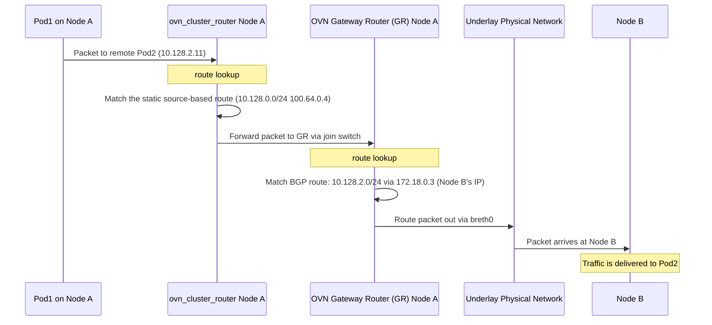
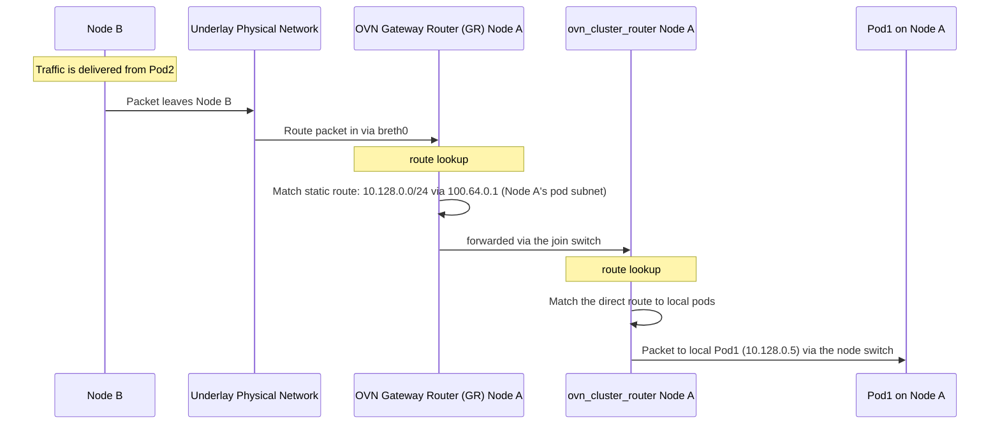
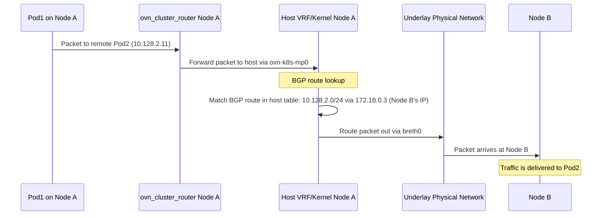
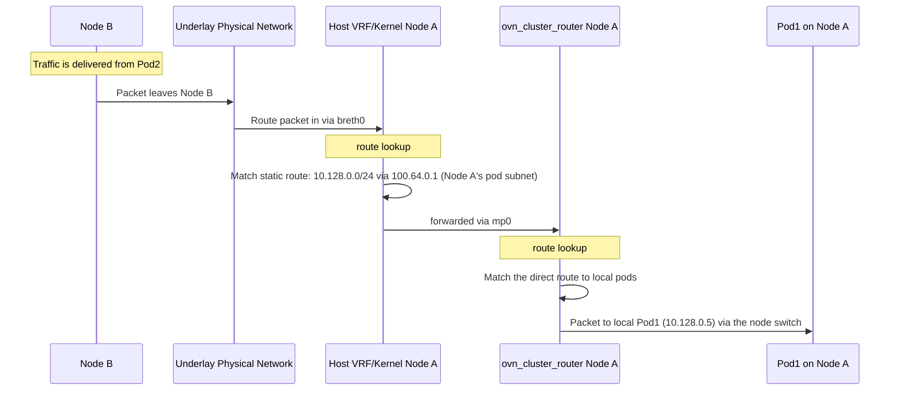
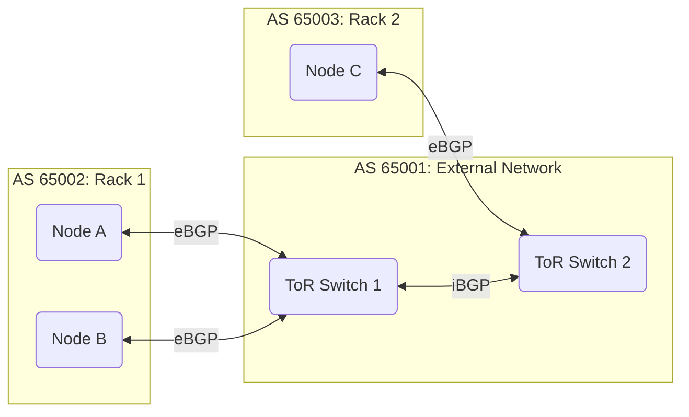
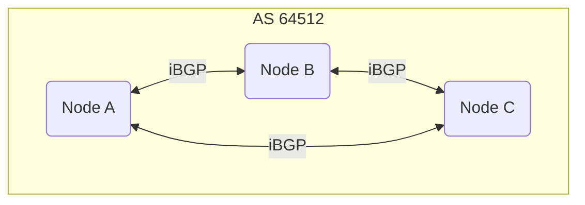
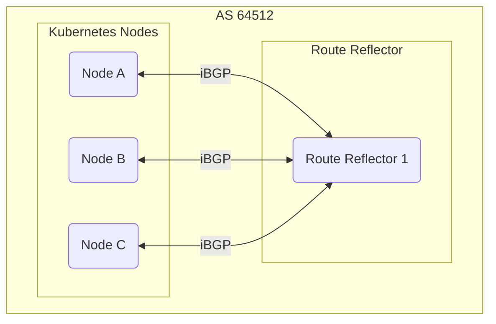

# OKEP-5259: No-overlay Mode For Layer-3 Networks

* Issue: [\#5259](https://github.com/ovn-kubernetes/ovn-kubernetes/issues/5259)  
* Authors: Riccardo Ravaioli, Peng Liu

## Problem Statement

Currently, OVN-Kubernetes uses Geneve as its encapsulation method on the overlay
network for east-west traffic; this adds overhead and reduces throughput. By
leveraging OVN-Kubernetes support for BGP, we want to provide a way for users to
enable a no-overlay mode, which would disable Geneve encapsulation and use
direct routing between nodes for east-west traffic on selected networks.

Many environments, particularly on-premise deployments or those with dedicated
networking infrastructure, prefer to utilize the underlying physical network's
routing capabilities directly. This "no-overlay" approach can offer several
benefits:

* Improved Performance: Eliminates overlay protocol overhead, potentially
  leading to lower latency and higher throughput for inter-pod communication.
* Leverage Existing Network Infrastructure: Integrates more seamlessly with
  existing BGP-capable network devices, allowing for direct routing to pod IPs.  
* Reduced Resource Consumption: Fewer CPU cycles spent on
  encapsulation/decapsulation.

## Terminology

* **Primary Network** - The network that is used as the default gateway for the
  pod. Typically recognized as the eth0 interface in the pod.
* **Cluster Default Network** - This is the routed OVN network that pods attach
  to by default today as their primary network. The pod default route, service
  access, as well as kubelet probe are all served by the interface (typically
  eth0) on this network.
* **User-Defined Network** - A network that may be primary or secondary, but is
  declared by the user.
* **ClusterUserDefinedNetwork** - Also known as CUDN, this is a cluster-scoped
  User-Defined Network created by the cluster admin that can be consumed by
  different namespaces.
* **Layer 2 Type Network** - An OVN-Kubernetes topology rendered into OVN where
  pods all connect to the same distributed logical switch (layer 2 segment)
  that spans all nodes.
* **Layer 3 Type Network** - An OVN-Kubernetes topology rendered into OVN where
  pods have a per-node logical switch and subnet. Routing is used for pod to pod
  communication across nodes. This is the network type used by the cluster
  default network today.
* **Localnet Type Network** - An OVN-Kubernetes topology rendered into OVN where
  pods connect to a per-node logical switch that is directly wired to the
  underlay.

## Goals

* Support no-overlay mode for the cluster default network(CDN).
* Support no-overlay mode for Primary layer-3 ClusterUserDefinedNetworks
  (CUDNs).
* A cluster can have networks operating in overlay and no-overlay modes
  simultaneously.
* Use the BGP feature to exchange routes to node subnets across the cluster.
* Allow direct communication without any overlay encapsulation for east-west
  traffic.
* Maintain compatibility with existing OVN-Kubernetes features where applicable.
* Compatible with both local gateway and shared gateway modes.

## Future Goals

* When OVN-Kubernetes supports BGP for UserDefinedNetwork CRs, extend no-overlay
  mode support for Primary layer-3 UDNs.

* Support toggling no-overlay mode on/off for an existing network. To support
  this functionality, there are two things we need to consider.
  First, in no-overlay mode, as there is no Geneve overhead, a network can have
  the same MTU size as the provider network. However, overlay networks require a
  smaller MTU (default 1400). We cannot modify a pod interface MTU without
  restarting the pod. So OVN-Kubernetes must work with other external
  controllers to accommodate such a migration.
  Secondly, to facilitate a smooth, node-by-node migration, it's crucial to
  allow networks to operate in a hybrid no-overlay and overlay mode.  

* Support EgressIP and EgressService features in networks operating in
  no-overlay mode. Both features leverage OVN-Kubernetes's logical routing
  policy to steer pod egress traffic. They also rely on overlay tunnels to
  transport pod egress traffic to egress nodes. Implementing these features in
  no-overlay mode with BGP requires significant architectural changes and
  careful consideration.

## Non-Goals

* No-overlay mode can only be configured by a cluster administrator. This
  enhancement does not support enabling no-overlay mode for tenant-created
  UserDefinedNetworks (UDNs).

* This enhancement does not aim to change the default behavior of
  OVN-Kubernetes, which will continue to use Geneve encapsulation for the
  default network and any user-defined networks unless no-overlay mode is
  explicitly enabled.

* This enhancement does not aim to change the existing advertised UDN isolation
  mechanism.

* This enhancement does not aim to change the existing BGP configuration or
  behavior. The user must ensure that the BGP configuration is correctly set up
  to support no-overlay mode.

* This enhancement does not aim to change the existing CUDN lifecycle
  management. The user must ensure that the CUDN CRs are correctly managed
  according to the existing lifecycle management practices.

* This enhancement does not aim to implement no-overlay mode with the
  centralized OVN architecture, as the BGP feature is only available in a
  cluster running in interconnect mode.

* This enhancement does not aim to implement no-overlay mode for the layer-2
  type of networks. The layer-2 type of networks is implemented by connecting
  pods to the same OVN distributed logical switch. Pods on different nodes are
  connected through a layer-2 segment using Geneve encapsulation. It's quite
  challenging to implement a layer-2 network over a layer-3 infrastructure
  without an overlay protocol.

## Introduction

In the [OVN-Kubernetes BGP Integration
enhancement](https://github.com/ovn-kubernetes/ovn-kubernetes/blob/master/docs/okeps/okep-5296-bgp.md#future-goals),
no-overlay mode was briefly discussed. In this enhancement, we aim to describe
the feature in detail, define the API changes we want to introduce for it, and
address a number of concerns with respect to the existing BGP Integration and
User-Defined Network Segmentation features.

Avoiding Geneve encapsulation and using the provider network for east-west
traffic stems from the need to minimize network overhead and maximize
throughput. Users who intend to enable BGP on their clusters can indeed leverage
BGP-learnt routes to achieve this. The goal is to provide users with an API to
create networks (default or CUDN), with no-overlay mode enabled, allowing
traffic to skip Geneve encapsulation (i.e., the overlay network) and simply make
use of the learnt routes in the underlay or provider network for inter-node
communication.

While BGP is the proposed solution for exchanging east-west routing information
within a cluster, it is not the only possible option. Future implementations of
no-overlay mode may incorporate additional routing technologies and protocols
beyond BGP.

## User-Stories/Use-Cases

### Story 1: Have the cluster default network in the no-overlay mode

As a cluster admin, I want to enable no-overlay mode for the cluster default
network to integrate seamlessly with existing BGP-capable networks, achieve
maximum network performance.

### Story 2: Create a CUDN in the no-overlay mode

As a cluster admin, I want to enable no-overlay mode for a cluster user defined
network to integrate seamlessly with existing BGP-capable networks, achieve
maximum network performance.

### Story 3: Deploy networks in the no-overlay mode without external BGP routers

As a cluster admin, I want to use no-overlay mode for intra-cluster traffic
without advertising pod networks to the external network or depending on
external BGP routers.

## Proposed Solution

This solution uses the existing BGP feature to advertise each node's allocated
pod subnet. BGP routers then propagate these routes throughout the provider
network, enabling direct pod-to-pod traffic without an overlay. A single
cluster can simultaneously have networks in both overlay and no-overlay modes.

When no-overlay mode is enabled for a network:

* For north-south traffic, we will follow the existing implementation of the BGP
  feature; the traffic from pods will no longer be SNATed on egress. In the BGP
  feature, SNAT is disabled for all pod egress traffic that leaves the node,
  regardless of whether the destination route is BGP learnt or not. For users
  who only want to have no-overlay mode but do not want to expose pod IPs
  externally, this behavior is not ideal. To address this, users will be able
  to enable SNAT for pod-to-external traffic. This will be configured via a
  new `outboundSNAT` field in the `ClusterUserDefinedNetwork` CRD for CUDNs,
  and the `--default-network-nat-outbound` flag for the default network.

* For east-west traffic:
  * Intra-node traffic remains unchanged, handled by the local OVN bridge.
  * Inter-node traffic will follow the same path as north-south traffic, routed
    via the underlay. Pod-to-pod, Pod-to-clusterIP traffic will be forwarded by
    the provider network without encapsulation or NAT. Pod-to-node egress
    traffic will be SNATed to the node IP at the source node to allow a pod to
    access nodePort services in a different UDN.

For the default network, we will add new flags `--default-network-overlay` and
`--default-network-nat-outbound` to the `ovnkube` binary.

* The `--default-network-overlay` flag accepts either `none` or `geneve`,
  defaulting to `geneve`. Setting it to `none` configures the default network to
  operate in no-overlay mode. More overlay encapsulation methods can be
  supported in the future. If `--default-network-overlay=none` is set but no
  `RouteAdvertisements` CR is configured for the default network, `ovnkube` will
  exit with an error.
* The `--default-network-nat-outbound` flag can only be set when
  `--default-network-overlay=none`. It accepts `Enable` or `Disable` and
  defaults to `Disable`. When set to `Enable`, it configures the default network
  to SNAT pod-to-external traffic to the node IP. Pod-to-remote-pod traffic is not
  SNATed, regardless of this setting.

For CUDNs, no-overlay mode is configured via their respective CRs. Due to a BGP
limitation, CUDNs with overlapping pod subnets cannot be advertised to the same
VRF. To enable no-overlay mode for these networks, a VRF-lite topology is required.

### API Details

We introduce new fields to the `spec.network` section of the
ClusterUserDefinedNetwork (CUDN) CRD to control network encapsulation:

* **`overlay`**: Specifies the encapsulation method.
  * Supported values: `Geneve` (default) or `None` (no-overlay).
  * More overlay encapsulation methods can be supported in the future.
* **`noOverlayOptions`**: Contains configuration for no-overlay mode. This is
  required when `overlay` is `None`.
  * `outboundSNAT`: Defines the SNAT behavior for outbound traffic from pods.
    * Supported values: `Enable` or `Disable`. Defaults to `Disable`.
    * `Enable`: SNATs pod-to-external traffic to the node IP. This is useful
      when pod IPs are not routable on the external network.
    * `Disable`: Does not SNAT pod-to-external traffic. This requires pod IPs to
      be routable on the external network.
    * Pod-to-remote-pod traffic is never SNATed in no-overlay mode.
  * `routeAdvertisements`: Specifies the name of the RouteAdvertisements CR used
    to advertise the pod network of this CUDN. This field acts as a
    discriminator, creating an explicit link between the RouteAdvertisements CR,
    the network, and the user's intent to prevent misconfiguration.

The `spec` field of a ClusterUserDefinedNetwork CR is immutable. Therefore, the
overlay configuration cannot be changed after a ClusterUserDefinedNetwork CR is
created.

```golang
type OverlayProtocol string
type SnatOption string

const (
    OverlayProtocolNone   OverlayProtocol = "None"
    OverlayProtocolGeneve OverlayProtocol = "Geneve"

    SnatEnable  SnatOption = "Enable"
    SnatDisable SnatOption = "Disable"
)

// NoOverlayOptions contains configuration options for networks operating in no-overlay mode.
type NoOverlayOptions struct {
    // OutboundSNAT defines the SNAT behavior for outbound traffic from pods.
    // +kubebuilder:validation:Enum=Enable;Disable
    // +kubebuilder:default=Disable
    // +optional
    OutboundSNAT SnatOption `json:"outboundSNAT,omitempty"`
    // RouteAdvertisements specifies the name of the RouteAdvertisements CR
    // used to advertise the pod network of this CUDN.
    // +optional
    RouteAdvertisements string `json:"routeAdvertisements,omitempty"`
}

type NetworkSpec struct {
    ...
    // Overlay describes the overlay protocol for east-west traffic.
    // Allowed values are "None" and "Geneve".
    // - "None": The network operates in no-overlay mode.
    // - "Geneve": The network uses Geneve overlay.
    // Defaults to "Geneve".
    // +kubebuilder:validation:Enum=None;Geneve
    // +kubebuilder:default=Geneve
    // +optional
    Overlay OverlayProtocol `json:"overlay,omitempty"`
    // NoOverlayOptions contains configuration for no-overlay mode.
    // It is required when Overlay is "None".
    // +optional
    NoOverlayOptions *NoOverlayOptions `json:"noOverlayOptions,omitempty"`
}
```

To prevent a user from setting unsupported no-overlay configurations in CUDN
accidentally, we will add the following CEL validation rules to the
`spec.network` field of the ClusterUserDefinedNetwork CRD.

```yaml
    network:
      x-kubernetes-validations:
      - message: "overlay 'None' is only supported for Layer3 topology"
        rule: 'self.overlay != "None" || self.topology == "Layer3"'
      - message: "noOverlayOptions is required when overlay is 'None'"
        rule: 'self.overlay != "None" || has(self.noOverlayOptions)'
      - message: "noOverlayOptions is only supported for no-overlay networks"
        rule: 'self.overlay == "None" || !has(self.noOverlayOptions)'
      - message: "noOverlayOptions.routeAdvertisements is required when overlay is 'None'"
        rule: 'self.overlay != "None" || (has(self.noOverlayOptions) && has(self.noOverlayOptions.routeAdvertisements) && self.noOverlayOptions.routeAdvertisements != "")'
```

#### Example of a layer-3 CUDN with no-overlay mode enabled

A layer-3 CUDN with no-overlay mode enabled should look like this:

```yaml
apiVersion: k8s.ovn.org/v1
kind: ClusterUserDefinedNetwork
metadata:
  name: my-cudn
spec:
  namespaceSelector:
    matchExpressions:
    - key: kubernetes.io/metadata.name
      operator: In
      values: ["red", "blue"]
  network:
    topology: Layer3
    layer3:
      role: Primary
      mtu: 1500
      subnets:
      - cidr: 10.10.0.0/16
        hostSubnet: 24
    overlay: "None"
    noOverlayOptions:
      outboundSNAT: "Disable"
      routeAdvertisements: "my-cudn-ra"
```

### Implementation Details

No-overlay mode relies on the BGP feature, which is exclusive to clusters
deployed in the single-node zone interconnect mode. Therefore, no-overlay mode
can only be enabled in clusters configured with single-node zone interconnect.

For networks configured with no-overlay mode, the OVN topology requires minor
adjustments. In the current interconnect architecture, a network can span
all cluster nodes thanks to the cross-node logical links that OVN establishes
between the transit switch and the ovn-cluster-router instances on each node.
That is the logical representation of the OVN network, and in practice, these
links are implemented through Geneve tunnels between every node in the cluster.
To route pod traffic directly over the underlay, the network's logical topology
is modified: the transit switch will not be created anymore, and
ovn_cluster_router routes all east-west traffic to the provider network,
following the same path as north-south traffic.

The following diagram shows the OVN topology of a cluster with three networks:

* a CUDN (in green) that uses Geneve encapsulation (default behavior)
* a default network (in gray) that is operating in no-overlay mode  
* a CUDN (in blue) that is operating in no-overlay mode


We need to update the ZoneInterconnectHandler for no-overlay mode. If a new
network is configured in no-overlay mode, ZoneInterconnectHandler shall not
connect the network to the transit switch. For each remote zone, there is no
need to add the static node subnet routes into the ovn_cluster_router. The
traffic shall be forwarded following the source-based route instead. The nexthop
depends on the gateway mode of the cluster.

#### Traffic Path in Shared Gateway Mode

At the ovn_cluster_router, the pod-to-remote-pod egress traffic will be
forwarded to the GatewayRouter via the join switch. Unlike the current route
advertisement behavior, the routes to remote node subnets will be imported to
the gateway router. Once the traffic reaches the GatewayRouter, it will be
forwarded to the nexthop node according to the imported BGP routes.

An example traffic path is as follows (assuming pod IP of 10.128.0.10 on node A,
destined to remote pod 10.128.2.11 on node B):

The ovn_cluster_router routes all local pod egress traffic to the gateway router
according to source-based route (10.128.0.0/24). The routing table of the
default network's ovn_cluster_router for node A would look like:

```
IPv4 Routes
Route Table <main>:
               100.64.0.4                100.64.0.4 dst-ip
            10.128.0.0/24                100.64.0.4 src-ip
            10.128.0.0/16                100.64.0.4 src-ip
```

And the routing table of the gateway router with learnt BGP routes to remote pod
subnets:

```
IPv4 Routes
Route Table <main>:
           169.254.0.0/17               169.254.0.4 dst-ip rtoe-GR_nodeA
            10.128.0.0/16                100.64.0.1 dst-ip
            10.128.1.0/24                172.18.0.2 dst-ip rtoe-rtoe-GR_nodeA
            10.128.2.0/24                172.18.0.4 dst-ip rtoe-rtoe-GR_nodeA
                0.0.0.0/0                172.18.0.1 dst-ip rtoe-rtoe-GR_nodeA
```


```mermaid
sequenceDiagram
    participant Pod1 on Node A
    participant ovn_cluster_router Node A
    participant OVN Gateway Router (GR) Node A
    participant Underlay Physical Network
    participant Node B

    Pod1 on Node A->>ovn_cluster_router Node A: Packet to remote Pod2 (10.128.2.11)
    Note over ovn_cluster_router Node A: route lookup
    ovn_cluster_router Node A->>ovn_cluster_router Node A: Match the static source-based route (10.128.0.0/24 100.64.0.4)
    ovn_cluster_router Node A->>OVN Gateway Router (GR) Node A: Forward packet to GR via join switch
    Note over OVN Gateway Router (GR) Node A: route lookup
    OVN Gateway Router (GR) Node A->>OVN Gateway Router (GR) Node A: Match BGP route: 10.128.2.0/24 via 172.18.0.3 (Node B's IP)
    OVN Gateway Router (GR) Node A->>Underlay Physical Network: Route packet out via breth0
    Underlay Physical Network->>Node B: Packet arrives at Node B
    Note over Node B: Traffic is delivered to Pod2
```

And the reply path:


```mermaid
sequenceDiagram
    participant Node B
    participant Underlay Physical Network
    participant OVN Gateway Router (GR) Node A
    participant ovn_cluster_router Node A
    participant Pod1 on Node A
    
    Note over Node B: Traffic is delivered from Pod2
    Node B->>Underlay Physical Network: Packet leaves Node B
    Underlay Physical Network->>OVN Gateway Router (GR) Node A: Route packet in via breth0
    Note over OVN Gateway Router (GR) Node A: route lookup
    OVN Gateway Router (GR) Node A->>OVN Gateway Router (GR) Node A: Match static route: 10.128.0.0/24 via 100.64.0.1 (Node A's pod subnet)
    OVN Gateway Router (GR) Node A->>ovn_cluster_router Node A: forwarded via the join switch
    Note over ovn_cluster_router Node A: route lookup
    ovn_cluster_router Node A->>ovn_cluster_router Node A: Match the direct route to local pods
    ovn_cluster_router Node A->>Pod1 on Node A: Packet to local Pod1 (10.128.0.5) via the node switch
```

#### Traffic Path in Local Gateway Mode

The pod-to-remote-pod egress traffic will enter the host VRF via the
ovn-k8s-mpX interface. Then it will be forwarded to remote nodes according to
the host routing table of the VRF.

An example traffic path is as follows (assuming pod IP of 10.128.0.10,
destined to remote pod 10.128.2.11):

The routing table of the default VRF of node A which contains learnt BGP routes:

```
10.128.0.0/16 via 10.128.2.1 dev ovn-k8s-mp0
10.128.0.0/24 dev ovn-k8s-mp0 proto kernel scope link src 10.128.0.2
10.128.1.0/24 nhid 30 via 172.18.0.2 dev eth0 proto bgp metric 20
10.128.2.0/24 nhid 25 via 172.18.0.4 dev eth0 proto bgp metric 20
```


```mermaid
sequenceDiagram
    participant Pod1 on Node A
    participant ovn_cluster_router Node A
    participant Host VRF/Kernel Node A
    participant Underlay Physical Network
    participant Node B

    Pod1 on Node A->>ovn_cluster_router Node A: Packet to remote Pod2 (10.128.2.11)
    ovn_cluster_router Node A->>Host VRF/Kernel Node A: Forward packet to host via ovn-k8s-mp0
    Note over Host VRF/Kernel Node A: BGP route lookup
    Host VRF/Kernel Node A->>Host VRF/Kernel Node A: Match BGP route in host table: 10.128.2.0/24 via 172.18.0.3 (Node B's IP)
    Host VRF/Kernel Node A->>Underlay Physical Network: Route packet out via breth0
    Underlay Physical Network->>Node B: Packet arrives at Node B
    Note over Node B: Traffic is delivered to Pod2
```

And the reply path:


```mermaid
sequenceDiagram
    participant Node B
    participant Underlay Physical Network
    participant Host VRF/Kernel Node A
    participant ovn_cluster_router Node A
    participant Pod1 on Node A
    
    Note over Node B: Traffic is delivered from Pod2
    Node B->>Underlay Physical Network: Packet leaves Node B
    Underlay Physical Network->>Host VRF/Kernel Node A: Route packet in via breth0
    Note over Host VRF/Kernel Node A: route lookup
    Host VRF/Kernel Node A->>Host VRF/Kernel Node A: Match static route: 10.128.0.0/24 via 100.64.0.1 (Node A's pod subnet)
    Host VRF/Kernel Node A ->>ovn_cluster_router Node A: forwarded via mp0
    Note over ovn_cluster_router Node A: route lookup
    ovn_cluster_router Node A->>ovn_cluster_router Node A: Match the direct route to local pods
    ovn_cluster_router Node A->>Pod1 on Node A: Packet to local Pod1 (10.128.0.5) via the node switch
```

#### Import Routes to NodeSubnets

Changes to BGP behavior are necessary to import node subnet routes into the
gateway router and the host routing table of each node. A new `encapsulation`
key will be included in the OVN CNI NetConf (the NAD's spec.config JSON) to
indicate the encapsulation of the network. If a network operates in no‑overlay
mode, this key is set to `"none"`. Users must not set this manually;
OVN‑Kubernetes generates it. This information can then be passed into the
NetInfo object and utilized by both the RouteAdvertisement controller and the
route import controller.

An example OVN-Kubernetes NAD may look like:

```yaml
apiVersion: k8s.cni.cncf.io/v1
kind: NetworkAttachmentDefinition
metadata:
  name: l3-network
  namespace: default
spec:
  config: |
    {
            "cniVersion": "0.3.1",
            "name": "l3-network",
            "type": "ovn-k8s-cni-overlay",
            "topology":"layer3",
            "mtu": 1500,
            "netAttachDefName": "default/l3-network",
            "role": "primary",
            "encapsulation": "none"
    }
```

##### Host Routing Tables

To [maintain isolation between
UDNs](https://github.com/ovn-kubernetes/ovn-kubernetes/pull/5140), node BGP
speakers do not accept routes to node subnets by default. However, to route
east-west traffic in no-overlay mode, these routes must be imported to the host
routing table. We need to update the RouteAdvertisement controller which is
responsible for generating the per-node FRRConfiguration instance. For a network
operating in no-overlay mode, the RouteAdvertisement controller shall generate
the FRRConfiguration that accepts the routes to pod node subnets explicitly.

##### Gateway Router

Currently, BGP routes to other node subnets are not imported into the gateway
router, which ensures node-to-pod traffic traverses the OVN logical topology.
However, we need the routes to be imported into the gateway router in no-overlay
mode. We need to update the route import controller to check whether a network
is in no-overlay mode and import the routes from the host routing table if so.

#### Configurable SNAT for Egress Traffic

The OVN-Kubernetes BGP feature currently disables SNAT for all pod egress
traffic if the pod network is advertised. The only exception is for traffic
destined to other nodes in the cluster (pod-to-other-node), to ensure nodePort
services can be accessed across networks. This egress traffic will remain SNATed
to the node IP before leaving the node.

However, this approach assumes that all external destinations can route back to
the pod IPs, which is often not true for destinations reached via non-BGP routes
(like a default internet gateway). To give users control over pod egress traffic
SNAT behavior, we introduce a new `natOutbound` field to the
ClusterUserDefinedNetwork CRD. When enabled, pod egress traffic will be SNATed
to the node IP before leaving the node.

The `natOutbound` field is intended for deployments where a user wants a
no-overlay network but has not advertised the pod network to external BGP
routers. When enabled, pod-to-external traffic is SNATed and forwarded by a
default gateway, while pod-to-remote-pod traffic is not SNATed.

##### Shared Gateway Mode

If `natOutbound` is enabled for a network, in the gateway router, the default
SNAT rule will be kept for pod-to-external traffic. But pod-to-remote-pod
traffic remains unaffected by SNAT.

In the future, if any non-BGP routes in the gateway router have prefixes that
overlap with those learnt via BGP, we can add these prefixes to another address
set and apply SNAT to traffic routed through them.

In the following example, `10.128.0.0/24` is the pod subnet in the local node,
`10.128.0.0/16` is the CIDR of the pod network. `natOutbound` is enabled.

```text
# Address_Set for the no-overlay pod network CIDR
_uuid               : a718588e-0a9b-480e-9adb-2738e524b82d
addresses           : ["10.128.0.0/16"]
external_ids        : {ip-family=v4}
name                : a15397791517117706455

# per-pod SNAT rule in the Gateway Router (exclude pod-network destinations)
_uuid               : cd9264de-f2c6-4528-8f53-c2ccb5b23c8d
allowed_ext_ips     : []
exempted_ext_ips    : ["a15397791517117706455"] # Exclude traffic to the pod Network
external_ids        : {}
external_ip         : "172.18.0.2"         # Node/GR external IP used for SNAT
external_mac        : []
external_port_range : "32768-60999"
gateway_port        : []
logical_ip          : "10.128.0.7"         # The local pod IP
logical_port        : []
match               : ""
options             : {stateless="false"}
priority            : 0
type                : snat
```

##### Local Gateway Mode

In the following example, `10.128.0.0/24` is the pod subnet in the local node,
`10.128.0.0/16` is the CIDR of the pod network. `natOutbound` is enabled in for
the network.

```text
table ip nat {
    chain postrouting {
        type nat hook postrouting priority 100; policy accept;
        # skip SNAT for pod-to-pod traffic
        ip saddr 10.128.0.0/24 ip daddr 10.128.0.0/16 return
        ip saddr 10.128.0.0/24 masquerade
    }
}
```

#### UDN Traffic Isolation

Currently, for cross-UDN pod-to-pod traffic, OVN-Kubernetes supports 2 modes:
loose and strict. In the loose mode, cross-UDN traffic is allowed if an external
router can route the traffic correctly. In strict mode, cross-UDN traffic is
blocked by ACL rule defined in the node switch. In no-overlay mode, these two
isolation modes shall still operate in the same way.

### Workflow

#### Enable No-overlay Mode for the Default Network

1. The frr-k8s pods shall be deployed on each node.
2. Before starting the ovnkube pods, the cluster admin shall create a base
   FRRConfiguration CR that is used for generating the per-node FRRConfiguration
   instances by OVN-Kubernetes.

    ```yaml
    apiVersion: frrk8s.metallb.io/v1beta1
    kind: FRRConfiguration
    metadata:
      name: default
      namespace: frr-k8s-system
      labels:
        # A custom label
        network: default
    spec:
      bgp:
        routers:
        - asn: 64512
          neighbors:
          # the external BGP route reflector
          - address: 172.20.0.2
            asn: 64512
            disableMP: true
    ```

3. The cluster admin shall create a RouteAdvertisements CR to advertise the
   default network. Make sure the RouteAdvertisements CR selects the
   FRRConfiguration defined in the previous step.

    ```yaml
    apiVersion: k8s.ovn.org/v1
    kind: RouteAdvertisements
    metadata:
      name: default
    spec:
      advertisements:
      - PodNetwork
      # Select the FRRConfiguration defined in step-2 with the custom label.
      frrConfigurationSelector:
        matchLabels:
          network: default
      networkSelectors:
      - networkSelectionType: DefaultNetwork
      # The empty nodeSelector selects all nodes. We don't support a network in a overlay and no-overlay hybrid mode.
      nodeSelector: {}
    ```

4. The cluster admin enables no-overlay mode by running ovn-kubernetes with the
   configuration flag `--default-network-overlay=none` set.  

5. OVN-Kubernetes will generate the following FRRConfiguration for each node.

    ```yaml
    apiVersion: frrk8s.metallb.io/v1beta1
    kind: FRRConfiguration
    metadata:
      name: route-generated-blue
      namespace: frr-k8s-system
    spec:
      bgp:
        routers:
        - asn: 64512
          neighbors:
          - address: 10.89.0.37
            asn: 64512
            disableMP: true
            toAdvertise:
              allowed:
                prefixes:
                # Advertise the local nodeSubnet
                - 10.128.1.0/24
            toReceive:
              # Allow to receive the routes to remote nodeSubnets.
              # This is no-overlay specific behavior.
              allowed:
                mode: filtered
                prefixes:
                - ge: 24
                  le: 24
                  prefix: 10.128.0.0/16
          prefixes:
          - 10.128.1.0/24
    ```

#### Create a ClusterUserDefinedNetwork in No-overlay Mode

Here is a configuration example:

1. The frr-k8s pods shall be deployed on each node.
2. A cluster admin wants to enable no-overlay mode for the blue network by
   creating the following ClusterUserDefinedNetwork CR.

    ```yaml
    apiVersion: k8s.ovn.org/v1
    kind: ClusterUserDefinedNetwork
    metadata:
      name: blue
      label:
        # A custom label
        network: blue
    spec:
      namespaceSelector:
        matchExpressions:
        - key: kubernetes.io/metadata.name
          operator: In
          values: ["ns1", "ns2"]
      network:
        topology: Layer3
        layer3:
          role: Primary
          # The UDN MTU shall not be larger than the provider network's MTU.
          mtu: 1500
          subnets:
          - cidr: 10.10.0.0/16
            hostSubnet: 24
        overlay: "None"
        noOverlayOptions:
          routeAdvertisements: "blue"
    ```

3. The cluster admin has created an FRRConfiguration CR to peer with an external
   BGP router `182.18.0.5`.

    ```yaml
    apiVersion: frrk8s.metallb.io/v1beta1
    kind: FRRConfiguration
    metadata:
      name: blue
      namespace: frr-k8s-system
      # A custom label
      labels:
        network: blue
    spec:
      bgp:
        routers:
        - asn: 64512
          neighbors:
          - address: 182.18.0.5
            asn: 64512
            disableMP: true
            holdTime: 1m30s
            keepaliveTime: 30s
            passwordSecret: {}
            port: 179
            toAdvertise:
              allowed:
                mode: filtered
            toReceive:
              # Allow to accept the routes to remote nodeSubnets.
              allowed:
                mode: filtered
                prefixes:
                - ge: 24
                  le: 24
                  prefix: 10.10.0.0/16
    ```

4. The cluster admin advertises the CUDN pod network. In this example, the
   `targetVRF` is set to default, meaning routes to the pod networks will be
   advertised to the default VRF.

    ```yaml
    apiVersion: k8s.ovn.org/v1
    kind: RouteAdvertisements
    metadata:
      name: blue
    spec:
      # advertise routes to the default VRF
      targetVRF: default
      # nodeSelector must be empty, since we don't support a network in a overlay and no-overlay hybrid mode.
      nodeSelector: {}
      frrConfigurationSelector:
        matchLabels:
        # Select the FRRConfiguration defined in step-3
        network: blue
      networkSelectors:
      - networkSelectionType: ClusterUserDefinedNetwork
        clusterUserDefinedNetworkSelector:
          networkSelector:
            matchLabels:
              # Select the CUDN defined in step-2
              network: blue
      advertisements:
      - PodNetwork
    ```

5. The route advertisement controller will generate a per-node
   FRRConfiguration. Here's an example:

    ```yaml
    apiVersion: frrk8s.metallb.io/v1beta1
    kind: FRRConfiguration
    metadata:
      name: route-generated-blue
      namespace: frr-k8s-system
    spec:
      bgp:
        routers:
        - asn: 64512
          neighbors:
          - address: 182.18.0.5
            disableMP: true
            asn: 64512
            toAdvertise:
              allowed:
                prefixes:
                # the local node subnet
                - 10.10.1.0/24
            toReceive:
              # Allow to receive the routes to remote nodeSubnets.
              # This is no-overlay specific behavior.
              allowed:
                mode: filtered
                prefixes:
                - ge: 24
                  le: 24
                  prefix: 10.10.0.0/16
          prefixes:
          - 10.10.1.0/24
    ```

### Deployment Considerations

#### BGP Topology

The selected `FRRConfiguration` CR determines the deployment mode for the
no-overlay network. There will be no new field added to the FRRConfiguration.
The goal is to exchange the routes to the node subnets across the cluster. The
possible BGP topologies are varied. Users shall be able to choose any topology
that is most suitable for their use case. However, frr and frr-k8s may not
support some BGP features. Here we list some common deployment options.

##### eBGP Peering with External Routers

A common deployment model is to use eBGP to peer each node with an external BGP
speaker, such as a Top-of-Rack (ToR) switch. This approach is often preferred in
enterprise environments as it provides clear Autonomous System (AS) boundaries
and allows for more advanced routing policies (e.g., AS path prepending, MEDs,
and filtering based on AS paths).

In this topology, the FRR instance on each node establishes an eBGP session with
its upstream router. The upstream routers are then responsible for advertising
the node subnet routes to the rest of the network. It is also possible for
different groups of nodes (e.g. nodes in different racks) to belong to different
Autonomous Systems.


```mermaid
graph LR
    subgraph AS 65002 [AS 65002: Rack 1]
        direction LR
        NodeA(Node A)
        NodeB(Node B)
    end
    subgraph AS 65003 [AS 65003: Rack 2]
        direction LR
        NodeC(Node C)
    end
    subgraph AS 65001 [AS 65001: External Network]
        direction LR
        ToR1(ToR Switch 1)
        ToR2(ToR Switch 2)
    end
    NodeA <-- eBGP --> ToR1
    NodeB <-- eBGP --> ToR1
    NodeC <-- eBGP --> ToR2
    ToR1  <-- iBGP --> ToR2
```
##### Full-Mesh iBGP across the Cluster

The FRR instance on each node maintains a full-mesh BGP peer relationship with
all other nodes across the cluster. In this mode, users can enable no-overlay
mode without relying on external BGP routes. Enabling `natOutbound` for the
no-overlay network allows pod egress traffic to be SNATed to the node IP,
enabling communication with external destinations even when the pod network is
not advertised externally.

This is particularly useful in smaller clusters or in environments where
external BGP speakers are not available. However, it is important to note that a
full-mesh iBGP setup can lead to increased CPU and memory consumption on the
nodes, as each node must maintain a session with every other node.


```mermaid
graph LR
    subgraph AS 64512 [ AS 64512 ]
      direction LR
      A(Node A)
      B(Node B)
      C(Node C)
      A <-- iBGP --> B
      B <-- iBGP --> C
      C <-- iBGP --> A
    end
```

Here's an example FRRConfiguration:

```yaml
apiVersion: frrk8s.metallb.io/v1beta1
kind: FRRConfiguration
metadata:
  labels:
    network: default
  name: receive-all
  namespace: frr-k8s-system
spec:
  bgp:
    routers:
    - asn: 64512
      # All nodes are added as neighbors to setup a full-mesh BGP topology
      neighbors:
      - address: 192.168.111.20
        asn: 64512
        disableMP: true
        toReceive:
          allowed:
            mode: all
      - address: 192.168.111.21
        asn: 64512
        disableMP: true
        toReceive:
          allowed:
            mode: all
      - address: 192.168.111.22
        asn: 64512
        disableMP: true
        toReceive:
          allowed:
            mode: all
```

##### External Route Reflectors for Larger Clusters

In a large cluster, a full-mesh BGP setup leads to more CPU and memory
consumption on the nodes. Instead of every node peering with every other node,
nodes peer only with external BGP route reflectors. This significantly reduces
the number of BGP sessions each node needs to maintain, improving scalability.


```mermaid
graph TD
    subgraph AS 64512 [ AS 64512 ]
        direction LR
        subgraph "Route Reflector"
            RR1(Route Reflector 1)
        end
        subgraph "Kubernetes Nodes"
            NodeA(Node A)
            NodeB(Node B)
            NodeC(Node C)
        end
    end
    NodeA <-- iBGP --> RR1
    NodeB <-- iBGP --> RR1
    NodeC <-- iBGP --> RR1
```

##### Internal Route Reflectors

If FRR node instances can act as a BGP route reflector, it enables creation of
an internal route reflector-based BGP network. However, it is not currently
supported by frr-k8s, which we use for integrating OVN-Kubernetes with FRR.
We will need to implement this feature in frr-k8s first before supporting this.

### Feature Compatibility

#### Multiple External Gateways (MEG)

MEG cannot work with advertised networks, therefore MEG cannot work with
networks operating in the no-overlay mode either.

#### Egress IP

Not supported.

A new `Ready` condition will be added to the status.conditions of the EgressIP
API. The condition will be set to `False`, if a user tries to configure EgressIP
for a no-overlay network.

```yaml
status:
  conditions:
    - type: "Ready"
      status: "False"
      reason: "NotSupportedInNoOverlayMode"
      message: "EgressIP is not supported in a network in no-overlay mode."
```

#### Services

MetalLB will still be used in order to advertise services across the BGP fabric.

#### Egress Service

Not supported.
A new `Ready` condition will be added to the status.conditions of the EgressService
API. The condition will be set to `False`, if a user tries to configure EgressService
for a no-overlay network.

```yaml
status:
  conditions:
    - type: "Ready"
      status: "False"
      reason: "NotSupportedInNoOverlayMode"
      message: "EgressService is not supported in a network in no-overlay mode."
```

#### Egress Firewall

Full support.

#### Egress QoS
Full support.

#### Network Policy/ANP

Full support.

#### IPsec

Not supported.

#### Multicast

Not supported.

OVN does not support routing multicast traffic to external networks. OVN logical
routers only support forwarding multicast traffic between logical switches. It
cannot exchange PIM messages with external routers. Additionally, FRR-K8s does
not currently support configuring the FRR multicast functions (IGMP/MLD, PIM,
etc.). Therefore, multicast is not supported in no-overlay mode.

### Testing Details

* E2E Testing Details
  The E2E test shall cover the following combination matrix:
  * Gateway Modes: LGW and SGW
  * IP Modes: IPv4, IPv6, and dual-stack
  * BGP Topologies: iBGP with an external route reflector, full-mesh iBGP,
    iBGP+eBGP combined and eBGP only.
  * test suite: conformance, control-plane
* API Testing Details
  * ClusterUserDefinedNetwork CR reports expected status conditions
  * No-overlay mode cannot be enabled for UserDefineNetworks
  * EgressIP and EgressService CR reports expected status conditions
* Scale Testing Details
  * The impact of the number of the imported BGP routes
* Performance Testing Details
  * Test pod to pod throughput and latency
* Cross-Feature Testing Details - coverage for interaction with other features
  * UDN isolation between UDNs in no-overlay mode
    * Default mode
    * Loose mode
  * NetworkPolicy
  * EgressFirewall

## Risks, Known Limitations and Mitigations

In the no-overlay mode, east-west traffic relies on the BGP network. Therefore,
internal and external BGP speaker outages may impact cluster networking.

The no-overlay mode inherits all limitations from the BGP integration feature.
Consequently, multicast is not supported in no-overlay mode.

As OVN is no longer delivering pod-to-pod traffic end-to-end, it will
necessitate BGP knowledge for debugging.

Features that rely on OVN to deliver pod-to-pod traffic, such as IPSec, EgressIP
and EgressService, are not supported in no-overlay mode.

## OVN Kubernetes Version Skew

To be discussed.

## Alternatives

N/A

## References

1. [OKEP-5296: OVN-Kubernetes BGP Integration](https://github.com/ovn-kubernetes/ovn-kubernetes/blob/master/docs/okeps/okep-5296-bgp.md)
2. [OKEP-5193: User Defined Network Segmentation](https://github.com/ovn-kubernetes/ovn-kubernetes/blob/master/docs/okeps/okep-5193-user-defined-networks.md)
