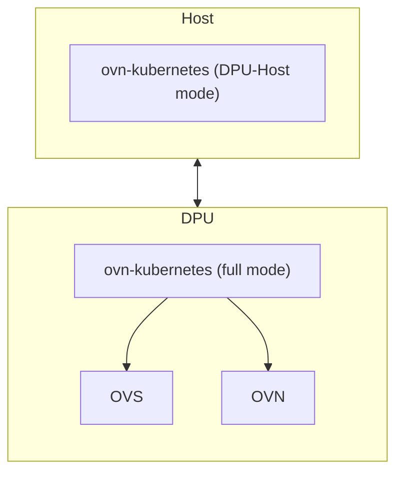
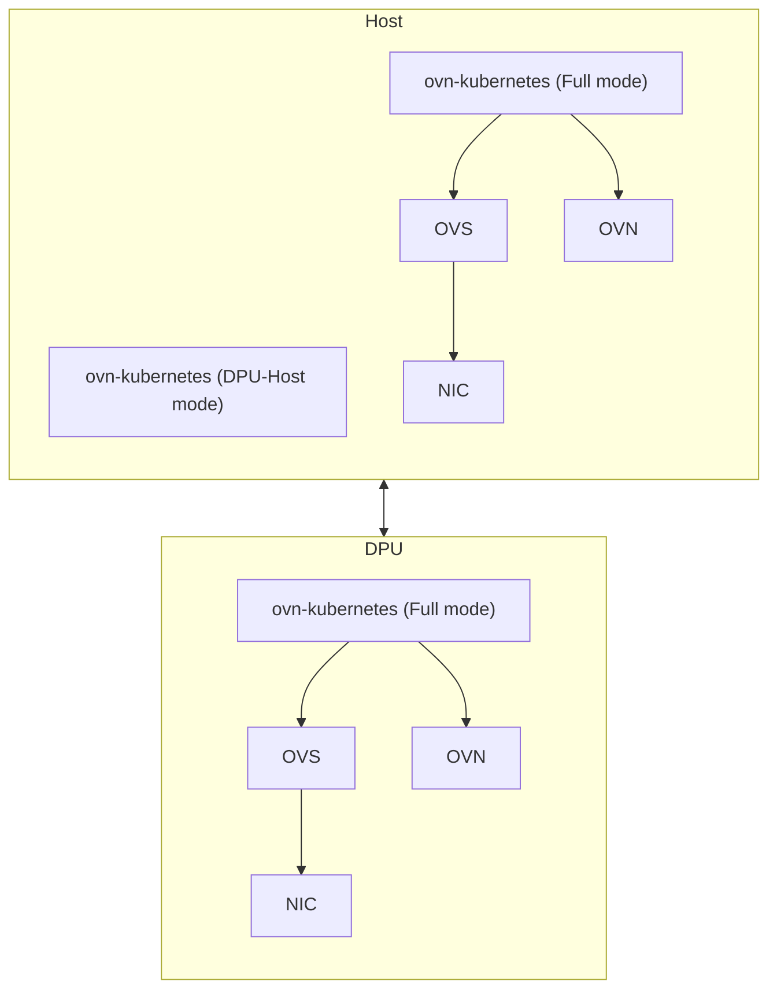

# OKEP-5521: Single Cluster Host+DPU

* Issue: [#5521](https://github.com/ovn-org/ovn-kubernetes/issues/5521)

## Problem Statement

When we first designed DPU support in OVN-Kubernetes, we designed it in a way that all traffic leaving the host would
traverse the DPU. In other words, as pods come up on the host, OVNK on the DPU (serving the host) would then wire the
pod's VF representors into OVS and handle configuring OVN. This design was short-sighted, as there exists use cases
where I may want some of my traffic to go via the DPU and some of the traffic to go via other NICs on my host.

To enable this architecture, we need full OVNK running on the host itself to handle the interfaces on the host, with
its own OVS, as well as OVNK running on the DPU (serving the host). We also still need the DPU Host component that runs
in the host on behalf of the DPU. Both of these OVNK are part of the same K8S cluster, and they both listen to events
from kapi server.

## Goals

* Allow two OVNK instances to serve a single node. One for DPU and one for the Host.
* Allow segmenting UDNs via the host or DPU.
* Avoid each instance doing unnecessary work if the event only affects the other OVNK instance.

## Non-Goals

* Addressing shared OVN, launching pods on the DPU itself, SFC, or any other part of the original 2 cluster DPU design.
* How to run OVNK on the DPU without kubelet on the DPU.

## Introduction

DPUs offer hardware offloading with OVN-Kubernetes. See [dpu-support](../features/hardware-offload/dpu-support.md) for more details.
The DPU runs most of OVN-Kubernetes down in the DPU itself, while on the host a small DPU-Host OVNK pod runs:



When pods on the host are launched, DPU-Host figures out the SRIOV interface for the pod and then annotates device
information to the pod, so that OVNK on the DPU can then wire the VF Representor into OVS and configure OVN. Now, let's
consider a use case where we have additional interfaces on the host that we want to leverage:



In this design, a pod may have some interfaces served via the VFs on the DPU, while other interfaces are connected via
the OVNK running on the host. From this point forward, the OVNK running on behalf of the host will be known as "OVNK-Full Host",
while the OVNK running on the DPU will be called "OVNK-Full DPU". The DPU-Host component will use its regular naming convention.


## User-Stories/Use-Cases

Story 1: Segment UDNs via different NICs

As a cluster admin, I want certain workloads to utilize the DPU for primary UDN/cluster default network access, while
I want to leverage my host based offloadable NICs for secondary UDNs. This will allow me to use my DPU for networks that
have north/south capabilities, while only using my host based NICs for east/west acceleration.

## Proposed Solution

### Running multiple OVNK instances on the same node

The first thing that must be addressed is how to actually run two OVN-Kubernetes instances that reference the same
Kubernetes node object. OVN-Kubernetes leverages annotations on the node to indicate key information about underlay network
and OVN configuration for the node. Some of these that are unique to the instance of OVN itself include:

* k8s.ovn.org/node-encap-ips
* k8s.ovn.org/node-chassis-id
* k8s.ovn.org/l3-gateway-config

These annotations may be different between OVNK-Full Host and OVNK-Full DPU processes. Therefore, one solution is to
duplicate these annotations and make them specific to the DPU, for example, "dpu-encap-ips". This solution is short-sighted
and will not accommodate for potentially in the future, using multiple DPUs. Therefore, the only other viable solution is
to store this information in its own CR. This solution involves two potential paths:

1. Use the existing node CRD and create DPU specific CRs
2. Create a new DPUNode CRD type that mirrors the format of the Node CRD.

For simplicity, it seems like going with option 1 should be the first choice, unless we hit a complication that forces us
to use option 2.

#### Creating extra node CRs for DPU instances

The duplicate node CR will be created by OVNK-Full DPU instance that will realize on start up it is running with a different
ovnk-identity. Let's assume the ovnk-identity is "dpu1-ovnk". OVNK-Full DPU will be started with a new configuration option
--ovnk-identity "dpu1-ovnk". After start up, OVNK-Full DPU will start a controller in its node controller, which will
watch for its node and mirror/mutate the information into a new Node CR. The name of this node CR will be
<original node name>-<ovnk-identity>. For example, given a Node:

```yaml
apiVersion: v1
kind: Node
metadata:
  annotations:
    k8s.ovn.org/host-cidrs: '["172.18.0.3/16","172.19.0.2/16"]'
    k8s.ovn.org/l3-gateway-config: '{"default":{"mode":"shared","bridge-id":"breth0","interface-id":"breth0_ovn-worker","mac-address":"c6:a8:ac:29:8c:d0","ip-addresses":["172.18.0.3/16"],"ip-address":"172.18.0.3/16","next-hops":["172.18.0.1"],"next-hop":"172.18.0.1","node-port-enable":"true","vlan-id":"0"}}'
    k8s.ovn.org/node-chassis-id: b4142d71-22dd-4ed9-b8d9-4dd187e9b0b0
    k8s.ovn.org/node-encap-ips: '["172.18.0.3"]'
    k8s.ovn.org/node-id: "3"
    k8s.ovn.org/node-masquerade-subnet: '{"ipv4":"169.254.0.0/17","ipv6":"fd69::/112"}'
    k8s.ovn.org/node-primary-ifaddr: '{"ipv4":"172.18.0.3/16"}'
    k8s.ovn.org/node-subnets: '{"default":["10.244.2.0/24"]}'
    k8s.ovn.org/node-transit-switch-port-ifaddr: '{"ipv4":"100.88.0.3/16"}'
    k8s.ovn.org/remote-zone-migrated: ovn-worker
    k8s.ovn.org/zone-name: ovn-worker
    kubeadm.alpha.kubernetes.io/cri-socket: unix:///run/containerd/containerd.sock
    node.alpha.kubernetes.io/ttl: "0"
    volumes.kubernetes.io/controller-managed-attach-detach: "true"
  creationTimestamp: "2025-08-25T22:12:56Z"
  labels:
    beta.kubernetes.io/arch: amd64
    beta.kubernetes.io/os: linux
    k8s.ovn.org/zone-name: ovn-worker
    kubernetes.io/arch: amd64
    kubernetes.io/hostname: ovn-worker
    kubernetes.io/os: linux
  name: ovn-worker
  resourceVersion: "102658"
  uid: 48ea7c29-ee34-48c1-b8a9-43e3db34c007
spec:
  podCIDR: 10.244.2.0/24
  podCIDRs:
  - 10.244.2.0/24
```

OVNK-Full DPU will create a new Node and update as needed:

```yaml
apiVersion: v1
kind: Node
metadata:
  annotations:
    k8s.ovn.org/identity: dpu1-ovnk
    k8s.ovn.org/host-cidrs: '["172.18.0.3/16","172.19.0.2/16"]'
    k8s.ovn.org/l3-gateway-config: '{"default":{"mode":"shared","bridge-id":"breth0","interface-id":"breth0_ovn-worker","mac-address":"c6:a8:ac:29:8c:d0","ip-addresses":["172.18.0.3/16"],"ip-address":"172.18.0.3/16","next-hops":["172.18.0.1"],"next-hop":"172.18.0.1","node-port-enable":"true","vlan-id":"0"}}'
    k8s.ovn.org/node-chassis-id: 7f3c4b26-5d1a-4d7f-b3a9-9c52c1b6e0d2
    k8s.ovn.org/node-encap-ips: '["10.0.0.4"]'
    k8s.ovn.org/node-id: "3"
    k8s.ovn.org/node-masquerade-subnet: '{"ipv4":"169.254.0.0/17","ipv6":"fd69::/112"}'
    k8s.ovn.org/node-primary-ifaddr: '{"ipv4":"172.18.0.3/16"}'
    k8s.ovn.org/node-subnets: '{"default":["10.244.2.0/24"]}'
    k8s.ovn.org/node-transit-switch-port-ifaddr: '{"ipv4":"100.88.0.3/16"}'
    k8s.ovn.org/remote-zone-migrated: ovn-worker-dpu1-ovnk
    k8s.ovn.org/zone-name: ovn-worker
    kubeadm.alpha.kubernetes.io/cri-socket: unix:///run/containerd/containerd.sock
    node.alpha.kubernetes.io/ttl: "0"
    volumes.kubernetes.io/controller-managed-attach-detach: "true"
  creationTimestamp: "2025-08-25T22:12:56Z"
  labels:
    beta.kubernetes.io/arch: amd64
    beta.kubernetes.io/os: linux
    k8s.ovn.org/zone-name: ovn-worker
    kubernetes.io/arch: amd64
    kubernetes.io/hostname: ovn-worker
    kubernetes.io/os: linux
  name: ovn-worker-dpu1-ovnk
  resourceVersion: "102658"
  uid: 48ea7c29-ee34-48c1-b8a9-43e3db34c007
spec:
  podCIDR: 11.244.2.0/24
  podCIDRs:
  - 11.244.2.0/24
```

In the new CR, a new annotation is added "k8s.ovn.org/identity", this will be used by OVNK-Full DPU controllers
to filter only on these node events. OVNK-Full Host will ignore nodes that have this identity field populated.

TODO: figure out which values in the above would actually change.

The node status will remain down, as kubelet will not be running in the DPU. But this status should be ignored by OVNK-Full DPU.

### Segmenting CDN and UDNs per OVNK Instance

A new argument will be provided to OVNK to indicate if this OVNK-instance should handle wiring the CDN:
--serve-cluster-default-network. The value of this by default will be true, and should be disabled as necessary. In the
example user story, the OVNK-Full Host instance would have "--serve-cluster-default-network false", in order to ensure
that only the OVNK-Full DPU instance will handle CDN for pods.

Additionally, a new field will be added to the UDN CRD spec which will allow specifying which identity should serve
this UDN. The absence of this optional field will indicate that the OVNK instance should serve this UDN. The field will
be available on both Primary and Secondary UDNs, and be enabled for all topology types.

OVN-Kube network controllers for both cluster default and user-defined networks will ignore UDN CRs that specify an
identity that does not match its runtime identity. This will avoid OVNK instances trying to process networks it does not serve.

### CNI enablement for two OVNK instances

With running DPU-Host and OVNK-Full Host, CNI is only able to call into one of the two instances to wire a pod. We need a way
to be able to ensure the correct OVNK instance serves the matching CNI call. One way to do this would be to configure
multus so that the DPU-Host CNI is called for primary UDNs/CDN, while copying the OVNK-Full Host CNI binary as a secondary CNI
called by multus. This has shortcomings because it assumes that all primary UDNs will be served by the DPU-Host, which may
not be true.

Therefore, it makes more sense to combine the DPU-Host CNI handling with the OVNK-Full Host CNI handling into a single
shim/server instance. To address this, a new mode will be added to OVNK along that indicates this OVNK instance should
handle both DPU-Host and regular CNI requests. The --dpu-host-identity argument will be used to indicate the identity
for the DPU-Host handling portion of the instance. --dpu-host-server-default-network, should be used to indicate that
the DPU-Host should serve CDN.

### Running a Pod attached to multiple networks, served by different OVNK instances

Let's assume we have a deployment where OVNK-Full DPU is configured to serve CDN, a primary UDN exists, with identity
set to the OVNK-Full DPU (dpu1-ovnk), and a secondary UDN exists, whose identity is set to (host-ovnk). A pod is launched
in a namespace served by the primary UDN, specifying an additional attachment to the secondary UDN. The following happens:

1. OVNK-Full Host sees the new pod event, and only its secondary UDN controller processes this pod.
2. OVNK-Full DPU sees the new pod event, and both the CDN controller and the Primary UDN controller process the pod.
3. Both instances update the k8s.ovn.org/pod-networks annotation on the pod.
4. Meanwhile, OVNK CNI is called for primary network. The request is sent to the OVNK CNI server, which is serving both DPU-Host and OVNK-Full Host.
5. CNI Server looks at the request for primary CNI, executes an identity check for CDN. Delegates the CDN setup to DPU-Host or adds the interface itself if OVNK-Full Host.
6. Since the identity of the CDN is not set for OVNK-Full Host, and is set for DPU-Host, DPU-Host logic handles the CDN interface.
7. CNI server finishes CDN interface, and executes identity check for Primary UDN by looking up the identity that matches the Primary UDN for this pod.
8. DPU-Host identity matches this Primary UDN, so DPU-Host handles configuring the Primary UDN interface for this pod.
9. A second CNI call executes for the Secondary network attachment. CNI Server looks up the Secondary UDN and matches the identity to OVNK-Full Host.
10. OVNK-Full Host CNI server logic wires the pod interface for the Secondary UDN.


### API Details

(... details, can point to PR PoC with changes but this section has to be
explained in depth including details about each API field and validation
details)

* add details if ovnkube API is changing

### Implementation Details

(... details on what changes will be made to ovnkube to achieve the
proposal; go as deep as possible; use diagrams wherever it makes sense)

* add details for differences between default mode and interconnect mode if any
* add details for differences between lgw and sgw modes if any
* add config knob details if any

### Testing Details

* Unit Testing details
* E2E Testing details
* API Testing details
* Scale Testing details
* Cross Feature Testing details - coverage for interaction with other features

### Documentation Details

* New proposed additions to ovn-kubernetes.io for end users
to get started with this feature
* when you open an OKEP PR; you must also edit
https://github.com/ovn-org/ovn-kubernetes/blob/13c333afc21e89aec3cfcaa89260f72383497707/mkdocs.yml#L135
to include the path to your new OKEP (i.e Feature Title: okeps/<filename.md>)

## Risks, Known Limitations and Mitigations

## OVN Kubernetes Version Skew

which version is this feature planned to be introduced in?
check repo milestones/releases to get this information for
when the next release is planned for

## Alternatives

(List other design alternatives and why we did not go in that
direction)

## References

(Add any additional document links. Again, we should try to avoid
too much content not in version control to avoid broken links)