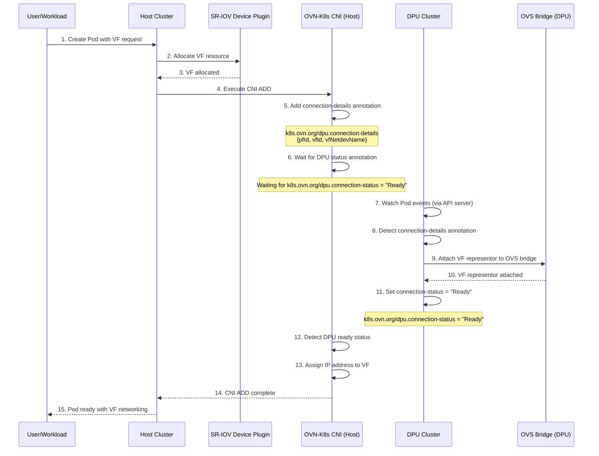
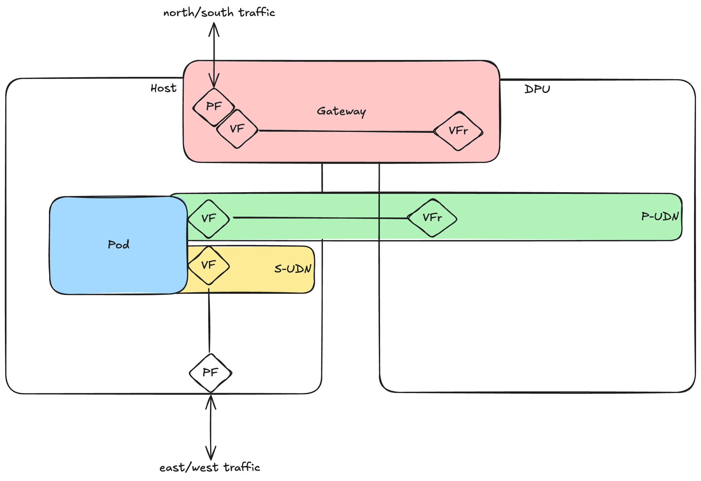
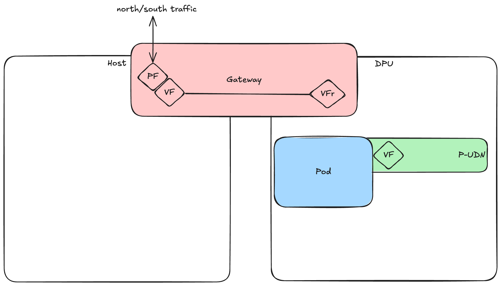
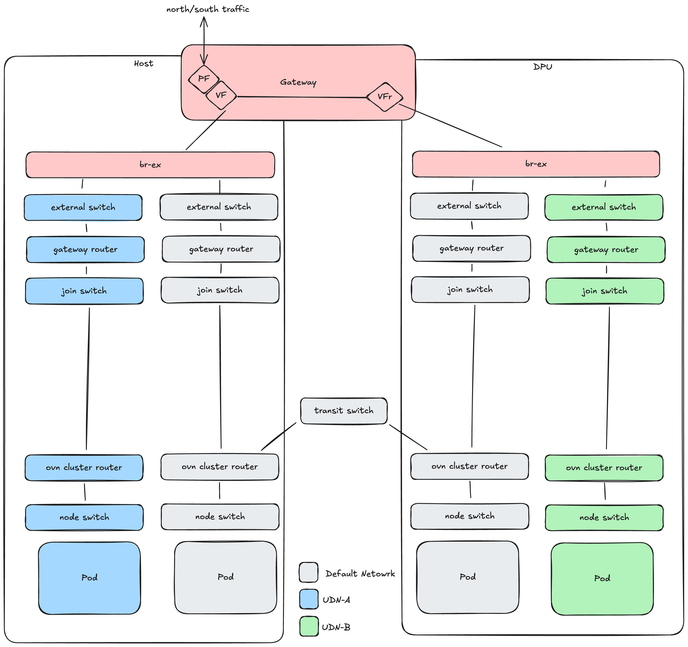

# OKEP-4368: OKEP Template

* Issue: [#5631](https://github.com/ovn-kubernetes/ovn-kubernetes/issues/5631)

## Problem Statement

Issue [#5523] shows that there is a use-case for running OVN-K8s in full mode on the host, alongside DPU-Host mode OVN-K8s.
Similarly, there is a use-case for running OVN-K8s in full mode on the DPU (to act as the CNI for any workloads scheduled on the DPU) alongside OVN-K8s running in DPU Mode.
Not only that, a comment in #5523 suggests a potential future where we have multi DPUs to consider.

If we continue along this trajectory we will end up with 2(N+1) instances of OVN-K8s running, where N is the number of DPUs.
At the simplest case, this is 2(1+1) = 4 OVN-K8s instances.

I propose that we consolidate the OVN-K8s functionality into a single mode of operation (OVN-K8s-full+dpu).
This would reduce the total number of OVN-Kubernetes instances required to 2.
It would also provide a good foundation to move to a shared OVN model, where we don't require 2 OVN deployments.

## Goals

* Reduce the total number of OVN-Kubernetes instances required to 2 (1 on the host, 1 on the DPU).
* Enable testing of DPU functionality in CI without special hardware.
* Provide an architecture that can support a shared OVN model.
* Provide an architecture that can scale to support multiple DPUs in future.

## Non-Goals

* Enabling DPUs offload without kubernetes on the DPU.

## Future Goals

* Migrate to a shared OVN model.

## Introduction

The current architecture of in DPU-mode is described in [docs/features/hardware-offload/dpu-support.md](docs/features/hardware-offload/dpu-support.md). While this was sufficient for the initial implementation, we have learned a lot about the use-cases and requirements for DPU-mode that has led us to re-evaluate the architecture.

The original design centered around having 2 distinct clusters, one for the host, one for the DPU.

OVN-Kubernetes on the host runs in "dpu-host" mode, and OVN-Kubernetes on the DPU runs in "dpu" mode.

The following diagram shows the Pod Networking Workflow in this architecture:



As shown in the diagram, annotations are used to convey the necessary
information to the DPU Cluster to setup the network plumbing.
Annotations are then used to signal the Host Cluster's OVN-Kubernetes that the
DPU network plumbing is complete.

The main limitations of this approach are:

1. It assumes that all pods must have their networking offloaded to the DPU.
2. We have many different modes of ovnkube-node, some of which are not well tested.
3. There is double the administration and management overhead, since we have 2 clusters to manage.
4. Coordinating upgrades between the 2 clusters is complex.

Several new use-cases have come to light that are not supported by this architecture.

## User-Stories/Use-Cases

Story 1: As a user, I want to be able to use DPU offload for north/south traffic, and use NICs on the host for east/west traffic.



This story was outlined in more detail in [#5523].

Story 2: As a user, I want to be able to schedule workloads on the DPU and have them networked using OVN-K8s.



## Proposed Solution

In order to fulfill these stories, I propose a solution that replaces the current DPU and DPU-Host modes with a single mode of operation.
In this mode, an instance of OVN-Kubernetes will be able to run on the host or the DPU, depending on the configuration.

Whether a workload's network is offloaded to the DPU or not will be determined by the UDN or C-UDN spec.

Making these changes will allow for:

1. A single OVN-Kubernetes instance to be able to run on the host or the DPU, depending on the configuration.
2. The ability to offload other workloads to the DPU if desired.
3. DPU nodes to run as workers in the same K8s cluster as the host nodes.

This fulfills the goals of the proposal and enables the use-cases outlined in the user-stories.

### API Details

There is only 1 API change required to support this.

UDN and C-UDN will need to know whether or not they are to be offloaded to the DPU.
This will require a spec change to the UDN and C-UDN CRs.

```go
type UserDefinedNetworkSpec struct {
	OffloadToDPU bool `json:"offloadToDPU"`
}
```

```go
type ClusterUserDefinedNetworkSpec struct {
	OffloadToDPU bool `json:"offloadToDPU"`
}
```

The default will be to not offload to the DPU.
This can be overridden by setting the `OffloadToDPU` field to `true`.

This field MUST be set at the time of creation of the UDN or C-UDN.
It cannot be changed later.

### Config Details

OVN-Kubernetes needs to additional configuration to operate in this new mode.

The following flags will be deprecated:
* `--ovnkube-node-mode`

The following flags will be added:
* `--dpu-listen-address` - the address for the DPU gRPC server to bind to.
* `--dpu-remote-address` - the IP address and port number of the gRPC service on the DPU.

TODO: What about the current flags for the management port?

### Implementation Details

#### Network Topology



The network topology remains largely the same today in OVN-Kubernetes, since the
DPU is now just another node in the cluster.
Gateway configuration follows that described in [the Accelerated Interface Configuration].
This allows for the DPU and the host to share the same gateway interface.

#### Vendor-specifc DPU component

TODO: Add details here about the dpu-operator daemon and VSPs.

#### Consolidation of DPU and DPU-Host modes

In the previous implementation, we had 2 separate modes of operation: DPU and DPU-Host.

DPU mode was used to run OVN-Kubernetes on the DPU, and DPU-Host mode was used to run OVN-Kubernetes on the host.

In DPU host mode:

1. CNI is executed on the host for a new Pod.
2. CNI sets the `dpu.connection-details` annotation on the Pod which includes the `pfId`, `vfId`, and `vfNetdevName`.
3. CNI waits for the `dpu.connection-status` annotation to be set on the Pod.
4. CNI proceeds with the Pod creation.

In DPU mode:

1. Watches for new pods, doesn't reconcile until the `dpu.connection-details` annotation is set.
2. Performs network plumbing on the DPU.
3. Sets the `dpu.connection-status` annotation on the Pod.

Rather than using annotations on the Pod to communicate the DPU connection details and status, we will use a gRPC service
to communicate the DPU connection details and status.

For this API, I propose that we use that we start with the one used in the [dpu-operator].
This can be refined as we go, in collaboraion with the upstream project.

##### Init

The [dpu-operator] has a `Init` function that is called when the ovn-kubernetes is started.
This `Init` function returns the IP/Port pair that's used to communicate with the DPU.

TODO: I'm not sure about the semantics of Init. Do we call this? Then start a new connection to the DPU-side?
Or do we just call CreateNetworkFunction and let some other process proxy to the DPU-side?

TODO: The DPU-side needs some additional information to initialize the connection.
For example, MAC address and IP address of the gateway interface. How do we provide this?

##### CreateNetworkFunction

The CNI flow will now be as follows:

1. CNI is executed on the host for a new Pod.
2. CNI makes a gRPC call `CreateNetworkFunction` to the DPU, providing `pfId`, `vfId`, and `vfNetdevName` along with
   anything else required from the Pod, NAD and UDN/C-UDN specs. Note that since this is a `string` field to enable
   the format to be vendor specific, we can simply JSON encode the request and send it as a string.
3. CNI will then wait for a response to the RPC call from the DPU.
4. CNI proceeds with the Pod creation.

The DPU flow will now be as follows:

1. DPU is listening for gRPC calls from the CNI.
2. DPU responds to the `CreateNetworkFunction` call, returning when it has completed the network plumbing.

In the specific case of NVIDIA DPUs, we expect that gRPC communication will occur over the `rshim` device.
mTLS can be used to secure the communication between the CNI and DPU, potentially using the certificates issued
by ovnkube-identity.

TODO: Need to think more on ovn-kube identity and mTLS.

##### DeleteNetworkFunction

TODO: Complete this section

#### HeartbeatService

TODO: Add details about the heartbeat service to check the liveness of the DPU connection.

### Testing Details

* Unit Testing details

The DPU gRPC service can be easily unit tested.
Existing unit tests can be re-used.

* E2E Testing details

For E2E testing, we will add a set of new DPU tests.
This will use kind to create a cluster with 6 nodes, 3 workers, 3 dpu workers.
It may be possible to run the worker node and dpu worker node in the same
network namespace and use veth pairs as a simulated VF, VFr pairs.
This would allow for full end-to-end testing of the DPU functionality, but may
require significant configuration changes to the kind cluster.

* API Testing details

We will add a set of new API tests to ensure that the DPU functionality is
working as expected.

* CI Testing details

The new E2E tests will be included in the CI pipeline.

### Documentation Details

* New proposed additions to ovn-kubernetes.io for end users
to get started with this feature

## Risks, Known Limitations and Mitigations

The biggest risk with this feature is hitting scale limitations. With many namespaces and networks, the number of
internal OVN objects will multiply, as well as internal kernel devices, rules, VRFs. There will need to be a large-scale
effort to determine how many networks we can comfortably support.

## OVN Kubernetes Version Skew

OVN Kubernetes v1.2

## Alternatives

The alternative to this proposal would be to address the 2 stories independently.

### 2 OVN-Kubernetes instances on the host

Proposed in [#5521].
Documented in [#5523].

I've attempted to address the same use-case in this proposal.

Similarities:
* We both propose using UDNs and C-UDNs to indicate whether or not a Pod's network is to be offloaded to the DPU.

Differences:
* The proposed solution runs 2 instances of OVN-Kubernetes on the same node, one to serve the host, one to serve in DPU-host mode.
* A CNI shim is inserted to decide which control plane to use.
* There are 2 distinct identities for the 2 instances of OVN-Kubernetes, and filter node events based on our current identity.

### 2 OVN-Kubernetes instances on the DPU

A spike of the work required for this was completed in [#5334].

This requires several changes:

1. `br-int` name must to be configurable to avoid overlap.
2. OVN-Kubernetes needs to be deployed with a `OvnChassisName` to identify the instance.
3. When `OvnChassisName` is set, management and gateway interfaces must be suffixed to avoid overlap.

This then allows for a 2nd instance of OVN-Kubernetes to be deployed on the DPU.

No CNI shim is require in this approach.
One OVN-K8s in DPU mode watches runs on the DPU, but watches for pods on the host cluster.
One OVN-K8s in Full mode watches for pods on the DPU cluster.

What's unclear is the interaction between the 2 instances of OVN-Kubernetes.
For example, while they use different bridges for `br-int`, do they both use the same `br-ex`?
Which instance manages `br-ex` flows in that case?

This will require a dedicated OKEP if we proceed with this approach.

## References

[#5334]: https://github.com/ovn-kubernetes/ovn-kubernetes/issues/5334
[#5521]: https://github.com/ovn-kubernetes/ovn-kubernetes/issues/5521
[#5523]: https://github.com/ovn-kubernetes/ovn-kubernetes/issues/5523
[dpu-operator]: https://github.com/openshift/dpu-operator/blob/main/dpu-api/api.proto
[the Accelerated Interface Configuration]: ../design/gatway-accelerated-interface-configuration.md.
[health check package]: ../go-controller/pkg/ovn/healthcheck/health.proto
