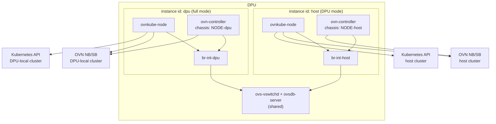

# OKEP-5861: Multiple OVN-Kubernetes Instances on a Node

* Issue: [#5825](https://github.com/ovn-kubernetes/ovn-kubernetes/issues/5825)
* Enhancement PR: [#5861](https://github.com/ovn-kubernetes/ovn-kubernetes/pull/5861),
  which this OKEP is numbered after
* POC: [#5354](https://github.com/ovn-kubernetes/ovn-kubernetes/pull/5354)

## Problem Statement

ovn-kubernetes cannot run more than one instance on the same node, so a DPU
cannot simultaneously run an instance in DPU mode (serving pods of the host
cluster) and an instance in full mode (serving pods running on the DPU itself).

## Goals

* Run multiple independent ovn-kubernetes instances on the same node, each with
  its own OVN stack and its own Kubernetes cluster. The primary use case is two
  instances on a DPU: one in DPU mode and one in full mode.
* Give every instance unambiguous ownership of the host state it creates:
  configuration, logs, sockets, PID files, OVN database files, OVS resources and
  interface names.
* Keep single-instance deployments byte-for-byte compatible: when no instance
  identifier is configured, every path and name is what it is today.
* Keep reconciliation and cleanup idempotent, so that an instance never adopts,
  renames or deletes another instance's resources.

## Non-Goals

* Changing how interfaces are selected for offload. Whether a pod uses an
  accelerated device or a veth remains a deployment decision, exactly as it is
  today for a single instance.
* Redesigning DPU support, or introducing a multi-tenancy API.
* Providing an operator or any other lifecycle management framework to deploy
  and upgrade the instances.
* Migrating an existing instance between instance identifiers. Changing an
  identifier changes the names of its host resources and its OVN chassis, so it
  is a remove-and-recreate operation rather than an in-place upgrade.
* Sharing an OVN stack, Kubernetes cluster, integration bridge or pod network.
  The local Open vSwitch, host namespaces and physical hardware remain shared
  and are partitioned as described below.

## Introduction

A DPU runs its own operating system and its own Kubernetes node, separate from
the host it is plugged into. In the DPU (trusted) architecture described in
[OKEP-5674](okep-5674-dpu-healthcheck.md), ovn-kubernetes runs in DPU mode on
the DPU and in DPU-host mode on the host, both serving the *host* cluster.

Some deployments additionally want to schedule pods on the DPU itself, as part
of a second, DPU-local cluster. That requires a second, full-mode
ovn-kubernetes instance on the same DPU, with its own OVN northbound and
southbound databases and its own Kubernetes API server.

Both instances share the local Open vSwitch installation, host namespaces and
physical hardware. Their OVN stacks and Kubernetes clients are per instance.
Upstream OVN already supports this topology:
since OVN 23.03, `ovn-controller` can be co-hosted, meaning several
`ovn-controller` instances with unique chassis names can use the same
`ovs-vswitchd`, each driving its own integration bridge. This OKEP describes the
changes ovn-kubernetes needs in order to use that capability.

Note that nothing in this design is specific to a DPU or to a count of two: it
generalizes to N instances on any node. DPUs with two instances are simply the
use case that is being proposed, implemented and tested here.

## User-Stories/Use-Cases

Story 1: Run DPU-local workloads while offloading host workloads

As a cluster admin deploying DPUs, I want to run an ovn-kubernetes instance in
DPU mode that provides networking for pods on the host, and at the same time run
an ovn-kubernetes instance in full mode that provides networking for pods
scheduled on the DPU, so that I can use the DPU both as an offload engine for
the host cluster and as a compute node of a separate cluster.

## Proposed Solution

Every instance is given an instance identifier. Its host state is derived from
that identifier, except for the explicitly configured gateway bridge and
conntrack zone range. Each instance runs its own `ovn-controller` against the
shared Open vSwitch, using a unique chassis name and a dedicated integration
bridge.



Because each instance has its own northbound and southbound databases, no OVN
logical object needs an instance-specific identifier: an instance is the only
writer of its own databases. Only resources in the shared Open vSwitch,
including connection-tracking zone allocation, and names in the shared host
namespaces (network interfaces, file paths, TCP ports), need to be scoped per
instance.

### API Details

The instance identifier is the primary knob. The gateway bridge and conntrack
zone range are configured explicitly because they own shared host resources:

| Knob | Default | Meaning |
| --- | --- | --- |
| `--instance-id=STRING` | `""` | Short identifier of this instance. Empty selects today's behaviour exactly. |
| `--ovn-chassis-name=STRING` | Existing chassis name if the identifier is empty; otherwise `NODE-INSTANCE_ID` | Optional chassis-name override, and therefore the `external_ids` suffix. |
| `--bridge-name=STRING` | `br-int` when unset, otherwise `br-int-INSTANCE_ID` | Optional integration-bridge override. |
| `--gateway-bridge=STRING` | Existing gateway bridge if the identifier is empty; otherwise required when gateway mode is enabled | Per-instance gateway bridge. |
| `--ovn-ct-zone-range=MIN-MAX` | Required when the identifier is set | Non-overlapping OVN connection-tracking zone range. |

The instance identifier must be a valid DNS label and short enough that every
interface name derived from it fits in `IFNAMSIZ`, which is validated at startup
(see [Naming constraints](#naming-constraints)). It is the value that appears in
interface names, directory paths and metrics labels, so it is deliberately kept
short and human readable, for example `host` for the DPU-mode instance serving
the host cluster and `dpu` for the full-mode instance serving the DPU-local
cluster.

The chassis name is a separate, longer identity because it must be unique within
its OVN southbound database, not merely on the node, and because OVN itself
requires it as the suffix of the chassis-specific `external_ids`. Deriving it
from the node name and the instance identifier keeps it unique by construction.
It is passed to `ovn-controller` with the `-n` command line option, which takes
precedence over the `system-id-override` file and over `external_ids:system-id`
in the database. That option is needed because `external_ids:system-id` is the
one option that cannot be made chassis-specific. In multi-instance mode,
ovn-kubernetes uses `-n` and never writes this shared key.

`--ovn-chassis-name` and `--bridge-name` already exist in the POC.
`--instance-id` is the primary input: when the override flags are not set,
ovn-kubernetes derives the chassis name and integration bridge from it.
`--gateway-bridge` and `--ovn-ct-zone-range` remain explicit because they
partition shared host resources.

Startup rejects an effective chassis name, bridge, path, interface, port or
gateway bridge that is already owned by another local instance.

Admission and cleanup are serialized by a node-wide lock at
`/var/run/ovn-kubernetes/instance-admission.lock`, acquired before validation
and held until instance-owned resources are created. A rejected concurrent start
creates no resources.

### Implementation Details

#### Instance-scoped host state

When the instance identifier is set, it is appended to the directories that the
instance owns. For an identifier of `host`:

| State | Today | Instance `host` |
| --- | --- | --- |
| OVN database files | `/etc/ovn/` (`OVN_ETCDIR`) | `/etc/ovn/host/` |
| OVN sockets and PID files | `/var/run/ovn/` (`run-dir`) | `/var/run/ovn/host/` |
| OVN logs | `/var/log/ovn/` (`OVN_LOGDIR`) | `/var/log/ovn/host/` |
| ovn-kubernetes logs | `/var/log/ovn-kubernetes/` | `/var/log/ovn-kubernetes/host/` |
| CNI server socket and certificates | `/var/run/ovn-kubernetes/` | `/var/run/ovn-kubernetes/host/` |
| ovn-kubernetes configuration file | `/etc/openvswitch/ovn_k8s.conf` (`--config-file`) | one file per instance, already selectable |
| Shared OVS sockets and PID files | `/var/run/openvswitch/` (`OVS_RUNDIR`) | unchanged, shared by every instance |

A separate OVN database directory is required because each instance runs its own
northbound and southbound databases, and `ovsdb-server` would otherwise reuse
the same files, sockets and PID files. The database, run and log directories of
OVN itself are selected by `OVN_ETCDIR`, `OVN_RUNDIR` and `OVN_LOGDIR` in the
image scripts, and the northbound and southbound run directories are already
ovn-kubernetes config knobs (`run-dir`), so the sockets need no new API, only a
per-instance value.

The run directory of the shared Open vSwitch is deliberately not scoped:
`ovs-vswitchd` and `ovsdb-server` are shared, so every instance keeps talking to
them through `/var/run/openvswitch/`.

Each instance talks to its own Kubernetes API server, using its own
kubeconfig or its own service account token, mounted only into its own pods.
Each instance also installs its own CNI configuration and CNI server socket in
its own directory; the CNI configuration directory read by a given kubelet
must only ever contain the configuration of the instance that serves that
kubelet's cluster.

#### OVS configuration

The instances share one `ovsdb-server`, and therefore one `Open_vSwitch` table
in the `Open_vSwitch` database. `ovn-controller` reads most of its configuration
from `external_ids` in that table, and supports a chassis-specific form of most
such options: `external_ids:<option>-<chassis-name>` overrides
`external_ids:<option>`. The instance is responsible for writing the
chassis-specific keys for its own chassis, and must not write the unsuffixed
ones when an instance identifier is set. With an empty identifier, existing
unsuffixed keys are preserved. For chassis `NODE-host`:

```text
external_ids:ovn-remote-NODE-host="ssl:10.0.0.1:9642"
external_ids:ovn-encap-type-NODE-host="geneve"
external_ids:ovn-encap-ip-NODE-host="10.0.0.5"
external_ids:ovn-bridge-NODE-host="br-int-host"
external_ids:ovn-bridge-datapath-type-NODE-host="netdev"
```

Note that the suffix is the *chassis name*, not the instance identifier: the
suffix is how `ovn-controller` finds its own configuration, and it looks it up
by the chassis name it was started with.

Only an allowlist of OVN-supported chassis-specific keys is suffixed: the five
keys above, `ovn-bridge-mappings`, the probe and flow-cache options,
`ovn-is-interconn`, `ovn-monitor-all`, and `ovn-pf-encap-ip-mapping`.
`external_ids:system-id` is never suffixed or updated in multi-instance mode.
`ovn-set-local-ip` was removed in OVN 24.09.

`ovn-bridge-mappings` maps physical network names to local bridges and therefore
decides which bridge each `ovn-controller` patches; it is written unsuffixed
today by ovn-kubernetes, so two instances would overwrite each other's mappings.
OVN reads it through the chassis-specific lookup, so the suffixed form works.

Each instance must use its own integration bridge, named after the instance
(`br-int-host`, `br-int-dpu`). Sharing one integration bridge between
co-hosted controllers is not supported in upstream OVN.

Not every co-hosting key is an `external_ids` key. `ovn-controller` keeps a
per-chassis index in `other_config:ovn-chassis-idx-<chassis-name>` of the same
table, which it allocates itself: the first controller on the host gets an empty
index, the next gets `0`, and tunnel ports are named `ovn<idx>-<chassis>-<hex>`
so that co-hosted controllers cannot collide on interface names. ovn-kubernetes
neither sets nor needs this key, but cleanup must not delete another chassis's
entry, and anything that matches tunnel port names has to accept the indexed
form.

Each instance sets `--ovn-ct-zone-range` to a non-overlapping range, so
controllers cannot dynamically pick the same zone for different logical ports.
Startup validates the range bounds and checks it against ranges owned by local
instances. This key is chassis-specific:

```text
external_ids:ct-zone-range-NODE-host="1-32767"
external_ids:ct-zone-range-NODE-dpu="32768-65535"
```

Support for these boundaries was added in OVN 24.09.

#### Gateway bridge and uplink

Each instance needs its own `--gateway-bridge`, because ovnkube-node owns the
whole flow table of a gateway bridge rather than a subset of it: the OpenFlow
manager re-synchronizes it with `ovs-ofctl --bundle replace-flows`, and gateway
cleanup replaces every flow with a single `NORMAL` action. Two instances pointed
at one bridge would erase each other's flows on every synchronization.

The existing `--gateway-interface` selects the uplink. It must be distinct per
instance, or be a distinct VLAN subinterface when one physical port is shared.
Startup validates the resolved gateway bridge and uplink ownership. Each
instance then publishes its own physical network mapping through its
chassis-specific `ovn-bridge-mappings`, so that its `ovn-controller` patches the
right bridge.

Sharing a single gateway bridge would require flow ownership inside the bridge,
which the OpenFlow manager does not have today, and is out of scope here.

#### Instance-scoped OVS and interface names

Several names are currently hardcoded and have to be derived from the instance
identifier instead. Each of these is a resource that two instances would
otherwise create, reconfigure and delete underneath each other:

* Integration bridge: `br-int` today, `br-int-<instance-id>` when an instance
  identifier is set. Every place that assumes the literal `br-int` must use the
  configured bridge name instead, including `ovs-appctl` and `ovs-vsctl`
  invocations, the hybrid overlay, and the sample decoder.
* Gateway and localnet patch ports: `GetPatchPortName()` builds the name from
  `types.PatchPortSuffix`, which is the literal `-to-br-int`, and the localnet
  port lookup makes the same assumption. Both must use the configured
  integration bridge name, otherwise the two instances generate identical patch
  port names and each one deletes the other's ports during reconciliation.
* Management port: `types.K8sMgmtIntfName` is the literal `ovn-k8s-mp0`, and
  both instances would otherwise create, rename, add routes and rules for, and
  clean up the same interface. User defined networks add further management
  interfaces built from `types.K8sMgmtIntfNamePrefix`, so the whole family has
  to be scoped, and `types.SFlowAgent` hardcodes the same name and must follow.
  See [Naming constraints](#naming-constraints) for the naming scheme, which is
  constrained by `IFNAMSIZ`.
* Any other OVS resource created by an instance must carry an ownership
  `external_ids` entry naming the owning instance, and every lookup of such a
  resource must filter on it. The POC does this for pod interfaces with
  `external_ids:bridge-name`, which is the pattern to generalize.

Reconciliation and cleanup must select resources by that ownership entry.
Resources belonging to another instance are ignored; resources belonging to no
instance are reported and left in place rather than adopted, so that starting,
restarting and removing an instance is idempotent and cannot disrupt a
co-hosted instance.

#### Health checks and metrics

The following listeners and probes bind to shared resources and must be
configured per instance:

* Listeners: controller, node, cluster-manager and OVN metrics, the OVS
  exporter and optional healthz use unique per-instance ports, validated at
  startup. Metrics carry the instance identifier as a label.
* EgressIP node reachability: `--egressip-node-healthcheck-port` must differ
  per instance.
* Readiness: the `ovn-kube-util readiness-probe` command addresses
  `ovn-controller` by its bare target name, so with two co-hosted controllers it
  reaches whichever one owns the default control socket, and its `ovnkube-node`
  target stats the literal `/etc/cni/net.d/10-ovn-kubernetes.conf`. Both must
  become instance aware, so that a probe cannot report an instance healthy
  because a co-hosted instance is running. Its checks against the shared
  `ovsdb-server` and `ovs-vswitchd` sockets stay as they are, since those
  daemons are shared.

Logs are written to the instance-specific log directory and include the
instance identifier, so that a centralized logging stack can separate the
instances.

#### Naming constraints

Linux limits interface names to 15 characters plus a terminating NUL
(`IFNAMSIZ` is 16), and this applies to the *values* of the names above, not to
the `external_ids` keys. The constraint binds quickly. `br-int-host` fits at 11
characters, but the management port does not: `ovn-k8s-mp0` is already 11
characters, and appending `-host` needs 16.

The management port family is therefore renamed rather than suffixed when an
instance identifier is set, replacing the fixed `ovn-k8s-` prefix:

```text
instance id unset:  ovn-k8s-mp0      ovn-k8s-mp1 ...   (unchanged)
instance id "host": ovnk-host-mp0    ovnk-host-mp1 ...
```

This leaves `15 - len("ovnk--mp") - digits` characters for the identifier. With
up to three digits of user defined network index, that is four characters, so
`host` and `dpu` fit and `local` does not. The identifier is validated at
startup against every name template it feeds, and startup fails with a clear
error naming the template that overflowed, rather than producing a truncated or
colliding interface name.

### Testing Details

* Unit tests: name generation and validation for every instance-scoped name
  (integration bridge, patch ports, management ports, paths, chassis name),
  including the rejection of identifiers that overflow `IFNAMSIZ`, and the
  empty-identifier case that must reproduce today's names exactly. Validate
  gateway-bridge, uplink and connection-tracking range collisions, including
  concurrent admission and cleanup, and verify multi-instance mode does not
  write `external_ids:system-id`.
* E2E tests: the existing `kind-dpu-offload` job already builds the two clusters
  this OKEP needs, since `dpu-simulator` brings up a host cluster and a
  DPU cluster as separate kind clusters with separate kubeconfigs. Extend it to
  run the DPU-mode instance and the full-mode instance on the simulated DPU
  node, and verify pod-to-pod, pod-to-service and egress traffic independently
  in IPv4-only, IPv6-only and dual-stack clusters. This keeps the motivating
  use case testable without DPU hardware.
* Isolation tests: each instance only sees its own configuration, sockets, PID
  files, database files, CNI configuration, integration bridge, patch ports,
  management ports and conntrack zones; restarting or deleting one instance
  leaves the other's resources and datapath untouched; a stale resource from a
  removed instance is not adopted by the surviving instance. Cover three
  instances to verify non-overlapping connection-tracking ranges.
* Cross feature tests: network policy, services, and EgressIP in each instance,
  since these depend on stateful conntrack behaviour that is affected by
  co-hosting (see [Risks, Known Limitations and
  Mitigations](#risks-known-limitations-and-mitigations)).
* Scale tests: measure per-instance consumption and contention in shared OVS,
  host and hardware resources to define a supported instance limit.

### Documentation Details

* A new page under the DPU documentation describing the architecture above,
  with example DaemonSets for the two instances showing the instance
  identifier, the separate credentials, host paths, integration bridges,
  metrics ports and readiness probes, plus the OVS commands to inspect the
  chassis-specific `external_ids`.
* An entry for this OKEP in `mkdocs.yml`.

## Risks, Known Limitations and Mitigations

* OVN 24.09 documents co-hosting `ovn-controller` instances as experimental
  and does not support stateful ACLs. OVN 26.09.0 removes the experimental
  status and supports stateful features when controllers use separate
  `ct-zone-range` values. Cross-feature tests must validate network policy,
  services and egress before this feature is declared supported.
* Anything that is shared and cannot be named or range-partitioned per instance
  is a blocker for co-hosting, not something this OKEP makes safe by
  convention. Host resources in this category, which the implementation must
  either partition or explicitly claim per instance, include nftables and
  iptables rules, routing table identifiers and rule priorities, and sysctls.
* Two instances mean two of everything on one node: CPU, memory and file
  descriptors roughly double, and the node must be sized accordingly.
* A misconfiguration in which two instances are given the same identifier, or a
  multi-instance deployment writes unsuffixed `external_ids`, would make the
  instances fight over the same resources. The identifier is therefore
  validated, and its uniqueness on the node is verified at startup.

## OVN-Kubernetes Version Skew

The feature is opt-in and inert unless an instance identifier is configured, so
there is no skew for existing deployments.

It is targeted at `v1.5.0`, rather than the current `v1.4.0` milestone, because
the implementation is still a draft and because the upstream limitation
discussed above needs to be settled first.

It requires OVN 26.09.0 or later: 23.03 added co-hosting, 24.09 added
per-chassis conntrack zone boundaries, and 26.09.0 adds stateful-feature
support. Startup rejects older versions when an instance identifier is set.

## Backwards Compatibility

* The instance identifier defaults to the empty string, in which case every
  path, interface name, `external_ids` key, metrics port and CNI location is
  unchanged, and no OVS resource gains an ownership entry it did not have
  before. No datapath or API change is visible to a single-instance deployment.
* No existing API field changes meaning, and no existing CLI flag changes its
  default.
* Existing E2E tests continue to run unmodified against a single instance, and
  the multi-instance coverage is added as new jobs.

## Alternatives

* Run the second instance in a separate network namespace with its own
  `ovs-vswitchd`. This avoids the shared `Open_vSwitch` table entirely, but a
  DPU has one hardware datapath: two `ovs-vswitchd` instances cannot both own
  the physical ports and the offload hardware.
* Use the unsuffixed `external_ids` and start each `ovn-controller` against a
  private copy of the OVS database. This would require running a second
  `ovsdb-server`, which has the same hardware ownership problem.
* Teach a single ovn-kubernetes instance to serve two clusters. This would mean
  two Kubernetes clients, two OVN stacks and two sets of controllers inside one
  process, with no isolation between them, and would change every controller in
  the tree rather than only the naming of node-level resources.
* Configure the chassis name, bridge name, directories, interface names and
  ports independently, as the POC does, instead of deriving them from one
  instance identifier. This is more flexible, but it makes a working
  configuration the deployer's responsibility, and nothing detects the
  combinations that silently collide.
* Number the management ports per instance instead of naming them, which is what
  the POC does today: `ovn-k8s-mp0` becomes `ovn-k8s-mp10` for the second
  instance. This sidesteps `IFNAMSIZ` without renaming anything, but it encodes
  the instance in a digit of an existing index, which does not extend past two
  instances and is hard to read on a live system.

## References

* [ovn-controller(8)](https://www.ovn.org/support/dist-docs/ovn-controller.8.html),
  chassis-specific configuration options and co-hosted controllers.
* [OVN 23.03 release notes](https://www.ovn.org/en/releases/23.03/):
  experimental support for co-hosting multiple controller instances.
* [Support 2+ controllers on the same vswitchd](https://mail.openvswitch.org/pipermail/ovs-dev/2023-January/400884.html),
  the upstream OVN series that introduced the capability.
* [OKEP-5674: DPU Healthcheck](okep-5674-dpu-healthcheck.md) for the DPU
  architecture this builds on.
* [DRAFT: Support running 2 ovnks on the same host](https://github.com/ovn-kubernetes/ovn-kubernetes/pull/5354),
  the POC that implements the chassis-scoped `external_ids`, the configurable
  integration bridge and the instance-scoped names described here.
