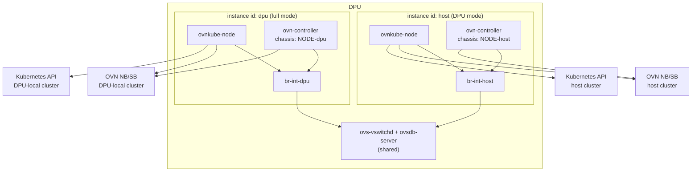

# OKEP-5861: Multiple OVN-Kubernetes Instances on a Node

* Issue: [#5825](https://github.com/ovn-kubernetes/ovn-kubernetes/issues/5825)
* Enhancement PR: [#5861](https://github.com/ovn-kubernetes/ovn-kubernetes/pull/5861),
  which this OKEP is numbered after
* POC: [#5354](https://github.com/ovn-kubernetes/ovn-kubernetes/pull/5354)

## Problem Statement

In the trusted DPU architecture, the DPU-mode ovn-kubernetes instance serves
the host cluster and cannot provide networking to pods in a DPU-local cluster.
Supporting non-host-networked DPU-local pods requires a full-mode instance to
coexist with the DPU-mode instance on the DPU.

## Goals

* Run a DPU-mode instance for the host cluster and a full-mode instance for a
  DPU-local cluster on the same DPU.
* Give every instance unambiguous ownership of the host state it creates:
  configuration, logs, sockets, PID files, OVN database files, OVS resources and
  interface names.
* Keep single-instance deployments byte-for-byte compatible: when no instance
  identifier is configured, every path and name is what it is today.
* Keep reconciliation and cleanup idempotent, so that an instance never adopts,
  renames or deletes another instance's resources.

## Non-Goals

* Changing how interfaces are selected for offload. Whether a pod uses an
  accelerated device or a veth remains a deployment decision, exactly as it is
  today for a single instance.
* Redesigning DPU support, or introducing a multi-tenancy API.
* Providing an operator or any other lifecycle management framework to deploy
  and upgrade the instances.
* Migrating an existing instance between instance identifiers. Changing an
  identifier changes the names of its host resources and its OVN chassis, so it
  is a remove-and-recreate operation rather than an in-place upgrade. Moving
  from an empty identifier to multi-instance mode follows the same sequence.
* Sharing an OVN stack, Kubernetes cluster, integration bridge or pod network.
  The local Open vSwitch, host namespaces and physical hardware remain shared
  and are partitioned as described below.

## Introduction

A DPU runs its own operating system and its own Kubernetes node, separate from
the host it is plugged into. In the DPU (trusted) architecture described in
[OKEP-5674](okep-5674-dpu-healthcheck.md), ovn-kubernetes runs in DPU mode on
the DPU and in DPU-host mode on the host, both serving the *host* cluster.

Some deployments additionally want to schedule pods on the DPU itself, as part
of a second, DPU-local cluster. That requires a second, full-mode
ovn-kubernetes instance on the same DPU, with its own OVN northbound and
southbound databases and its own Kubernetes API server.

Both instances share the local Open vSwitch installation, host namespaces and
physical hardware. Their OVN stacks and Kubernetes clients are per instance.
Upstream OVN already supports this topology:
since OVN 23.03, `ovn-controller` can be co-hosted, meaning several
`ovn-controller` instances with unique chassis names can use the same
`ovs-vswitchd`, each driving its own integration bridge. This OKEP describes the
changes ovn-kubernetes needs in order to use that capability.

Note that nothing in this design is specific to a DPU or to a count of two: it
generalizes to N instances on any node. DPUs with two instances are simply the
use case that is being proposed, implemented and tested here.

## User-Stories/Use-Cases

Story 1: Run DPU-local workloads while offloading host workloads

As a cluster admin deploying DPUs, I want to run an ovn-kubernetes instance in
DPU mode that provides networking for pods on the host, and at the same time run
an ovn-kubernetes instance in full mode that provides networking for pods
scheduled on the DPU, so that I can use the DPU both as an offload engine for
the host cluster and as a compute node of a separate cluster.

## Proposed Solution

Every instance is given an instance identifier. Its host state is derived from
that identifier, except for the explicitly configured gateway bridge, conntrack
zone range, and shared-gateway conntrack base. Each
instance runs its own `ovn-controller` against the shared Open vSwitch, using a
unique chassis name and a dedicated integration bridge.


```mermaid
flowchart TB
  subgraph DPU["DPU"]
    direction TB
    subgraph I1["instance id: host (DPU mode)"]
      A1["ovnkube-node"]
      C1["ovn-controller<br/>chassis: NODE-host"]
      B1["br-int-host"]
    end
    subgraph I2["instance id: dpu (full mode)"]
      A2["ovnkube-node"]
      C2["ovn-controller<br/>chassis: NODE-dpu"]
      B2["br-int-dpu"]
    end
    OVS["ovs-vswitchd + ovsdb-server<br/>(shared)"]
    A1 --> B1
    A2 --> B2
    C1 --> B1
    C2 --> B2
    B1 --> OVS
    B2 --> OVS
  end
  DB1["OVN NB/SB<br/>host cluster"]
  DB2["OVN NB/SB<br/>DPU-local cluster"]
  K1["Kubernetes API<br/>host cluster"]
  K2["Kubernetes API<br/>DPU-local cluster"]
  C1 --> DB1
  C2 --> DB2
  A1 --> DB1
  A2 --> DB2
  A1 --> K1
  A2 --> K2
```

Because each instance has its own northbound and southbound databases, no OVN
logical object needs an instance-specific identifier: an instance is the only
writer of its own databases. Only resources in the shared Open vSwitch,
including connection-tracking zone allocation, and names in the shared host
namespaces (network interfaces, file paths, TCP ports), need to be scoped per
instance.

### API Details

The instance identifier is the primary knob. The gateway bridge, OVN conntrack
range, and shared-gateway conntrack base are configured explicitly because they
own shared host resources:

| Knob | Default | Meaning |
| --- | --- | --- |
| `--instance-id=STRING` | `""` | Short identifier of this instance. Empty selects today's behaviour exactly. |
| `--ovn-chassis-name=STRING` | Existing chassis name if the identifier is empty; otherwise `NODE-INSTANCE_ID` | Optional chassis-name override, and therefore the `external_ids` suffix. |
| `--bridge-name=STRING` | `br-int` when unset, otherwise `br-int-INSTANCE_ID` | Optional integration-bridge override. |
| `--gateway-bridge=STRING` | Existing gateway bridge if the identifier is empty; otherwise required when gateway mode is enabled | Per-instance gateway bridge. |
| `--ovn-ct-zone-range=MIN-MAX` | Required when the identifier is set | OVN connection-tracking zone range, disjoint from every other instance and from the gateway zones below. |
| `--conntrack-zone=INT` | `64000` when the identifier is empty; otherwise required | Base shared-gateway conntrack zone. The instance also reserves the next four zones. |

When set, the instance identifier must be a valid DNS label of at most eight
characters. `br-int-<id>` is the derived interface name that determines this
limit (see [Naming constraints](#naming-constraints)). The empty value is not a
DNS label and continues to select today's behaviour. The identifier is the value
that appears in
interface names, directory paths and metrics labels, so it is deliberately kept
short and human readable, for example `host` for the DPU-mode instance serving
the host cluster and `dpu` for the full-mode instance serving the DPU-local
cluster.

The chassis name is a separate, longer identity because it must be unique within
its OVN southbound database, not merely on the node, and because OVN itself
requires it as the suffix of the chassis-specific `external_ids`. Deriving it
from the node name and the instance identifier keeps it unique by construction.
It is passed to `ovn-controller` with the `-n` command line option, which takes
precedence over the `system-id-override` file and over `external_ids:system-id`
in the database. That option is needed because `external_ids:system-id` is the
one option that cannot be made chassis-specific. In multi-instance mode,
ovn-kubernetes uses `-n` and never writes this shared key.

The derived name is also used by every ovn-kubernetes chassis consumer,
including gateway setup, encap configuration and node annotation; multi-instance
code must not read the shared `external_ids:system-id` as its chassis identity.

The instance ID sets the default chassis name and integration bridge.
ovn-kubernetes can move an existing `system-id` to the derived chassis name
itself. `--ovn-chassis-name` and `--bridge-name` remain so an operator can
override those names if that migration does not fit. Startup still rejects a
chassis name or bridge that another local instance owns. `--gateway-bridge`,
`--ovn-ct-zone-range`, and `--conntrack-zone` stay
explicit because they select shared host resources.

Startup rejects an effective chassis name, bridge, path, interface, port or
gateway bridge that is already owned by another local instance.

When an instance identifier is set, admission and cleanup use a node-wide lock
at `/var/run/ovn-kubernetes/instance-admission.lock`. It is held from collision
validation until every shared resource has an ownership entry, closing the
concurrent-start race. The empty-identifier path does not use the lock.

### Implementation Details

#### Instance-scoped host state

When the instance identifier is set, it is appended to the directories that the
instance owns. These are host paths, which a containerized deployment mounts at
the conventional paths inside the container. For an identifier of `host`:

| State | Host path today | Host path for instance `host` |
| --- | --- | --- |
| OVN database files | `/etc/ovn/` (`OVN_ETCDIR`) | `/etc/ovn/host/` |
| OVN sockets and PID files | `/var/run/ovn/` (`run-dir`) | `/var/run/ovn/host/` |
| OVN logs | `/var/log/ovn/` (`OVN_LOGDIR`) | `/var/log/ovn/host/` |
| ovn-kubernetes logs | `/var/log/ovn-kubernetes/` | `/var/log/ovn-kubernetes/host/` |
| CNI server socket | `/var/run/ovn-kubernetes/cni/ovn-cni-server.sock` | `/var/run/ovn-kubernetes/host/cni/ovn-cni-server.sock` |
| ovn-kubernetes configuration file | `/etc/openvswitch/ovn_k8s.conf` (`--config-file`) | one file per instance, already selectable |
| Shared OVS sockets and PID files | `/var/run/openvswitch/` (`OVS_RUNDIR`) | unchanged, shared by every instance |

A separate OVN database directory is required because each instance runs its own
northbound and southbound databases, and `ovsdb-server` would otherwise reuse
the same files, sockets and PID files. The database, run and log directories of
OVN itself are selected by `OVN_ETCDIR`, `OVN_RUNDIR` and `OVN_LOGDIR` in the
image scripts, and the northbound and southbound run directories are already
ovn-kubernetes config knobs (`run-dir`), so the sockets need no new API, only a
per-instance value.

A container mounting `/etc/ovn/host` at `/etc/ovn` keeps the conventional path
inside the process, so only deployments that share a mount namespace see the
suffixed path directly. Separate backing storage covers everything in the table.
It does not cover the bridges, interface names and `external_ids` keys, which
live in the shared Open vSwitch and still have to carry the instance identifier.

The run directory of the shared Open vSwitch is deliberately not scoped:
`ovs-vswitchd` and `ovsdb-server` are shared, so every instance keeps talking to
them through `/var/run/openvswitch/`.

Each instance talks to its own Kubernetes API server, using its own
kubeconfig or its own service account token, mounted only into its own pods.
DPU mode does not run a CNI server, so the DPU-mode instance does not create
that socket. The host cluster's CNI server runs on the host, in DPU-host mode,
and the DPU-local cluster's CNI server runs in the full-mode instance. Those
servers are on different machines, so that pair does not share a CNI socket.
Two full-mode instances on one machine both run a CNI server and use the
instance path in the table. An empty identifier keeps
`/var/run/ovn-kubernetes/cni/ovn-cni-server.sock`.

#### OVS configuration

The instances share one `ovsdb-server`, and therefore one `Open_vSwitch` table
in the `Open_vSwitch` database. `ovn-controller` reads most of its configuration
from `external_ids` in that table, and supports a chassis-specific form of most
such options: `external_ids:<option>-<chassis-name>` overrides
`external_ids:<option>`. The instance is responsible for writing the
chassis-specific keys for its own chassis, and must not write the unsuffixed
ones when an instance identifier is set. With an empty identifier, existing
unsuffixed keys are preserved. For chassis `NODE-host`:

```text
external_ids:ovn-remote-NODE-host="ssl:10.0.0.1:9642"
external_ids:ovn-encap-type-NODE-host="geneve"
external_ids:ovn-encap-ip-NODE-host="10.0.0.5"
external_ids:ovn-bridge-NODE-host="br-int-host"
external_ids:ovn-bridge-datapath-type-NODE-host="netdev"
```

Note that the suffix is the *chassis name*, not the instance identifier: the
suffix is how `ovn-controller` finds its own configuration, and it looks it up
by the chassis name it was started with.

ovn-kubernetes readers use the same effective suffix. Direct unsuffixed lookups,
including metrics and the CNI lookup of `ovn-pf-encap-ip-mapping`, are replaced
with an instance-aware helper.

Only an allowlist of OVN-supported chassis-specific keys is suffixed: the five
keys above, `hostname`, `ovn-bridge-mappings`, the probe and flow-cache options,
`ovn-is-interconn`, `ovn-monitor-all`, and `ovn-pf-encap-ip-mapping`.
`external_ids:system-id` is never suffixed or updated in multi-instance mode.
`ovn-set-local-ip` was removed in OVN 24.09.

`dist/images/ovnkube.sh` must receive the identifier before reading OVS. In
multi-instance mode its `host-k8s-nodename` and `ovn-gw-*` lookups use an
`-INSTANCE_ID` suffix without falling back to the unsuffixed keys. The
empty-identifier path is unchanged.

`ovn-bridge-mappings` maps physical network names to local bridges and therefore
decides which bridge each `ovn-controller` patches; it is written unsuffixed
today by ovn-kubernetes, so two instances would overwrite each other's mappings.
OVN reads it through the chassis-specific lookup, so the suffixed form works.

Settings without a chassis-specific form, such as
`other_config:bundle-idle-timeout`, must have the same value in every instance;
startup rejects a mismatch and cleanup does not remove shared values.

Each instance must use its own integration bridge, named after the instance
(`br-int-host`, `br-int-dpu`). Sharing one integration bridge between
co-hosted controllers is not supported in upstream OVN.

Not every co-hosting key is an `external_ids` key. `ovn-controller` keeps a
per-chassis index in `other_config:ovn-chassis-idx-<chassis-name>` of the same
table, which it allocates itself: the first controller on the host gets an empty
index, the next gets `0`, and tunnel ports are named
`ovn<idx>-<first 5 or 6 characters of the chassis name>-<hex>` so that
co-hosted controllers cannot collide on interface names. ovn-kubernetes
neither sets nor needs this key, but cleanup must not delete another chassis's
entry, and anything that matches tunnel port names has to accept the indexed
form.

Each instance sets `--ovn-ct-zone-range` so controllers cannot pick the same
zone. That OVN key is chassis-specific. The range must stay outside the
shared-gateway zones. `--conntrack-zone` is the ovnkube setting that selects
their base, and the instance uses the next four for host masquerade, OVN
masquerade, NodePort, and reassembly. Startup rejects a range or base that
overlaps another local instance:

```text
external_ids:ct-zone-range-NODE-host="1-31999"
external_ids:ct-zone-range-NODE-dpu="32000-63999"
conntrack-zone host="64000"    gateway zones 64000-64004
conntrack-zone dpu="64100"     gateway zones 64100-64104
```

Support for these boundaries was added in OVN 24.09.

#### Gateway bridge and uplink

Each instance needs its own `--gateway-bridge`, because ovnkube-node owns the
whole flow table of a gateway bridge rather than a subset of it: the OpenFlow
manager re-synchronizes it with `ovs-ofctl --bundle replace-flows`, and gateway
cleanup replaces every flow with a single `NORMAL` action. Two instances pointed
at one bridge would erase each other's flows on every synchronization.

The existing `--gateway-interface` selects the uplink. It must be distinct per
instance, or be a distinct VLAN subinterface when one physical port is shared.
The `Uplink` CRD resolves a host interface to an OVS bridge, and the node
controller already refuses a bridge that is the node's own default gateway
bridge: `validateDefaultGatewayBridge` reports `Resolved=False` with
`DefaultGatewayBridgeUnsupported` on the `UplinkState`. It reads that bridge
from the node's `k8s.ovn.org/l3-gateway-config` annotation, so it only knows
the gateway bridge of its own cluster. In multi-instance mode that check must
reject every gateway bridge owned by a local instance, so that an `Uplink` in
one cluster cannot resolve to the other cluster's gateway bridge. This stays a
resolution failure on the `UplinkState`, not a startup rejection, since an
`Uplink` can be created at any time. Each
instance then publishes its own physical network mapping through its
chassis-specific `ovn-bridge-mappings`, so that its `ovn-controller` patches the
right bridge.

Sharing a single gateway bridge would require flow ownership inside the bridge,
which the OpenFlow manager does not have today, and is out of scope here.

#### Shared host networking

Multi-instance mode supports only shared gateway with the nftables backend.
Each instance uses `inet ovn-kubernetes-INSTANCE_ID`, instance-owned routes and
rules, and non-overlapping CIDRs; cleanup selects only that state. Local gateway,
NodePort and any feature that still writes unscoped host state are rejected.
Node-wide sysctls must have identical values across instances.

#### Instance-scoped OVS and interface names

Several names are currently hardcoded and have to be derived from the instance
identifier instead. Each of these is a resource that two instances would
otherwise create, reconfigure and delete underneath each other:

* Integration bridge: `br-int` today, `br-int-<instance-id>` when an instance
  identifier is set. Every place that assumes the literal `br-int` must use the
  configured bridge name instead, including `ovs-appctl` and `ovs-vsctl`
  invocations, the hybrid overlay, the sample decoder, and the `ovsIntegrationBridge`
  constant that the uplink controller compares resolved bridges against.
* Gateway and localnet patch ports: the gateway bridge is already part of the
  name, as in `patch-breth0_ovn-worker-to-br-int`, so distinct gateway bridges
  do not collide. `types.PatchPortSuffix` is still the literal `-to-br-int`.
  It must follow the instance integration bridge so reconciliation attaches the
  port to that bridge.
* Management port: names are unchanged (see
  [Naming constraints](#naming-constraints)).
* Any other OVS resource created by an instance must carry an ownership
  `external_ids` entry naming the owning instance, and every lookup of such a
  resource must filter on it. The POC does this for pod interfaces with
  `external_ids:bridge-name`, which is the pattern to generalize.

Reconciliation and cleanup must select resources by that ownership entry.
Resources belonging to another instance are ignored; resources belonging to no
instance are reported and left in place rather than adopted, so that starting,
restarting and removing an instance is idempotent and cannot disrupt a
co-hosted instance.

Changing an identifier, including moving from an empty identifier to
multi-instance mode, is a remove-and-recreate. The old instance is stopped and
cleaned up under its old identity before the replacement starts. Cleanup removes
its suffixed `external_ids`, chassis index, owned OVS resources, and instance
files. The replacement does not adopt or delete resources left under another
identity.

#### Health checks and metrics

The following listeners and probes bind to shared resources and must be
configured per instance:

* Listeners: controller, node, cluster-manager and OVN metrics, the OVS
  exporter and optional healthz use unique per-instance ports, validated at
  startup. Metrics carry the instance identifier as a label.
* Readiness: the `ovn-kube-util readiness-probe` command addresses
  `ovn-controller` by its bare target name, so with two co-hosted controllers it
  reaches whichever one owns the default control socket. That probe must address
  the instance's own controller. The CNI configuration check stays on the
  machine where that instance's kubelet runs. Its checks against the shared
  `ovsdb-server` and `ovs-vswitchd` sockets stay as they are, since those
  daemons are shared.

Logs are written to the instance-specific log directory and include the
instance identifier, so that a centralized logging stack can separate the
instances.

#### Naming constraints

Linux limits interface names to 15 characters plus a terminating NUL
(`IFNAMSIZ` is 16). `br-int-` leaves eight characters for the identifier, so
`host` and `dpu` fit. Startup rejects an identifier that overflows a derived
name.

Management ports keep their current names. They do not collide: in DPU mode the
controller plumbs a representor and creates no `ovn-k8s-mp<network id>` netdev,
so only the full-mode instance creates those.

The chassis name has no interface-name limit, because it never becomes one.
`ovn-controller` truncates it to the first five or six characters when it builds
tunnel port names, so a long node name cannot overflow `IFNAMSIZ` there.

### Testing Details

* Unit tests: name generation and validation for every instance-scoped name
  (integration bridge, patch ports, management ports, paths, chassis name),
  including the rejection of identifiers that overflow `IFNAMSIZ`, and the
  empty-identifier case that must reproduce today's names exactly. Validate
  gateway-bridge, uplink and connection-tracking range collisions, including
  concurrent admission and cleanup. Verify the effective chassis identity and
  shared-value validation.
* E2E tests: the existing `kind-dpu-offload` job already builds the two clusters
  this OKEP needs, since `dpu-simulator` brings up a host cluster and a
  DPU cluster as separate kind clusters with separate kubeconfigs. Extend it to
  run the DPU-mode instance and the full-mode instance on the simulated DPU
  node, and verify pod-to-pod, pod-to-service and egress traffic independently
  in IPv4-only, IPv6-only and dual-stack clusters. This keeps the motivating
  use case testable without DPU hardware.
* Isolation tests: each instance only sees its own configuration, sockets, PID
  files, database files, CNI configuration, integration bridge, patch ports,
  management ports and conntrack zones; restarting or deleting one instance
  leaves the other's resources and datapath untouched; a stale resource from a
  removed instance is not adopted by the surviving instance. Cover three
  instances to verify non-overlapping connection-tracking ranges.
* Cross feature tests: network policy and ClusterIP Services in each instance,
  since these depend on stateful conntrack behaviour that is affected by
  co-hosting. Verify unsupported host-network features are rejected.
* Scale tests: measure per-instance consumption and contention in shared OVS,
  host and hardware resources to define a supported instance limit.

### Documentation Details

* A new page under the DPU documentation describing the architecture above,
  with example DaemonSets for the two instances showing the instance
  identifier, the separate credentials, host paths, integration bridges,
  metrics ports and readiness probes, plus the OVS commands to inspect the
  chassis-specific `external_ids`.
* An entry for this OKEP in `mkdocs.yml`.

## Risks, Known Limitations and Mitigations

* OVN 24.09 documents co-hosting `ovn-controller` instances as experimental
  and does not support stateful ACLs. OVN 26.09.0 removes the experimental
  status and supports stateful features when controllers use separate
  `ct-zone-range` values. Cross-feature tests must validate network policy,
  services and egress before this feature is declared supported.
* Local gateway mode, NodePort and host-network features without complete
  instance scoping are initially unsupported. They must fail during startup,
  before creating resources, rather than relying on deployment convention.
* Two instances mean two of everything on one node: CPU, memory and file
  descriptors roughly double, and the node must be sized accordingly.
* A misconfiguration in which two instances are given the same identifier, or a
  multi-instance deployment writes unsuffixed `external_ids`, would make the
  instances fight over the same resources. The identifier is therefore
  validated, and its uniqueness on the node is verified at startup.

## OVN-Kubernetes Version Skew

The feature is opt-in and inert unless an instance identifier is configured, so
there is no skew for existing deployments.

It is targeted at `v1.5.0`, rather than the current `v1.4.0` milestone, because
the implementation is still a draft and because the upstream limitation
discussed above needs to be settled first.

It requires OVN 26.09.0 or later: 23.03 added co-hosting, 24.09 added
per-chassis conntrack zone boundaries, and 26.09.0 adds stateful-feature
support. Startup rejects older versions when an instance identifier is set.

## Backwards Compatibility

* The instance identifier defaults to the empty string, in which case every
  path, interface name, `external_ids` key, metrics port and CNI location is
  unchanged, and no OVS resource gains an ownership entry it did not have
  before. No datapath or API change is visible to a single-instance deployment.
* No existing API field changes meaning, and no existing CLI flag changes its
  default.
* Existing E2E tests continue to run unmodified against a single instance, and
  the multi-instance coverage is added as new jobs.

## Alternatives

* Run the second instance in a separate network namespace with its own
  `ovs-vswitchd`. This avoids the shared `Open_vSwitch` table entirely, but a
  DPU has one hardware datapath: two `ovs-vswitchd` instances cannot both own
  the physical ports and the offload hardware.
* Use the unsuffixed `external_ids` and start each `ovn-controller` against a
  private copy of the OVS database. This would require running a second
  `ovsdb-server`, which has the same hardware ownership problem.
* Teach a single ovn-kubernetes instance to serve two clusters. This would mean
  two Kubernetes clients, two OVN stacks and two sets of controllers inside one
  process, with no isolation between them, and would change every controller in
  the tree rather than only the naming of node-level resources.
* Configure every directory, interface name, and port independently, as the POC
  does, instead of deriving them from one instance identifier. The chassis name
  and integration bridge remain optional overrides. Leaving every name to the
  deployer means nothing detects the combinations that silently collide.
## References

* [ovn-controller(8)](https://www.ovn.org/support/dist-docs/ovn-controller.8.html),
  chassis-specific configuration options and co-hosted controllers.
* [OVN 23.03 release notes](https://www.ovn.org/en/releases/23.03/):
  experimental support for co-hosting multiple controller instances.
* [Support 2+ controllers on the same vswitchd](https://mail.openvswitch.org/pipermail/ovs-dev/2023-January/400884.html),
  the upstream OVN series that introduced the capability.
* [OKEP-5674: DPU Healthcheck](okep-5674-dpu-healthcheck.md) for the DPU
  architecture this builds on.
* [DRAFT: Support running 2 ovnks on the same host](https://github.com/ovn-kubernetes/ovn-kubernetes/pull/5354),
  the POC that implements the chassis-scoped `external_ids`, the configurable
  integration bridge and the instance-scoped names described here.
