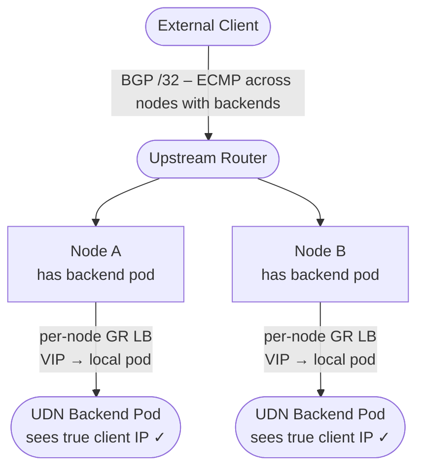
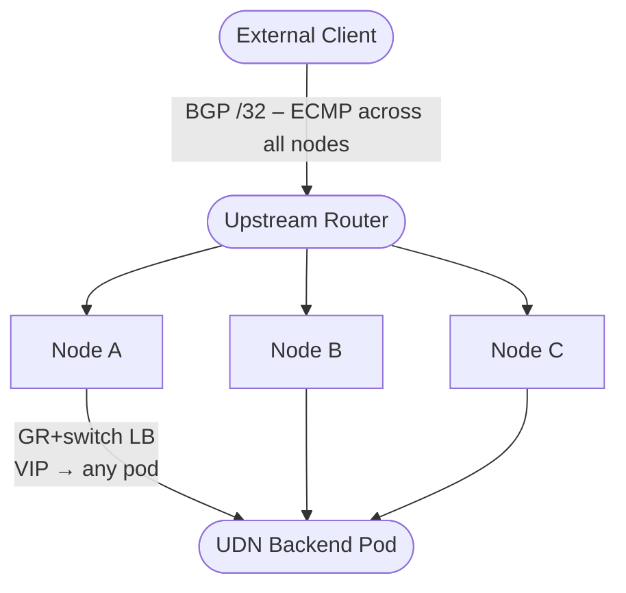
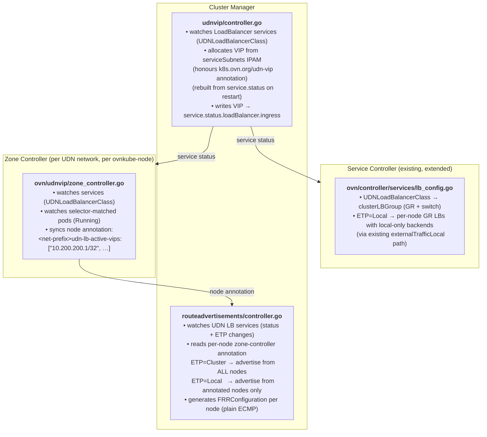

# OKEP-6616: Exposing UDN-Backed Services via BGP

* Issue: [#6616](https://github.com/ovn-kubernetes/ovn-kubernetes/issues/6616)

## Problem Statement

Workloads running on User-Defined Networks (UDNs) in OVN-Kubernetes need to
be reachable from external networks via BGP-advertised virtual IPs (VIPs).
Today, the standard mechanism for external service exposure is
`Service type=LoadBalancer` combined with a LoadBalancer implementation such
as MetalLB. For a `LoadBalancer` Service, Kubernetes assigns a ClusterIP from
the cluster `serviceCIDR` and delegates external IP allocation to the
configured implementation. MetalLB is not UDN-aware: it allocates external IPs
from its own operator-configured pools, with no concept of UDN address spaces
or VRF topology.

Kubernetes provides an extension point for this: `Service.spec.loadBalancerClass`.
This field allows multiple LoadBalancer implementations to coexist in the same
cluster, each handling Services that specify its class. OVN-Kubernetes can
directly implement LoadBalancer Services for UDN namespaces by watching for
Services with a UDN-specific class, allocating VIPs from the UDN address
space, and programming OVN and FRR accordingly — all without conflicting with
MetalLB or other controllers.

## Proposed Solution

Use standard `type=LoadBalancer` Services with a UDN-specific `loadBalancerClass`.
OVN-Kubernetes watches for Services with this class, allocates a VIP from the
UDN address space, publishes it in the standard `.status.loadBalancer.ingress`
field, programs OVN's load balancer for the data path, and triggers FRR to
advertise the VIP via BGP.

This is the standard Kubernetes LoadBalancer model — the same pattern used by
MetalLB, cloud provider controllers, and other LB implementations.
OVN-Kubernetes simply acts as the LoadBalancer implementation for UDN Services.
The VIP appears in the well-known `.status.loadBalancer.ingress` field, which
means existing tooling (ExternalDNS, monitoring, kubectl) works without
modification.

## How It Works

1. **Service creation.** A `type=LoadBalancer` Service is created in a UDN
   namespace with `spec.loadBalancerClass: k8s.ovn.org/udn-loadbalancer`.
   Kubernetes assigns a primary ClusterIP from the cluster service subnet as
   usual. OVN-Kubernetes sees the matching class and takes ownership.

2. **VIP allocation.** OVN-Kubernetes allocates a VIP from the `serviceSubnets`
   configured on the CUDN and publishes it in `.status.loadBalancer.ingress`.

3. **OVN datapath programming.** OVN load-balancer rules are programmed so
   that traffic arriving at the VIP is forwarded to backend pods via their
   UDN-side addresses. The LB is placed in `clusterLBGroup` (GR + switch), so
   both internal pod-to-VIP and external-to-VIP flows are handled identically.
   The entire data path stays within the UDN topology.

4. **BGP advertisement via FRR.** The VIP `/32` is advertised via FRR using
   the same `RouteAdvertisements` machinery that already advertises UDN CIDRs.
   Which nodes advertise is controlled by `externalTrafficPolicy`.

## Goals

- Allow both `Layer2Config` and `Layer3Config` to declare one or more CIDR
  ranges (`serviceSubnets`) from which load-balancer VIPs are allocated.
- Support standard `LoadBalancer` Services with `spec.loadBalancerClass`
  as the selection mechanism — no conflict with MetalLB or cloud providers.
- Support `externalTrafficPolicy: Local` (source-IP preservation; only nodes
  with local backends advertise) and `Cluster` (all-nodes ECMP).
- Reuse existing FRR BGP machinery — no new BGP speaker.
- Make VIPs available via `.status.loadBalancer.ingress` for ExternalDNS
  and standard tooling.

## Non-Goals

- UDN DNS: in-cluster CoreDNS continues to resolve Services to ClusterIP.
  External DNS is the operator's responsibility; ExternalDNS integration is
  straightforward via the standard ingress field and is a follow-on.
- Upstream Kubernetes multi-network Service API (KEP-3698): this proposal is
  designed to be forward-compatible if such an API emerges.

## Address Allocation

The VIP must come from a well-defined range. Two options are supported via the
same `serviceSubnets` field:

| Source | Pros | Cons |
|---|---|---|
| Reserved range within UDN CIDR | No extra config; topologically co-located with backends | Reduces pod address space; must not clash with auto-computed infra IPs |
| Explicit CIDR outside the UDN | Clean separation; stable IP ranges from existing IPAM | Requires distinct route advertisement |

When the CIDR falls within the UDN pod subnet, pod IPAM excludes it. When it
is outside, no reservation is needed (pods cannot be assigned those IPs
anyway). A specific VIP may be requested via the `k8s.ovn.org/udn-vip`
annotation on the Service.

## BGP Advertisement Controls

FRR already runs on nodes for UDN CIDR advertisement. This proposal adds the
`LoadBalancerVIP` advertisement type to `RouteAdvertisements`.

### Traffic model: anycast VIP

The VIP is advertised as a `/32` (or `/128`) to upstream routers, which use
ECMP to distribute traffic across advertising nodes. Which nodes advertise
depends on `spec.externalTrafficPolicy`:

**`externalTrafficPolicy: Local`** — Only nodes with a Running local backend
pod advertise. OVN's per-node GR LB forwards to local pods only. Client
source IP is preserved end-to-end.



**`externalTrafficPolicy: Cluster` (default)** — All nodes advertise. OVN's
LB forwards to any backend pod in the cluster. Source IP may be replaced by
the GR masquerade IP for cross-chassis traffic (see [Source IP preservation](#source-ip-preservation)).



## API Details

### 1. `serviceSubnets` field on `Layer2Config` and `Layer3Config`

```go
// serviceSubnets specifies CIDRs reserved for load-balancer VIP allocation.
// Pods receive a host route for each serviceSubnets CIDR via their node's
// gateway, making VIPs reachable from within the UDN.
// Only supported for Primary networks.
// +optional
ServiceSubnets []CIDR `json:"serviceSubnets,omitempty"`
```

**Layer2**: Each CIDR may be within the shared pod subnet (excluded from pod
IPAM; must not overlap auto-computed infrastructure IPs) or completely external
(no pod IPAM interaction needed).

**Layer3**: Each CIDR must be **external** to all configured `subnets` CIDRs.
VIP allocations are global (one IP per service, cluster-wide). However, Layer3
also has a *node subnet allocator* that independently carves per-node
pod-addressing slices from the same `subnets` CIDR. These two allocators are
unaware of each other: if `serviceSubnets` overlaps with `subnets`, the node
allocator may assign the same prefix to a node that the VIP allocator is also
drawing from, causing a silent address collision. Using an independent address
block sidesteps this entirely and is the recommended pattern.

> **Future work:** Internal Layer3 serviceSubnets (within a `subnets` CIDR)
> require coordinating the two allocators and are planned as a follow-on.

### 2. `loadBalancerClass`

```
k8s.ovn.org/udn-loadbalancer
```

OVN-Kubernetes acts as the LoadBalancer controller for Services carrying this
class in UDN namespaces. The VIP is placed in `clusterLBGroup` (GR + switch) —
the same group as any other UDN service. No special switch-only placement is
required.

> **Recommendation:** Set `spec.allocateLoadBalancerNodePorts: false` on UDN
> LoadBalancer Services. External ingress arrives via the BGP-advertised VIP
> through the per-node gateway router, which is inside the UDN VRF. A NodePort
> on the host network sits outside the VRF, cannot reach UDN pods directly,
> and unnecessarily widens the attack surface.

### 3. Specific VIP annotation

```
k8s.ovn.org/udn-vip: "<ip>"
```

Optional annotation to request a specific VIP from `serviceSubnets`. This
follows the pattern recommended by the upstream deprecation of
`spec.loadBalancerIP` (Kubernetes v1.24), which explicitly advises switching
to provider-specific annotations.

If the requested IP is already claimed by another Service or falls outside
`serviceSubnets`, OVN-Kubernetes emits a `VIPConflict` Warning Event on the
Service (visible via `kubectl describe svc`) and does **not** requeue. The
conflict will not resolve itself — the operator must release the conflicting
Service, update the annotation, or expand `serviceSubnets`.

### 4. `LoadBalancerVIP` advertisement type in `RouteAdvertisements`

```go
// LoadBalancerVIP advertises each UDN LoadBalancer service VIP as a /32
// anycast prefix via BGP. Which nodes advertise is driven by ETP:
//   Cluster: all cluster nodes.
//   Local:   only nodes with a running selector-matched backend pod.
LoadBalancerVIP AdvertisementType = "LoadBalancerVIP"
```

## Implementation Details

### Controller architecture



### Data path

| Traffic | OVN path | CT correctness |
|---|---|---|
| pod → VIP | Switch LB DNAT (serviceSubnets gateway route prevents ARP) | CT on source chassis |
| pod → ClusterIP | Unchanged k8s behaviour | CT on source chassis |
| external → ClusterIP | GR LB DNAT | CT on source chassis |
| external (ETP=Cluster) → VIP | GR LB DNAT; any backend | `ct_commit` on backend chassis (same as ClusterIP) |
| external (ETP=Local) → VIP | Per-node GR LB; local backends only | CT entirely on receiving chassis |
| cross-UDN | Dropped — L2 isolation; no route to VIP address space | — |

No br-ex flows or kernel `/32` routes are needed — empirically confirmed: no
pre-existing OVS flows for UDN subnets exist on br-ex.

### VIP IPAM

In-memory allocator per `serviceSubnets` CIDR, scoped per CUDN, rebuilt from
`service.status.loadBalancer.ingress` on restart. Only serviceSubnets within
the pod subnet are passed to the pod IPAM as reserved; external serviceSubnets
require no pod IPAM reservation.

### Node annotation lifecycle

| Event | Zone controller action |
|---|---|
| VIP allocated (status written) | Check local pods; if any Running → add VIP CIDR to annotation |
| Backend pod becomes Running locally | Re-check; add VIP |
| Backend pod deleted or no longer Running | Re-check; remove VIP if no remaining capacity |
| Service deleted | Remove VIP from annotation |

## Concerns

### Source IP preservation

OVN Gateway Routers are created with `lb_force_snat_ip` in their options. When
a GR load-balancer DNAT fires and the selected backend is on a **different
chassis**, OVN applies SNAT to ensure the reply returns through the same GR
(which holds the CT state for un-DNAT). The SNAT replaces the client's source
IP with:

- **Layer2 UDN GRs**: the join-subnet IP (`lb_force_snat_ip = <joinSubnetIP>`),
  because a Layer2 GR may have multiple external IPs and a single deterministic
  SNAT target is needed.
- **Layer3 UDN / default network GRs**: the GR's own router IP
  (`lb_force_snat_ip = router_ip`).

`lb_force_snat_ip` only triggers for cross-chassis forwarding. When the
DNAT'd backend is **on the same chassis** as the receiving GR, OVN delivers
locally without SNAT and the backend sees the true client IP — even with
`externalTrafficPolicy: Cluster`.

| ETP | Backend placement | Source IP at backend |
|---|---|---|
| `Local` | Always local (per-node GR LB enforces this) | Client IP ✓ |
| `Cluster` | Same chassis (ECMP hash lands locally) | Client IP ✓ |
| `Cluster` | Different chassis | GR masquerade IP ✗ |

This is an OVN behaviour, not a MetalLB limitation. Use
`externalTrafficPolicy: Local` when true source IP preservation is required.

### ECMP granularity with `Local` policy

ECMP distributes at the flow level across advertising nodes, not across pods.
A node with one backend pod receives the same share of traffic as a node with
ten. Use `Cluster` policy when per-pod distribution matters more than source-IP
preservation.

### ECMP rehashing

When a node joins or leaves the ECMP set, upstream routers rehash existing
flows. Without resilient hashing on the upstream router, active connections may
be redirected to a different node and break. This is a network infrastructure
property outside OVN-Kubernetes' control.

### VIP allocation conflicts (internal serviceSubnets)

When `serviceSubnets` is carved from the UDN CIDR, misconfiguration could
silently overlap with pod IPs. A pending admission webhook will enforce
non-overlap at create time.

### Dual-stack

The VIP must reflect the UDN's address family (e.g. IPv6-only UDN), not the
cluster's service CIDR family.

### FRR route withdrawal latency

When a backend pod terminates, FRR must withdraw the BGP route. During the
convergence window (BGP hold timers, upstream router processing) traffic
continues to arrive at the now-empty node. This is inherent to BGP anycast.

### Not advertising `PodNetwork`

When the `RouteAdvertisements` CR omits `PodNetwork`, external systems cannot
reach pods directly. Any workflow relying on direct pod IP access from outside
the cluster must go through the service VIP or run inside the cluster. This is
the intent of a service-only exposure model.

### VIP range exposure

Advertising a service range via BGP makes those IPs routable from the external
network. The transition from "UDN is isolated" to "UDN services are
BGP-reachable" is explicit (operator configures the `RouteAdvertisements` CR)
and auditable.

## Backwards Compatibility

- `serviceSubnets` is optional; existing CUDNs without it are unaffected.
- `k8s.ovn.org/udn-loadbalancer` is a new class; existing Services are unaffected.
- `LoadBalancerVIP` is a new `AdvertisementType`; existing RA objects are unaffected.

## Alternatives Considered

**Host-Network Pod with BGP-Advertised VIP.** A `hostNetwork: true` pod cannot
communicate with UDN pods. OVN-K isolates UDN traffic from the host network
namespace; traffic arriving at the host-network pod has no path to UDN backends.

**Pod-Elected VIP with BGP Advertisement.** OVN-K programs port security and
forwarding based on addresses it has assigned. A pod cannot claim an arbitrary
IP — traffic to an unregistered address is dropped at the OVN logical switch
port. Disabling port security to work around this undermines UDN isolation.

**Upstream Kubernetes Multi-Network Service API (KEP-3698).** Progress is slow
and the design is unsettled. The `loadBalancerClass` approach is
forward-compatible: if an upstream API emerges, OVN-Kubernetes can migrate to
it without changing the FRR integration.

**Switch-only LB group for VIP.** Would require br-ex OpenFlow rules or kernel
`/32` routes for external access — empirically confirmed to not exist for UDN
subnets. Using `clusterLBGroup` is simpler and consistent with standard k8s
LoadBalancer behaviour.

**HA_Chassis_Group active/standby.** Required custom NBDB virtual LSP
management and OVN port-security changes for virtual port claiming. Replaced
by plain ECMP with ETP-driven advertisement scope — simpler, no NBDB side-
effects, and 5-tuple hash provides adequate flow affinity.

## References

- [Kubernetes LoadBalancer Class (KEP-1145)](https://github.com/kubernetes/enhancements/tree/master/keps/sig-network/1145-service-lb-class-field)
- [KEP-3698: Multi-Network Services](https://github.com/kubernetes/enhancements/issues/3698)
- [OKEP-5296: BGP support](okep-5296-bgp.md)
- [OKEP-5193: User Defined Networks](okep-5193-user-defined-networks.md)
- [frr-k8s FRRConfiguration API](https://github.com/metallb/frr-k8s)
- [MetalLB loadBalancerClass](https://metallb.universe.tf/configuration/_advanced_l2_configuration/)
