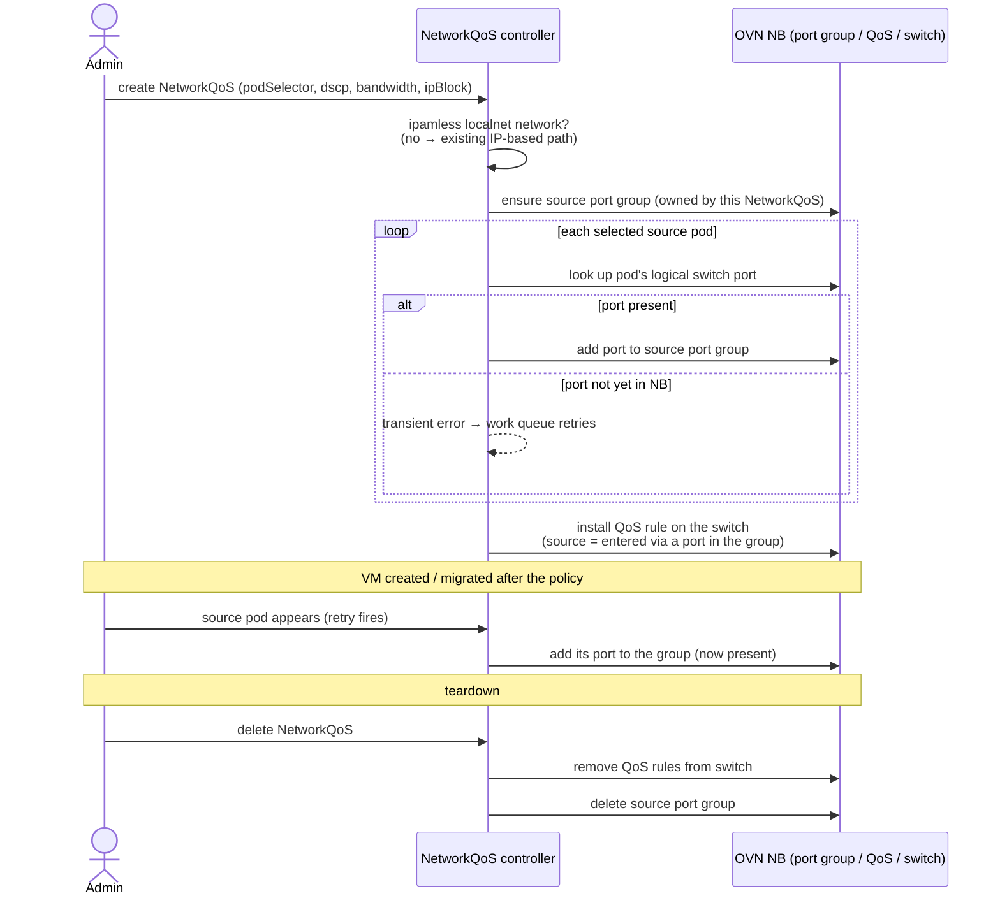

# OKEP-6815: Add NetworkQoS support for ipamless localnet networks

* Issue: [#6815](https://github.com/ovn-kubernetes/ovn-kubernetes/issues/6815)

## Problem Statement

NetworkQoS ([OKEP-4380](okep-4380-network-qos.md)) delivers DSCP marking and
bandwidth policing by building OVN QoS match expressions from pod IP addresses
read from the `k8s.ovn.org/pod-networks` annotation.

On secondary **localnet** networks with IPAM disabled (**ipamless**) - the topology commonly
used by KubeVirt / OpenShift Virtualization VMs whose IP addresses are managed
statically or by an external DHCP server - pods have no OVN-Kubernetes-managed
IPs, so `getPodAddresses()` returns nothing and the controller silently skips
them. As a result NetworkQoS is non-functional on these networks, and there is
today no supported way to apply network QoS (workload-tier prioritization,
backup-traffic deprioritization, or bandwidth capping) to VMs running on them.

Ipamless **layer2** networks share the same underlying limitation, but this
proposal is scoped to **localnet**; see [Non-Goals](#non-goals) and
[Future Goals](#future-goals) for how layer2 is treated.

## Goals

- Make NetworkQoS functional on secondary ipamless **localnet** networks.
- Support, on ipamless networks, the QoS capabilities the target use cases
  require, **without requiring OVN-Kubernetes to discover or manage pod IP
  addresses**:
  - source pod/VM selection by label (`podSelector`);
  - DSCP marking;
  - bandwidth policing (`rate` / `burst`);
  - protocol + port classification (TCP/UDP/SCTP + port);
  - destination matching by IP range (`ipBlock` / CIDR);
  - priority ordering across and within NetworkQoS objects.

## Non-Goals

- **Ipamless layer2 topology, as a committed deliverable.** This proposal
  targets localnet. The enabling mechanism is expected to apply to ipamless
  layer2 as well; **if layer2 support comes essentially for free** (little or no
  additional work beyond the localnet implementation), it will be folded into
  this effort opportunistically. **If layer2 requires meaningful additional
  work**, it will be pursued as a **separate enhancement** rather than expanding
  this one (see [Future Goals](#future-goals)).
- **Destination selection by `podSelector` / `namespaceSelector` on ipamless
  networks.** Destination matching on ipamless networks is limited to
  `ipBlock` (IP / CIDR). The target use cases in this OKEP do not require
  selecting *destination* pods by label (see Requirements and User-Stories).
  Supporting labeled-pod destinations on ipamless networks is a
  [Future Goal](#future-goals): it depends on resolving destination pod
  identity, which under OVN Interconnect is topology-dependent (and, on
  localnet specifically, not reliably resolvable across nodes).
- **NetworkQoS on layer3 ipamless topology.** Layer3 uses per-node logical
  switches connected by a logical router; layer3 also exists primarily for
  routed multi-subnet deployments, which implies IPAM.
- **IP discovery or reporting for ipamless networks** (DHCP snooping, KubeVirt
  VMI status watching, ARP/NDP learning, IP-claim CRDs, or similar). This OKEP
  does not add any mechanism for OVN-Kubernetes to learn the guest's IP.
- **Changes to the NetworkQoS CRD API / schema.** Users create the same
  `NetworkQoS` resources with the same fields; only controller-internal
  behavior changes.
- **Ingress-direction QoS and traffic shaping.** NetworkQoS is egress-only and
  *polices* (drops excess) rather than *shapes* (queues) - an existing product
  constraint, not introduced here.
- **Minimum bandwidth guarantees / reservations.** Not supported by OVN.
- **Arbitration against other node traffic (host/OCP, CSI, other networks).**
  NetworkQoS governs only the selected localnet UDN's own egress. It does not
  prioritize that traffic over - or protect it from - other traffic sharing the
  node's uplink. The two mechanisms it offers are: **throttling** the UDN's
  traffic (bandwidth policing, a rate cap on that traffic alone), and **DSCP
  marking**, which has no local forwarding effect and is only acted upon by the
  physical fabric. Neither is a cross-class scheduler, and there is no
  minimum-bandwidth guarantee relative to other traffic.

## Future Goals

- **Ipamless layer2 support**, if it is not delivered opportunistically as part
  of this proposal. Should enabling layer2 require more than trivial additional
  work beyond the localnet implementation, it will be tracked and delivered as a
  separate enhancement that reuses this work.
- **Destination `podSelector` / `namespaceSelector` on ipamless networks** -
  "apply QoS to traffic *toward* a labeled set of pods." This is the principal
  capability deferred by this OKEP. It becomes relevant only if a future
  requirement needs to select destination pods by label rather than by address
  range. Because destination matching is built from IP address sets (not port
  identity), delivering it comes down to getting the pod IP into the
  `k8s.ovn.org/pod-networks` annotation so the existing IP-based path applies -
  e.g. KubeVirt static-IP propagation, or the DHCP IPAM path of
  [OKEP-6224](okep-6224-dhcp-ipam-localnet.md).
- **Convergence with DHCP IPAM ([OKEP-6224](okep-6224-dhcp-ipam-localnet.md)).**
  DHCP-mode networks have subnets configured (for the DHCP pool), so
  `DoesNetworkRequireIPAM()` returns true and they already follow the standard
  IP-based path. A future optimization could unify the ipamless and DHCP paths.

## Introduction

### How NetworkQoS works, and its IP dependency

The NetworkQoS CRD (`k8s.ovn.org/v1alpha1`) is namespace-scoped and defines:

- **`podSelector`** - selects source pods by label (empty = all pods in the
  namespace).
- **`networkSelectors`** - restricts the rule to specific networks (default,
  UDN, NAD).
- **`priority`** (0–100) - resolves conflicts when multiple NetworkQoS objects
  match the same packet; higher value wins.
- **`egress`** (ordered list, up to 20 rules) - each rule specifies `dscp`
  (0–63), an optional `bandwidth` (`rate` in kbps, `burst` in kilobits;
  policing, not shaping), and an optional `classifier` matching by destination
  (`ipBlock`, `podSelector`, `namespaceSelector`) and/or by `ports` (protocol +
  port). Later rules in the list take higher precedence.

### Why ipamless secondary localnet is the target topology

Enterprises migrating VM workloads to OpenShift Virtualization need the same
network QoS controls they had on traditional hypervisors (e.g. VMware ESX):
differentiating priority between workload tiers, between application and
infrastructure traffic, and capping bandwidth for specific traffic classes.

These VMs commonly attach to **secondary ipamless localnet UDNs** - the guest
OS or an external DHCP server manages addressing, not OVN-Kubernetes.

A natural question is why these workloads do not simply adopt DHCP IPAM
([OKEP-6224](okep-6224-dhcp-ipam-localnet.md)), which would place them on the
standard IP-based path (where destination `podSelector` also works). The target
population is precisely the set that cannot: VMs with truly static, externally
managed addresses - for these, no OVN-managed IP ever exists, so an
IP-independent matching path is the only option. Workloads that *can* use
DHCP IPAM should prefer it (see [Future Goals](#future-goals) on convergence).

This proposal targets localnet; ipamless layer2 networks share the same
limitation and may benefit from the same fix, but layer2 is not a committed
deliverable here (see [Non-Goals](#non-goals) and
[Future Goals](#future-goals)).

On localnet there is **no Geneve tunnel**: traffic egresses directly onto the
physical network, so a DSCP value stamped on the IP header is immediately
visible to the fabric with no inner/outer-header concerns. This is favorable
for fabric-level prioritization - provided the physical network is configured
to honor DSCP and map it to hardware queues.

The diagram below shows the egress traffic path for a KubeVirt VM on a secondary
ipamless localnet UDN, and where each QoS action is enforced. Everything left of
the enforcement boundary is under OVN-Kubernetes' control on the *sending* node;
everything right of it is the physical fabric, which OVN-Kubernetes never sees
again (the basis for the source-only matching argument in the next section).

```text
           sending node (OVN-Kubernetes control)          │  physical fabric
                                                          │  (out of OVN-K control)
 ┌───────────┐   ┌───────────────────────────────────────┐│
 │ KubeVirt  │   │        secondary localnet UDN         ││
 │   VM      │   │  (ipamless: MAC only, no OVN-managed  ││
 │ (source   │ ─>│   pod IP; label-selected source)      ││
 │  pod,     │   │                                       ││
 │  label:   │   │   logical switch port ── zone-local   ││
 │  tier=..) │   │   on the sending node, so the source  ││
 └───────────┘   │   is always identifiable (no pod IP)  ││
                 └───────────────┬───────────────────────┘│
                                 ▼                        │
                 ┌───────────────────────────────────────┐│
                 │        OVN/OVS QoS (to-lport)         ││
                 │  • source matching   (by port/label)  ││
                 │  • dst matching      (ipBlock/CIDR)   ││
                 │  • bandwidth policing (rate/burst)    ││
                 │  • DSCP marking      (stamp IP hdr)   ││
                 └───────────────┬───────────────────────┘│
                                 ▼                        │
                 ┌───────────────────────────────────────┐│      ┌─────────────┐
                 │   OVS bridge → physical NIC           ││      │ QoS-aware   │
                 │   (localnet: NO Geneve tunnel;        ││----▶ │ switches    │
                 │    DSCP on outer IP hdr, fabric-      ││ DSCP │ honor DSCP, │
                 │    visible immediately)               ││ on   │ map to HW   │
                 └───────────────────────────────────────┘│ wire │ queues      │
                                                          │      └─────────────┘
                 <------- enforcement boundary ---------->│
```

Because there is no tunnel, the DSCP value stamped by OVN/OVS QoS travels on the
same IP header the fabric reads - no inner/outer-header translation is needed for
the marking to reach QoS-aware physical switches.

### Scope of destination matching in this proposal

Destination matching in this OKEP is limited to **IP range (`ipBlock` / CIDR)**.
Source selection remains fully label-driven; classification by protocol/port is
unchanged; DSCP, bandwidth, and priority are unchanged. Labeled-pod destination
selection on ipamless networks is deferred to [Future Goals](#future-goals).

This is a deliberate scoping decision, not merely an implementation shortcut.
The reasons it is the right initial scope:

1. **On localnet, source is the only thing we can reliably match and enforce
   on.** OVN-Kubernetes enforces QoS at the sending node's OVN/OVS datapath. On
   localnet there is no tunnel and no cluster-managed path to the destination:
   the moment a packet egresses the node onto the physical fabric it leaves
   OVN-Kubernetes' control and visibility entirely - it can be routed, NAT'd,
   re-marked, or dropped, and OVN-Kubernetes will never see it again. The source
   pod, by contrast, is right there on the local switch and always identifiable.
   Destination pod *identity* is out of reach on ipamless networks for the same
   root reason the source would be without this proposal's enabling work: there
   is no OVN-managed IP in the pod annotation. (Destination matching is built
   from an IP address set - `ip4.dst == $dest_as`, evaluated against the packet
   header - so wherever pod IPs exist it already works cluster-wide regardless
   of OVN Interconnect zone; it is not gated on port identity or zone-locality.
   The blocker on ipamless networks is purely the missing IP, not topology.) On
   top of that, much QoS-relevant traffic terminates off-cluster (external
   services, appliances, hosts on the segment) where there is no destination pod
   to select at all. `ipBlock`, in contrast, is evaluated locally against the packet
   header before egress - no destination-side cooperation or resolution
   required - so it is not a lossy substitute for a working feature; it is the
   honest, complete story for what can be matched correctly today.

2. **The use cases are source-side; the destination refinements are address
   ranges.** Workload-tier differentiation (production vs. staging), per-class
   bandwidth capping, and DSCP marking for fabric prioritization are all decided
   by *who is sending* (selected by label). Destination matching appears only as
   a secondary refinement (e.g. "deprioritize traffic *to* the backup subnet"),
   and in every such case the destination is stable, fixed-address
   infrastructure - backup servers, storage/NFS targets, monitoring collectors.
   That is the canonical `ipBlock` case ("traffic to `10.20.0.0/16`"), not a
   churning label-selected pod set. Fabric-level enforcement reinforces this:
   once a packet is marked, the physical fabric queues it by that marking
   regardless of destination.

3. **It aligns with an already-accepted platform constraint.** MultiNetworkPolicy
   already restricts ipamless networks to `ipBlock` peers, and `ipBlock` is a
   long-established, widely-used selector in Kubernetes NetworkPolicy. Scoping
   destination matching to IP/CIDR follows an existing platform norm rather than
   introducing a novel limitation.

4. **There is a clear escape hatch, so the door is not permanently closed.** A
   user who genuinely needs label-based destination selection can get pod IPs
   into the `k8s.ovn.org/pod-networks` annotation - via DHCP IPAM
   ([OKEP-6224](okep-6224-dhcp-ipam-localnet.md)) or static-IP propagation -
   which moves the network onto the standard IP-based path where destination
   `podSelector` already works. This capability is deferred
   ([Future Goals](#future-goals)), not foreclosed.

## User-Stories/Use-Cases

### Definition of personas

- **Cluster admin** - creates and manages secondary networks and cluster-wide
  policies.
- **Namespace admin** - deploys workloads and manages per-namespace QoS
  policies within a namespace.
- **VM operator** - runs virtual machines via KubeVirt on secondary networks.

### Story 1: Workload-tier differentiation (production over staging)

**As a** cluster admin,
**I want** production VM workloads to receive higher network priority than
staging workloads, even when both share the same ipamless localnet subnet,
**so that** production traffic is forwarded preferentially by the physical
fabric.

**Example:** Production and staging VMs run on the same secondary localnet UDN,
labeled `tier: production` and `tier: staging`. The admin creates two
`NetworkQoS` objects selecting each tier by `podSelector`, marking production
with a high-priority DSCP class (e.g. EF / 46) and staging with a lower class
(e.g. AF11 / 10), and uses `priority` to resolve overlaps. This is entirely a
**source-side** decision. Without ipamless support these objects are silently
ignored.

### Story 2: Intra-VM backup-traffic deprioritization

**As a** namespace admin,
**I want** in-guest backup traffic from a VM to be marked at lower priority and
optionally rate-capped, relative to the VM's regular application traffic,
**so that** bulk backup transfers do not degrade application performance on the
shared NIC.

**Example:** VMs run an in-guest backup agent that sends bulk traffic to a
backup server on a known port and/or a stable address range. Within a single
`NetworkQoS` object, an earlier egress rule marks general traffic at a high
DSCP, and a later, higher-precedence rule classifies backup traffic (by
protocol/port and/or the backup server's `ipBlock`) with a low DSCP and a
bandwidth cap. Because later rules take higher precedence, the specific backup
rule overrides the general high-DSCP rule for backup packets. The backup
destination is stable infrastructure - the canonical `ipBlock` case - not a
churning set of label-selected pods.

### Story 3: Bandwidth capping per workload class

**As a** namespace admin,
**I want** to cap egress bandwidth for a specific class of VMs (selected by
label) on an ipamless localnet network,
**so that** a batch class cannot exceed a fixed egress rate and monopolize the
shared NIC, leaving headroom for latency-sensitive workloads - even when IP
addresses are managed outside Kubernetes.

**Example:** Batch-processing VMs (`workload: batch`) are capped via a
`NetworkQoS` `bandwidth` rate, leaving the remaining capacity to
latency-sensitive VMs. This is source- and/or port-scoped, not
destination-pod-scoped.

### Story 4: DSCP marking for fabric-level prioritization on tunnel-free localnet

**As a** cluster admin,
**I want** egress traffic from selected VMs on an ipamless localnet network to
carry a DSCP marking,
**so that** QoS-aware physical switches place the traffic in the appropriate
hardware queue - without OVN-Kubernetes needing to know the VMs' IP addresses.

**Example:** VMs labeled `priority: gold` have egress traffic marked DSCP 46.
Because localnet has no tunnel, the marking is visible on the physical
interface directly (verifiable with `tcpdump` on the OVS bridge port). This
`tcpdump` check verifies only that OVN-Kubernetes applied the mark; whether the
fabric honors it (queues accordingly, or re-marks/clears it at a trust boundary)
is a separate, out-of-scope prerequisite not validated by this OKEP.

## Requirements

Derived from the user stories above and the driving user requests tracked in
the upstream enhancement issue
([#6815](https://github.com/ovn-kubernetes/ovn-kubernetes/issues/6815)):

- The solution must work on **secondary OVN localnet networks with
statically managed IPs (ipamless)**. Ipamless **layer2** is not a committed
target: it will be reused opportunistically if the localnet mechanism applies
with little or no additional work, otherwise pursued as a separate
enhancement.
- Destination matching on ipamless networks must support **IP range
(`ipBlock` / CIDR)** classification. Destination selection by `podSelector` /
`namespaceSelector` is deliberately out of scope for this proposal (see
[Non-Goals](#non-goals) and [Future Goals](#future-goals)), because `ipBlock`
is sufficient for the target use cases.

## Proposed Solution

The controller gains an **IP-independent source-matching path** that activates
only on ipamless localnet networks. Instead of resolving source pods to IP
addresses and matching `ip4.src == {$address_set}`, the controller places each
selected source pod's **logical switch port (LSP)** into a per-`NetworkQoS`
**OVN port group** and matches `inport == @<port_group> && (ip4 || ip6)`.
Everything else about a `NetworkQoS` - destination `ipBlock`, protocol/port
classifier, DSCP action, bandwidth policing, priority ordering, and the
`to-lport` QoS row attached to the network's logical switch - is reused
unchanged from the existing IPAM implementation.

The path is selected at reconcile time by a single predicate,
`isIPAMlessLocalnet()` = `TopologyType() == LocalnetTopology && !DoesNetworkRequireIPAM(NetInfo)`
(`go-controller/pkg/ovn/controller/network_qos/utils.go`). When it is false - on
every IPAM-enabled network and on non-localnet topologies - the controller takes
the existing address-set path unchanged.

### API Details

**No NetworkQoS CRD API changes.** The feature is entirely controller-internal:
the same `k8s.ovn.org/v1alpha1` CRD, the same `podSelector` / `networkSelectors`
/ `priority` / `egress` fields, and the same `classifier` semantics. There is no
OpenAPI/schema diff and no new field, and existing manifests are interpreted
identically - the only difference is that a manifest selecting an ipamless
localnet network, which is silently a no-op today, becomes functional.

The one behavioral caveat is that on ipamless networks the `classifier.to`
`podSelector` / `namespaceSelector` destination forms are not honored; this is a
behavioral scoping of an existing field on a topology where it cannot be
resolved, not an API change.

### Implementation Details

The change is contained to the NetworkQoS controller. Conceptually it adds one
alternative to the single decision where the controller chooses *how to identify
the source of a packet*: on IPAM networks that identity is an IP address set; on
ipamless localnet networks it becomes membership in an OVN port group. Every
other stage of building a `NetworkQoS` - destination matching, protocol/port
classification, DSCP, bandwidth, priority, and attaching the resulting QoS rule
to the network's logical switch - is shared with the existing path and left
untouched.

At a high level, the controller:

1. **Detects the topology.** While reconciling a `NetworkQoS`, it checks whether
   the target is an ipamless localnet network. If not, it uses the existing
   IP-based path with no change; everything below applies only when it is.
2. **Maintains a source port group.** Rather than resolving selected source pods
   to IP addresses, it keeps a port group - owned by, and named after, the
   `NetworkQoS` - whose members are the logical switch ports of the currently
   selected source pods. Ports are added and removed as pods start or stop
   matching (label, network selection, deletion). A pod attaching through another
   namespace's NAD is resolved to the correct port and lands in the same group.
3. **Matches on membership.** The QoS rule's source condition becomes "the packet
   entered through a port in this group" instead of "the packet's source IP is in
   this address set". The rest of the match (destination `ipBlock`,
   protocol/port) and the actions (DSCP, bandwidth) are produced exactly as
   today.
4. **Handles pods that appear after the policy.** The common KubeVirt case is a
   VM created or migrated *after* its `NetworkQoS` already exists, so the pod's
   port may not be in OVN yet when the controller first tries to add it. The
   controller treats "pod is attached but its port is not present yet" as a
   transient condition and lets the existing work queue retry until the port
   lands - no external event or user action required. (The rejected alternative
   and the reasoning are in [Alternatives](#alternatives) and
   [Deferred / Open Questions](#deferred--open-questions).)
5. **Tears down in order.** On delete, the QoS rules are removed from the switch
   first and the source port group afterwards, so no live object ever references
   a deleted one. The port group participates in the same ownership-keyed garbage
   collection as the existing QoS objects, so orphans are reclaimed across
   controller restart or rename.



The resulting QoS rules - source fragment, destination, priority ordering, and
rule selection - are shown concretely in the [Worked example](#worked-example)
below.

### Worked example

The following mirrors Stories 1 and 2 on a single ipamless localnet UDN. The NAD
is ipamless (no `subnets`) and carries a label the QoS `networkSelectors` match:

```yaml
apiVersion: k8s.cni.cncf.io/v1
kind: NetworkAttachmentDefinition
metadata:
  name: tenant-blue
  namespace: vms
  labels:
    nqos-network: tenant-blue          # matched by networkSelectors below
spec:
  config: |
    {
      "cniVersion": "1.0.0",
      "name": "tenant-blue",
      "type": "ovn-k8s-cni-overlay",
      "topology": "localnet",
      "physicalNetworkName": "physnet",
      "vlanID": 100,
      "netAttachDefName": "vms/tenant-blue"
    }                                    # no "subnets" => ipamless
```

**Story 1 - tier differentiation.** Two objects select each tier by label;
production is marked EF (46), staging AF11 (10), with `priority` resolving any
overlap in favour of production:

```yaml
apiVersion: k8s.ovn.org/v1alpha1
kind: NetworkQoS
metadata: { name: tier-production, namespace: vms }
spec:
  networkSelectors:
  - networkSelectionType: NetworkAttachmentDefinitions
    networkAttachmentDefinitionSelector:
      namespaceSelector: {}
      networkSelector: { matchLabels: { nqos-network: tenant-blue } }
  podSelector: { matchLabels: { tier: production } }
  priority: 60
  egress:
  - dscp: 46                            # EF; no classifier => all egress, IPv4 and IPv6
---
apiVersion: k8s.ovn.org/v1alpha1
kind: NetworkQoS
metadata: { name: tier-staging, namespace: vms }
spec:
  networkSelectors:
  - networkSelectionType: NetworkAttachmentDefinitions
    networkAttachmentDefinitionSelector:
      namespaceSelector: {}
      networkSelector: { matchLabels: { nqos-network: tenant-blue } }
  podSelector: { matchLabels: { tier: staging } }
  priority: 40
  egress:
  - dscp: 10                            # AF11; no classifier => all egress, IPv4 and IPv6
```

On an ipamless network these produce `to-lport` QoS rows whose **source fragment
is `inport == @<port_group>`** rather than `ip4.src == {$address_set}`. Because
neither rule sets a `classifier`, no destination clause is appended and the
`(ip4 || ip6)` source fragment matches both IP families:

```text
# tier-production rule 0  (spec.priority 60, rule 0) -> OVN priority 10600
match: inport == @<tier-production pg> && (ip4 || ip6)   action: dscp=46
# tier-staging rule 0     (spec.priority 40, rule 0) -> OVN priority 10400
match: inport == @<tier-staging pg>    && (ip4 || ip6)   action: dscp=10
```

**Story 2 - intra-VM backup deprioritization, and QoS rule priority
resolution.** A single object with two rules: rule 0 marks all traffic EF; rule 1
(later in the list, hence higher precedence) demotes backup traffic to CS1 (8)
and caps it. It is set at `priority: 70`, **deliberately above** `tier-production`
(60) - see below.

```yaml
apiVersion: k8s.ovn.org/v1alpha1
kind: NetworkQoS
metadata: { name: backup-deprioritization, namespace: vms }
spec:
  networkSelectors:
  - networkSelectionType: NetworkAttachmentDefinitions
    networkAttachmentDefinitionSelector:
      namespaceSelector: {}
      networkSelector: { matchLabels: { nqos-network: tenant-blue } }
  podSelector: { matchLabels: { app: payments } }
  priority: 70
  egress:
  - dscp: 46                            # rule 0: regular app traffic -> EF (no classifier => all egress, v4+v6)
  - dscp: 8                             # rule 1: backup traffic -> CS1 + cap
    bandwidth: { rate: 100000, burst: 5000 }
    classifier:
      to: [ { ipBlock: { cidr: 10.20.0.0/16 } } ]
      ports: [ { protocol: TCP, port: 2049 } ]
```

A payments VM carrying both `app: payments` and `tier: production` lands in the
source set of **both** objects, so all three rules install:

| Source rule | dscp | bandwidth | dst match | OVN priority |
|---|---|---|---|---|
| `tier-production` r0 | 46 | - | all (v4+v6) | 10600 |
| `backup-deprioritization` r0 | 46 | - | all (v4+v6) | 10700 |
| `backup-deprioritization` r1 | 8 | 100 Mbps | `10.20.0.0/16` tcp:2049 | 10701 |

In current OVN (26.03.x), marking and metering are applied together in a single QoS stage.
The highest-priority matching rule determines both actions; actions from
lower-priority matching rules are not combined with it.

With the priorities shown above, backup packets match rule 1 at OVN priority
10701, which applies DSCP 8 and the 100 Mbps rate cap. Other matching traffic
uses rule 0 at priority 10700, which applies DSCP 46 without a rate cap.

If `backup-deprioritization` were assigned a lower priority than
`tier-production`, the tier catch-all at OVN priority 10600 would win for
production payments VMs. Backup traffic would then be marked DSCP 46 and would
not receive the backup rule's rate cap. Giving the backup policy higher priority
ensures that both its marking and policing take effect.

`NetworkQoS.podSelector` matches the **virt-launcher pod**, so QoS labels belong
on the `VirtualMachine`'s `spec.template.metadata.labels`; guest addressing (a
static IP or external DHCP) is configured inside the guest and is never seen by
OVN-Kubernetes.

### Testing Details

Everything NetworkQoS already validates for IPAM'ed networks
([OKEP-4380](okep-4380-network-qos.md)) - DSCP marking, bandwidth policing,
protocol/port classification, CIDR destinations, IPv4 and IPv6 - is re-run
against an ipamless localnet network with label-selected source pods, to the
extent applicable on this topology (destinations are `ipBlock`/CIDR only). Those
scenarios are not re-enumerated here.

This proposal must test the typical virtualization lifecycle specific processes, like:
- VM live migration
- VM controller restart

### Documentation Details

- Extend the existing NetworkQoS feature documentation
  (`docs/features/network-qos/`) to state that it now applies to ipamless
  localnet networks, calling out only what differs on this topology:
  - the `ipBlock`-only destination limitation (users coming from IPAM NetworkQoS
    will expect destination `podSelector` / `namespaceSelector` to work);
  - worked examples for the KubeVirt/VM use cases (workload-tier differentiation,
    intra-VM backup deprioritization), including guest addressing (static IP /
    external DHCP).

## Risks, Known Limitations and Mitigations

- **No destination `podSelector` / `namespaceSelector`** on ipamless networks
  (a permanent scope boundary, not a temporary limitation). *Mitigation:* document
  prominently; the discovery mechanism is still open (see
  [Deferred / Open Questions](#deferred--open-questions)).
- **Stale/orphan port-group GC across controller rename/restart.**
  *Mitigation:* the implementation must confirm the ownership-keyed GC (the same
  machinery as address sets) reclaims orphaned port groups; this is called out as
  an implementation checkpoint.

## OVN-Kubernetes Version Skew

This feature is targeted for the next upcoming release, **release-1.5**.

The feature uses only OVN NB constructs that NetworkQoS already depends on - the
`QoS` table, `Port_Group`, `Logical_Switch.qos_rules`, and the `inport` / `ip4`
/ `ip6` match primitives. It introduces **no new OVN feature dependency**, so
there is no `ovn-northd`/OVN version floor beyond what NetworkQoS already
requires, and no CRD version change. During implementation, confirm that no
mixed-zone ordering assumption is introduced (moot for single-zone localnet;
relevant only under OVN Interconnect - see
[Deferred / Open Questions](#deferred--open-questions)).

## Backwards Compatibility

Strictly additive. NetworkQoS on ipamless localnet networks is non-functional
today (source pods are silently skipped for lack of an IP), so enabling it
changes no existing behavior. IPAM-enabled networks are untouched: the
`isIPAMlessLocalnet()` predicate isolates every new code path, and the IPAM
address-set match is emitted exactly as before (R12). There is no migration, no
data reformat, and no change to any persisted object on existing networks; an
upgrade simply makes previously-inert manifests take effect on ipamless localnet
networks.

## Alternatives

Source-matching approaches fall into two families: **IP-independent** matching
(needs no guest IP) and **IP-dependent** matching (obtains the guest IP and
reuses the existing address-set path). The chosen approach is described in the
[Proposed Solution](#proposed-solution); the alternatives weighed against it
are listed below.

**IP-independent approaches (no guest IP required).**

1. **MAC address set / `eth.src`.** Match `eth.src == {$mac_set} && (ip4 || ip6)`.
   Functionally equivalent for source matching today, but becomes spoofable once
   the localnet disable-MAC-spoofing capability lands
   ([OKEP-3926](okep-3926-disable-port-security.md)) - a guest could set its own
   source MAC to evade or impersonate a QoS class. This spoofing exposure is the
   reason it is not the preferred option.

**IP-dependent approaches (learn the guest IP, reuse the existing path).** Both
of the following obtain the guest IP and feed it to the unchanged
`ip4.src == {$address_set}` machinery. Their shared upside is that they preserve
the **full** IPAM feature set - including destination `podSelector` /
`namespaceSelector` - because they produce a real IP. They differ only in *who*
supplies the IP (the user vs. the controller).

2. **Guest IP recorded in a pod annotation (user/CNI-provided).** Have the
   user/CNI record the guest IP in an annotation and feed the existing
   `ip4.src == {$address_set}` machinery. Not preferred: it pushes IPAM
   responsibility onto the user, is fragile for VMs that change IPs at runtime,
   and still would not remove the need for a different match on truly static
   addresses.
3. **OVN-Kubernetes actively introspects the guest to learn its IP (IP
   discovery).** Rather than asking the user to supply the IP, the controller
   *discovers* it and populates the source (and, for VM destinations, the
   destination) address set, restoring the full IPAM feature set. Candidate
   discovery mechanisms:
   - **KubeVirt VMI status watching** - read guest-reported addresses from
     `VirtualMachineInstance.status.interfaces[].ipAddress` and populate the
     address set.
   - **DHCP snooping** - observe DHCP ACKs on the localnet bridge to learn the
     lease the external server hands the guest.
   - **ARP/ND learning** - passively learn the source IP from the guest's own
     ARP/NDP traffic.
   - **IP-claim CRD** - an `IPAMClaim`-style cluster object recording the guest's
     address.

   Not preferred, and captured as a [Non-Goal](#non-goals) rather than a live
   design option, for several reasons:
   - **It reintroduces the IP-management responsibility this OKEP sets out to
     avoid.** The target population is precisely VMs whose addresses are managed
     entirely outside OVN-Kubernetes; making the controller track those addresses
     re-couples QoS to an IP OVN-K neither owns nor can authoritatively validate.
   - **Learned IPs are guest-asserted, hence spoofable.** DHCP-snooped and
     ARP-learned addresses originate from the guest; matching QoS on them reopens
     the spoofing exposure the `inport` design closes by construction (a guest
     could source-spoof to change or evade its QoS class), directly conflicting
     with the localnet disable-MAC-spoofing direction
     ([OKEP-3926](okep-3926-disable-port-security.md)).
   - **It is eventually-consistent, so it recreates the silent-skip failure in a
     new form.** Addresses are learned asynchronously and can change at runtime
     (renumbering, secondary/floating IPs, failover); between a change and its
     detection QoS silently under-applies - the very behavior the Problem
     Statement objects to - and address-set churn adds reconcile load.
   - **Cost/coupling is disproportionate.** The KubeVirt-status variant adds a
     hard control-plane dependency on the KubeVirt API for a feature that must
     also serve non-VM pods and non-KubeVirt deployments; the datapath variants
     (DHCP snooping, ARP/ND learning) are substantial new datapath features, each
     larger than the entire rest of this proposal.
   - **It is not required by the target use cases.** Every source-side use case
     (Stories 1-4) is satisfied by IP-independent `inport` matching. The only
     capability introspection would unlock - destination `podSelector` on
     ipamless networks - is an explicit [Future Goal](#future-goals), and the
     OKEP prefers to reach it through a clean, authoritative IP path (DHCP IPAM
     per [OKEP-6224](okep-6224-dhcp-ipam-localnet.md), or static-IP propagation)
     rather than by inferring IPs the controller does not manage.

**Why none of these was chosen.** The MAC-set match becomes spoofable once
disable-MAC-spoofing lands; the IP-dependent approaches preserve the full
destination feature set but reintroduce the IP-management burden, spoofable match
criteria, and eventual-consistency gaps this proposal sets out to avoid. The
chosen port-group match (see [Proposed Solution](#proposed-solution)) sidesteps
all of these, at the cost of `ipBlock`/CIDR-only destinations - the deliberate
scope trade documented in
[Scope of destination matching](#scope-of-destination-matching-in-this-proposal).

## Deferred / Open Questions

- **Discovery mechanism for unsupported/degraded configs on ipamless networks**

  For better user experience, a `NetworkQoS` config relying on a capability
  unavailable on an ipamless network (notably destination `podSelector` /
  `namespaceSelector`) must not degrade silently - but deliberately does not fix
  *how* the user is told. This is an open design question for the Proposed
  Solution, with (at least) two options:

  1. **Emit a Kubernetes event per reconcile** - low-effort; events are not part
     of the `NetworkQoS` API surface, so this is arguably the cleaner option
     (controller-internal behavior). Downsides: events are ephemeral and
     noisy on a hot reconcile loop, and easy to miss after the fact.
  2. **Surface a condition on the `NetworkQoS` object's status** - persistent and
     queryable. Although the `NetworkQos` CRD struct already exposes
     `Status.Conditions` (no OpenAPI/schema diff needed), introducing a *new
     condition type* with defined semantics is an **additive API change** - an
     externally observable contract that must be documented and maintained.

## References

- [OKEP-4380: Network QoS Support](okep-4380-network-qos.md) - existing
  NetworkQoS implementation.
- [OKEP-6224: DHCP IPAM Support for Localnet Networks](okep-6224-dhcp-ipam-localnet.md)
  - DHCP-based IP delivery (related, not a dependency).
- [OVN NB Schema - QoS Table](https://www.ovn.org/support/dist-docs/ovn-nb.5.html)
  - QoS match expression syntax.
- Upstream tracking:
  [ovn-kubernetes#6815](https://github.com/ovn-kubernetes/ovn-kubernetes/issues/6815)
  - enhancement tracking issue for this OKEP, where the driving user requests
  and discussion are recorded.
